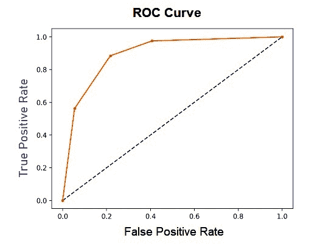
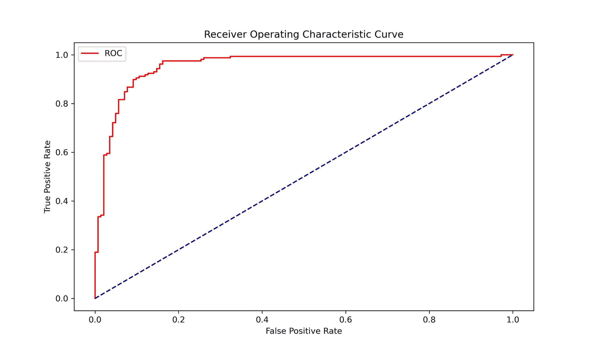

# 机器学习中的 ROC 曲线

> 原文：<https://www.askpython.com/python/examples/roc-curves-machine-learning>

ROC 曲线代表**接收机工作特性曲线**。ROC 曲线显示了分类模型的性能。

ROC 告诉我们，根据预测的概率，该模型在区分给定类别方面有多好。

在本文中，我们将了解 ROC 曲线，什么是 AUC，并实现一个二元分类问题，以了解如何绘制模型的 ROC 曲线。

## ROC 曲线介绍

假设我们有一个[逻辑回归模型](https://www.askpython.com/python/examples/logistic-regression-from-scratch)，它将一个事件分类为真或假。我们知道，在逻辑回归中，将一个点分类为真或假的默认阈值是 0.5，但是我们可以根据需要改变该阈值来匹配。

因此，ROC 曲线是对于 0.0 和 1.0 之间的多个不同候选阈值，假阳性率(FPR) (x 轴)对真阳性率(TPR) (y 轴)的图。

## 了解 TPR 和 FPR

如前所述，ROC 曲线取决于真阳性率和假阳性率，让我们看看它们是什么。

**真阳性率:**真阳性率的计算方法为真阳性数除以真阳性数和假阴性数之和。

```py
True Positive Rate = True Positives / (True Positives + False Negatives)

```

**假阳性率:**假阳性率的计算方法是假阳性数除以假阳性数和真阴性数之和。

```py
False Positive Rate = False Positives / (False Positives + True Negatives)

```

对于不同的阈值，我们将得到不同的 TPR 和 FPR。



**ROC Curve**

## 我们为什么要用 ROC 曲线？

**ROC 曲线因以下原因而有用:**

*   曲线下的***【AUC】***面积可以作为模型性能的指标。
*   不同的模型可以根据它们的 ROC 曲线相互比较。

为了获得最佳模型，我们希望提高我们的真阳性率，降低我们的假阳性率(TPR = 1，FPR = 0)。

这意味着我们的模型将能够正确地分离这些类。这样的模型被称为熟练模型。在现实生活中，这是永远达不到的。

在每个阈值没有技能的模型由从图的左下角到右上角的对角线(上图中的蓝线)表示。此类模型的 AUC 为 0.5。这种模型对于每个阈值都具有相等的 TPR 和 FPR。

## 用 Python 绘制 ROC 曲线

现在让我们构建一个二元分类器，并绘制它的 ROC 曲线，以便更好地理解这个过程。

对于这个例子，我们将使用逻辑回归模型。我们在这里与三个重要的库合作——[Matplotlib](https://www.askpython.com/python-modules/matplotlib/python-matplotlib)、 [Numpy](https://www.askpython.com/python-modules/numpy/python-numpy-module) 和 sklearn。

```py
#Importing Required Modules
import numpy as np
import matplotlib.pyplot as plt
from sklearn.datasets import make_classification
from  sklearn.linear_model import LogisticRegression
from sklearn.model_selection import train_test_split
from sklearn.metrics import roc_curve

##Creating a Dataset
X, label = make_classification(n_samples=500, n_classes=2, weights=[1,1], random_state=100)

#Splitting the data into train and test sets
X_train, X_test, y_train, y_test = train_test_split(X, label, test_size=0.3, random_state=1)

#Creating the class object and 
model = LogisticRegression()
model.fit(X_train, y_train)

#predict probabilities
probs = model.predict_proba(testX)

#Keeping only positive class
probs = probs[:, 1]

#Calculating the FPR and TPR
fpr, tpr, thresholds = roc_curve(testy, probs)

#Plotting the figure
plt.figure(figsize = (10,6))
plt.plot(fpr, tpr, color='red', label='ROC')
plt.plot([0, 1], [0, 1], color='darkblue', linestyle='--')
plt.xlabel('False Positive Rate')
plt.ylabel('True Positive Rate')
plt.title('Receiver Operating Characteristic Curve')
plt.legend()
plt.show()

```



ROC Curve Of Logistic Regression Model

sklearn 模块为我们提供了`roc_curve`函数，返回误报率和真报率作为输出。

该函数接受两个类的实际概率和使用`LogisticRegression`类的`.predict_proba( )`方法计算的预测正概率数组。

好了，现在我们知道如何绘制二元分类模型的 ROC 曲线。

## 结论

在本文中，我们获得了一些关于 ROC 曲线的信息，以及为什么它很重要。我们还对真阳性率和假阳性率以及 ROC 曲线如何依赖于它们有了一些了解。最后，我们研究了为逻辑回归模型绘制 ROC 曲线的代码。

快乐学习！