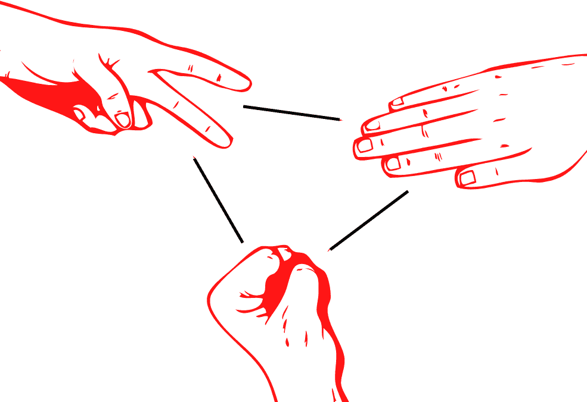
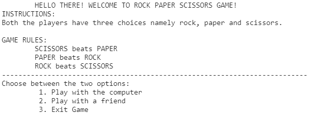
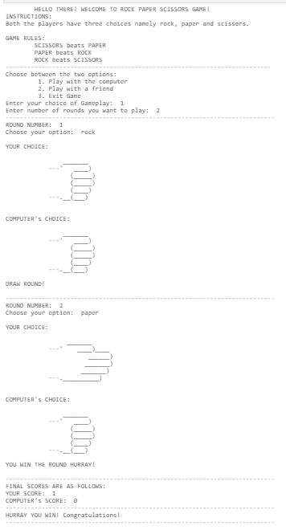
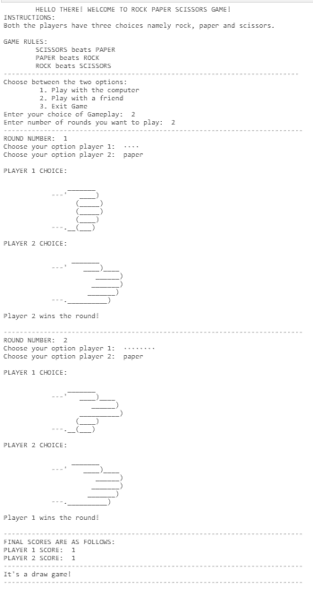

# 用 Python 构建石头剪刀布游戏！

> 原文：<https://www.askpython.com/python/examples/rock-paper-scissors-in-python-with-ascii-hand>

哦，你好，游戏程序员！今天，我将指导你如何自己制作一个简单的石头剪刀布游戏。

你准备好了吗？让我们开始吧！

## 石头剪刀布游戏介绍

在构建任何新游戏之前，你需要了解游戏的所有内容，包括它的规则、输入和输出，以及所有必要的东西。

### 游戏怎么玩？

石头剪子布是我们从小就玩的经典手游之一。它通常在两个玩家之间进行(也可以由两个以上的玩家进行)，每个人用一只手同时形成三种形状(石头、布、剪刀)中的一种。

### 如何为选项形成手势？

摇滚用握紧的拳头代表；纸由一只扁平的手代表，剪刀由一个 V 形(流行的和平信号)代表。下图展示了这些手势。



Rock Paper Scissors Shape

***推荐阅读:[Python 中的图形化 Hi-lo 游戏](https://www.askpython.com/python/examples/pygame-graphical-hi-lo-game)***

### 游戏规则

虽然游戏的编码部分可能有点复杂，但游戏规则很简单，如下所示:

1.  石头赢了剪刀。
2.  剪刀赢在纸上。
3.  纸赢了石头。

* * *

## 用 Python 制作石头剪刀布

我们会把整个游戏建筑分成几个部分，让你觉得简单！我们制作游戏的所有步骤如下:

1.  导入所有必需的模块
2.  打印问候消息并询问玩家想要如何玩游戏。
3.  为以下目的创建单独的函数:
    *   画手绘图
    *   玩电脑！
    *   和朋友一起玩！

### 步骤 1–导入必要的模块。

我们在构建游戏时使用了一些模块。让我把你一个一个介绍给他们。

1.  [随机模块](https://www.askpython.com/python-modules/python-random-module-generate-random-numbers-sequences):内置模块，用于生成随机对象，可以是整数、浮点数，也可以是其他对象。
2.  Getpass 模块 : Getpass 模块通常用于从用户处获取密码，但在游戏中，它也用于向玩家 2 隐藏玩家 1 的输入，以实现公平游戏。

为了导入模块，我们使用以下代码:

```py
import random
import getpass

```

### 第二步-打印问候信息，并询问玩家想如何玩游戏。

游戏制作者在游戏开始前问候玩家是明智的。更好的问候信息会让你的游戏比同一个游戏的其他开发者更好。问候之后，玩家会被询问是想和电脑或朋友一起玩，还是想简单地退出游戏。

在我们的例子中，我们将定义一个存储所有问候信息的函数。相同的代码如下所示:

```py
def Info ():
    print ("\tHELLO THERE! WELCOME TO ROCK PAPER SCISSORS GAME!")
    print ("INSTRUCTIONS:\nBoth the players have three choices namely rock, paper and scissors.")
    print ("\nGAME RULES:")
    print ("\tSCISSORS beats PAPER")
    print ("\tPAPER beats ROCK")
    print ("\tROCK beats SCISSORS")
    print ("--------------------------------------------------------------------------")
    print ("Choose between the two options: ")
    print ("\t 1\. Play with the computer")
    print ("\t 2\. Play with a friend")
    print ("\t 3\. Exit Game")

```

当调用“Info”函数时，它以如下所示的模式打印信息:



Info Rock Paper Scissors

在选择了游戏方法后，玩家会被询问想要和电脑还是朋友玩几局。必须考虑的一些事情是回合数应该是整数，玩家选择的游戏方法也应该是有效的。

游戏相同的整个启动过程的代码如下所示。

```py
Info ()
choices = ["rock","paper","scissors"]
wrong = True
while wrong:
    try:
        n= int (input ("Enter your choice of Gameplay: "))
        if(n==1):
            wrong = False
            x = int (input ("Enter number of rounds you want to play: "))
            begin_game_computer(x)
        elif(n==2):
            wrong = False
            x = int (input ("Enter number of rounds you want to play: "))
            begin_game_friend(x)
        elif(n==3):
            wrong=False
            print ("\nThank you for playing! \nBye!")
        else:
            print ("Choose Again!")
    except (ValueError):
        print ("INVALID INPUT! Choose Again!")
        wrong=True

```

让我们明白这里到底发生了什么。首先，我们调用 Info 函数来问候玩家，然后我们利用 Python 异常来处理必要的事情。

如果玩家选择玩电脑，则调用“begin_game_computer”函数，同样，如果玩家选择与朋友玩，则调用“begin_game_friend”函数。

### 步骤 3-为不同的目的创建不同的函数。

现在，构建游戏的主要步骤是定义游戏正常运行所需的功能。让我们从头开始构建所有项目。

#### 1.定义绘制手形图的函数。

为了使游戏对玩家来说更具互动性，我们将定义一个函数来打印对应于所选正确选项的手型图。

相同的代码如下:

```py
def draw_diagrams(ch):
    if(ch=="rock"):
        print("""
                _______
            ---'   ____)
                  (_____)
                  (_____)
                  (____)
            ---.__(___)
            """)
    elif(ch=="paper"):
        print("""
                 _______
            ---'    ____)____
                       ______)
                      _______)
                     _______)
            ---.__________)
            """)
    elif(ch=="scissors"):
        print("""
                _______
            ---'   ____)____
                      ______)
                   __________)
                  (____)
            ---.__(___)
            """)
    else:
        print("WRONG INPUT! CHOOSE AGAIN PLEASE!\n")

```

#### 2.定义在电脑上玩的功能。

在解释任何东西之前，让我先展示一下代码，解释妥当。

```py
def begin_game_computer(n):
    score1=0
    score2=0
    for i in range(n):
        print("---------------------------------------------------------------------------")
        print("ROUND NUMBER: ",i+1)
        check = True
        while check:
            p_ch = input("Choose your option: ")
            if(p_ch.lower() in choices):
                check=False
            else:
                print("Wrong Input! Enter Again!")
        c_ch = choices[random.randint(0,2)]

        print("\nYOUR CHOICE: ")
        draw_diagrams(p_ch.lower())
        print("\nCOMPUTER's CHOICE: ")
        draw_diagrams(c_ch.lower())

        winner = check_win(p_ch,c_ch)
        if(winner==1):
            print("YOU WIN THE ROUND HURRAY!\n")
            score1+=1
        elif(winner==2):
            print("Oh no! Computer wins the round!\n")
            score2+=1
        else:
            print("DRAW ROUND!\n")
    print("---------------------------------------------------------------------------")
    print("FINAL SCORES ARE AS FOLLOWS: ")
    print("YOUR SCORE: ",score1)
    print("COMPUTER's SCORE: ",score2)
    if(score1>score2):
        print("---------------------------------------------------------------------------")
        print("HURRAY YOU WIN! Congratulations!")
        print("---------------------------------------------------------------------------")
    elif(score1<score2):
        print("---------------------------------------------------------------------------")
        print("Computer wins this time! Better Luck next time!")
        print("---------------------------------------------------------------------------")
    else:
        print("---------------------------------------------------------------------------")
        print("It's a draw game!")
        print("---------------------------------------------------------------------------")

```

现在让我们仔细了解整个信息。这个函数在游戏中起着重要的作用，所以试着正确理解这个函数。

我们用两个变量`score1`和`score2`来存储两个玩家的分数(在这个例子中，玩家 2 是计算机)。现在运行一个循环来计算总回合数，对于每一回合，我们确保包括三件事:

1.  两个玩家的输入:对于计算机，我们定义了一个包含所有三个选项的列表，并使用随机库，计算机从三个选项中随机选择一个。
2.  **检查谁赢了这轮:**为了检查谁赢了这轮，我们使用了一个单独的函数，该函数将两个输入都作为参数，并返回哪个玩家赢了(1 或 2)。赢家检查功能的代码如下所示:

```py
def check_win(c1,c2):
    if(c1=='rock' and c2=='paper'):
        return 2
    elif(c1=='paper' and c2=='rock'):
        return 1
    elif(c1=='paper' and c2=='scissors'):
        return 2
    elif(c1=='scissors' and c2=='paper'):
        return 1
    elif(c1=='rock' and c2=='scissors'):
        return 1
    elif(c1=='scissors' and c2=='rock'):
        return 2
    elif(c1==c2):
        return 0  

```

3.  **更新得分值:**下一步是增加第一个和第二个玩家的得分，如果他们中的任何一个赢了，并且如果有平局，什么也没有发生。

对于玩家提到的回合数，重复相同的过程。然后我们显示电脑和玩家的最终分数，并比较分数，让玩家知道谁赢了游戏！

#### 3.定义和朋友一起玩的功能。

和朋友玩游戏就像和电脑玩游戏一样。唯一的区别是，在这种情况下，我们将采用两个输入，而不是随机采用第二个输入。

这里我们做的另一个小改变是，在第二个玩家选择之前，我们隐藏了第一个玩家的回答。同样，我们使用`getpass`方法。

让我向您展示与朋友一起玩的代码是什么样子的:

```py
def begin_game_friend(n):
    score1=0
    score2=0
    for i in range(n):
        print("---------------------------------------------------------------------------")
        print("ROUND NUMBER: ",i+1)

        check = True
        while check:
            p1_ch = getpass.getpass(prompt="Choose your option player 1: ",stream=None)
            if(p1_ch.lower() in choices):
                check=False
            else:
                print("Wrong Input! Enter Again!")

        check = True
        while check:
            p2_ch = input("Choose your option player 2: ")
            if(p2_ch.lower() in choices):
                check=False
            else:
                print("Wrong Input! Enter Again!")

        print("\nPLAYER 1 CHOICE: ")
        draw_diagrams(p1_ch.lower())
        print("PLAYER 2 CHOICE: ")
        draw_diagrams(p2_ch.lower())

        winner = check_win(p1_ch,p2_ch)
        if(winner==1):
            print("Player 1 wins the round!\n")
            score1+=1
        elif(winner==2):
            print("Player 2 wins the round!\n")
            score2+=1
        else:
            print("DRAW ROUND!\n")

    print("---------------------------------------------------------------------------")
    print("FINAL SCORES ARE AS FOLLOWS: ")
    print("PLAYER 1 SCORE: ",score1)
    print("PLAYER 2 SCORE: ",score2)
    if(score1>score2):
        print("---------------------------------------------------------------------------")
        print("PLAYER 1 WINS! Congratulations!")
        print("---------------------------------------------------------------------------")
    elif(score1<score2):
        print("---------------------------------------------------------------------------")
        print("PLAYER 2 WINS! Congratulations")
        print("---------------------------------------------------------------------------")
    else:
        print("---------------------------------------------------------------------------")
        print("It's a draw game!")
        print("---------------------------------------------------------------------------")

```

### 最终输出

恭喜你！我们现在都准备好运行游戏了！让我给你看一个用电脑和和一个朋友两轮的结果样本。



Test RPS Round With Computer



Test RPS Round With Friend

* * *

## 结论

我希望你能够成功地建立和理解整个游戏建设！恭喜你！现在你知道了如何为石头剪子布游戏创建逻辑，你可以自己创建一些其他的游戏！

感谢您的阅读！编码快乐！