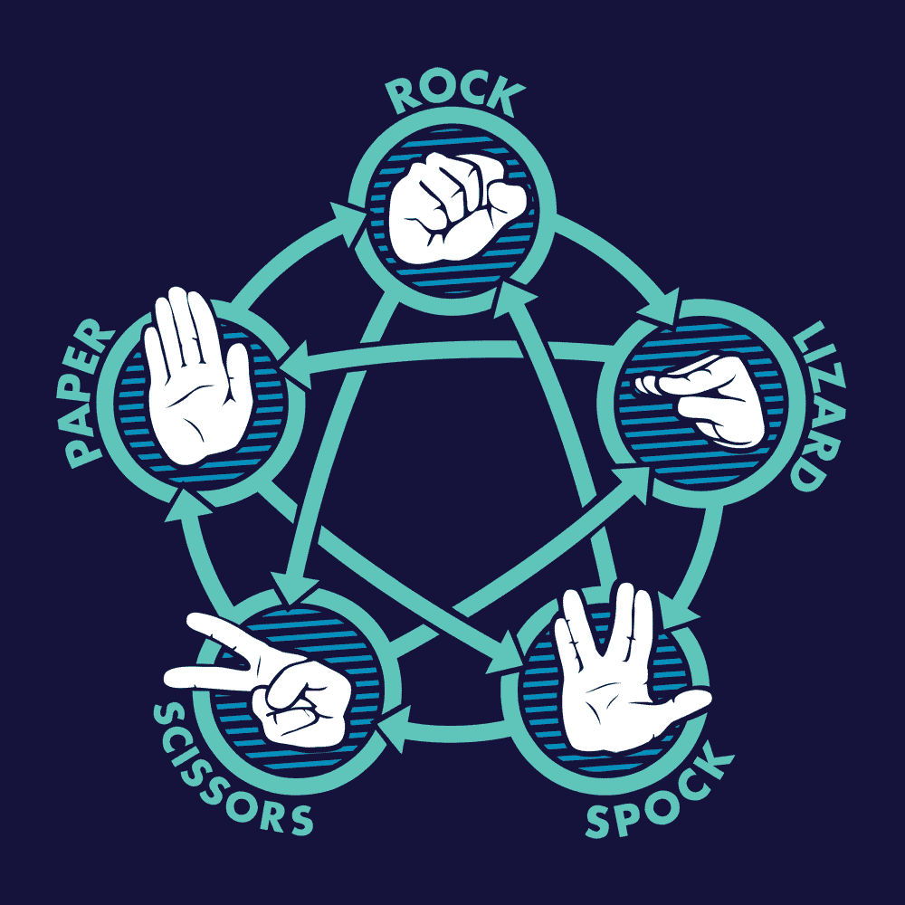
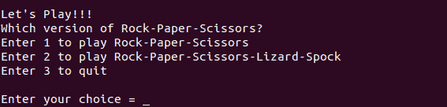
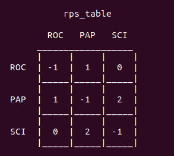
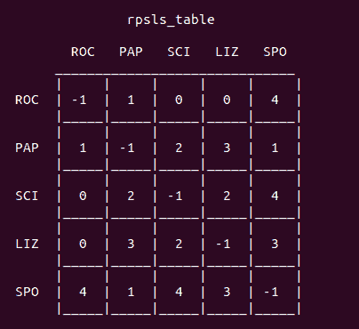
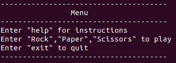

# Python 中的石头剪刀布——完整的分步指南

> 原文：<https://www.askpython.com/python/examples/rock-paper-scissors-in-python>

在本文中，我们将通过 Python 语言创建我们自己的石头剪刀布游戏的步骤。

## 关于石头剪刀布

传统的石头剪刀布是一个双人游戏，每个人同时选择石头、布或剪刀，假设石头压剪刀，剪刀剪布，布盖石头。根据规则，决定谁是赢家。

如果你熟悉流行电视剧《生活大爆炸》，你可能知道这个游戏的另一个版本，叫做石头剪刀布蜥蜴史波克。下面的信息图可能会帮助你理解。



Rock-Paper-Scissors-Lizard-Spock

箭头的方向决定了胜利者。一个实体的箭头意味着，这个实体在特定的比赛中的优势。

* * *

## 游戏演示

* * *

## 在 Python 中创建石头剪刀布

我们今天要创建的游戏支持两种版本的石头剪刀布。不是每个人都热衷于玩新版本的游戏，因此我们需要一个游戏菜单来区分粉丝群。菜单是这样的。



Game Menu

* * *

### 创建数据结构

游戏的完整运行需要两种特定的数据结构。

```py
# The mapping between moves and numbers
game_map = {0:"rock", 1:"paper", 2:"scissors", 3:"lizard", 4:"Spock"}

# Win-lose matrix for traditional game
rps_table = [[-1, 1, 0], [1, -1, 2], [0, 2, -1]]

# Win-lose matrix for new version of the game
rpsls_table = [[-1, 1, 0, 0, 4],[1, -1, 2, 3, 1], [0, 2, -1, 2, 4], [0, 3, 2, -1, 3], [4, 1, 4, 3, -1]]

```

### 映射游戏移动

为了决定赢家和输家，我们需要在可能的移动和数字之间建立某种映射。为此，我们使用了 python 字典。

### 输赢矩阵

在 Python 中检查石头剪子布的获胜者的最简单的方法是参考对应于每个玩家输入的单元格。下面是传统游戏的矩阵:



Win-Lose Matrix

矩阵的非负值表示相应输入的获胜者。让我们举一个例子，来完整地理解这个矩阵。

假设，在某个博弈中，参与人 1 选择剪刀(指数= 2)，参与人 2 选择布(指数= 1)。矩阵中的单元(2，1)和(1，2)表示剪刀和纸之间的匹配。这些单元格包含剪刀的索引，因为剪刀会剪纸。

包含`'-1'`的单元格表示平局游戏。

以下是新版本的矩阵:



Win-Lose Matrix

上面解释的数据结构总结了创建我们的石头剪子布游戏所需的完整游戏逻辑。剩下的两件事是管理玩家输入和计算机移动。

* * *

### 构建游戏循环

Python 中石头剪刀布最关键的部分之一是**游戏循环**。在这个游戏的上下文中，游戏循环负责维护玩家之间的一串匹配。

```py
# The GAME LOOP
while True:

	# The Game Menu
	print()
	print("Let's Play!!!")
	print("Which version of Rock-Paper-Scissors?")
	print("Enter 1 to play Rock-Paper-Scissors")
	print("Enter 2 to play Rock-Paper-Scissors-Lizard-Spock")
	print("Enter 3 to quit")
	print()

	# Try block to handle the player choice 
	try:
		choice = int(input("Enter your choice = "))
	except ValueError:
		clear()
		print("Wrong Choice")	
		continue

	# Play the traditional version of the game
	if choice == 1:
		rps()

	# Play the new version of the game
	elif choice == 2:
		rpsls()

	# Quit the GAME LOOP 	
	elif choice == 3:
		break

	# Other wrong input
	else:
		clear()
		print("Wrong choice. Read instructions carefully.")

```

`'rps()'`和`'rpsls()'`函数有一个内部游戏循环来处理各自版本的一系列游戏。

'`clear()'`'功能负责清除终端，以防止输出拥挤。

* * *

### Python 中石头剪刀布的游戏说明

在期望玩家采取行动之前，程序员有责任向玩家提供一组指令。我们需要创建两个独立的函数来为这两种游戏提供指令。

```py
# Set of instructions for Rock-Paper-Scissors
def rps_instructions():

	print()
	print("Instructions for Rock-Paper-Scissors : ")
	print()
	print("Rock crushes Scissors")
	print("Scissors cuts Paper")
	print("Paper covers Rock")
	print()

# Set of instructions for Rock-Paper-Scissors-Lizard-Spock
def rpsls_instructions():

	print()
	print("Instructions for Rock-Paper-Scissors-Lizard-Spock : ")
	print()
	print("Scissors cuts Paper")
	print("Paper covers Rock")
	print("Rock crushes Lizard")
	print("Lizard poisons Spock")
	print("Spock smashes Scissors")
	print("Scissors decapitates Lizard")
	print("Lizard eats Paper")
	print("Paper disproves Spock")
	print("Spock vaporizes Rock")
	print("Rock crushes Scissors")
	print()

```

显示指令后，我们要求玩家输入。

* * *

### 处理玩家输入

因为我们的游戏支持玩家对战电脑的场景，所以我们必须在 Python 中的石头剪刀布游戏中注意每一步棋

#### 输入菜单

我们需要给玩家一种控制游戏的感觉。我们可以通过提供“寻求帮助”、“可能的移动”和“退出游戏”的选项来做到这一点。下面的输入菜单会解决这个问题:



Input Menu

#### 玩家的移动

处理玩家输入的主要焦点是将字符串输入转换成数字映射。对于 Python 中的传统游戏石头剪子布，我们接受以下输入招式。

```py
# Player Input
inp = input("Enter your move : ")

if inp.lower() == "help":
	clear()
	rps_instructions()
	continue
elif inp.lower() == "exit":
	clear()
	break	
elif inp.lower() == "rock":
	player_move = 0
elif inp.lower() == "paper":
	player_move = 1		
elif inp.lower() == "scissors":
	player_move = 2
else:
	clear()
	print("Wrong Input!!")
	rps_instructions()	
	continue

```

我们可以使用 [if-elif-else 语句](https://www.askpython.com/python/python-if-else-elif-statement)有条件地执行检查。

* * *

### 管理计算机移动

为了管理公正的计算机移动，我们需要借助 Python 的`'random'`库。我们从可能的选项中选择一个随机的移动。

```py
# Get the computer move randomly
comp_move = random.randint(0, 2)

# Print the computer move
print("Computer chooses ", game_map[comp_move].upper())

```

使用随机库的`'randint()'`功能，我们为计算机选择一个随机移动。

* * *

### 决定并宣布获胜者

利用输赢矩阵，我们可以很容易地选出赢家。

```py
# Find the winner of the match
winner = rps_table[player_move][comp_move]

# Declare the winner 
if winner == player_move:
	print(name, "WINS!!!")
elif winner == comp_move:
	print("COMPUTER WINS!!!")
else:
	print("TIE GAME")
print()
time.sleep(2)
clear()

```

我们使用`'sleep()'`函数来暂停 Python 脚本的执行。在上面的例子中，脚本等待了 2 秒钟。

这总结了运行石头剪子布游戏的 Python 脚本的解释。

* * *

## Python 中石头剪刀布的完整代码

下面是我们用 Python 写的石头剪刀布游戏的完整代码。

```py
import random
import os
import time

def clear():
	os.system("clear")

# Set of instructions for Rock-Paper-Scissors
def rps_instructions():

	print()
	print("Instructions for Rock-Paper-Scissors : ")
	print()
	print("Rock crushes Scissors")
	print("Scissors cuts Paper")
	print("Paper covers Rock")
	print()

# Set of instructions for Rock-Paper-Scissors-Lizard-Spock
def rpsls_instructions():

	print()
	print("Instructions for Rock-Paper-Scissors-Lizard-Spock : ")
	print()
	print("Scissors cuts Paper")
	print("Paper covers Rock")
	print("Rock crushes Lizard")
	print("Lizard poisons Spock")
	print("Spock smashes Scissors")
	print("Scissors decapitates Lizard")
	print("Lizard eats Paper")
	print("Paper disproves Spock")
	print("Spock vaporizes Rock")
	print("Rock crushes Scissors")
	print()

def rps():

	global rps_table
	global game_map
	global name

	# Game Loop for each game of Rock-Paper-Scissors
	while True:

		print("--------------------------------------")
		print("\t\tMenu")
		print("--------------------------------------")
		print("Enter \"help\" for instructions")
		print("Enter \"Rock\",\"Paper\",\"Scissors\" to play")
		print("Enter \"exit\" to quit")
		print("--------------------------------------")

		print()

		# Player Input
		inp = input("Enter your move : ")

		if inp.lower() == "help":
			clear()
			rps_instructions()
			continue
		elif inp.lower() == "exit":
			clear()
			break	
		elif inp.lower() == "rock":
			player_move = 0
		elif inp.lower() == "paper":
			player_move = 1		
		elif inp.lower() == "scissors":
			player_move = 2
		else:
			clear()
			print("Wrong Input!!")
			rps_instructions()	
			continue

		print("Computer making a move....")

		print()
		time.sleep(2)

		# Get the computer move randomly
		comp_move = random.randint(0, 2)

		# Print the computer move
		print("Computer chooses ", game_map[comp_move].upper())

		# Find the winner of the match
		winner = rps_table[player_move][comp_move]

		# Declare the winner 
		if winner == player_move:
			print(name, "WINS!!!")
		elif winner == comp_move:
			print("COMPUTER WINS!!!")
		else:
			print("TIE GAME")

		print()
		time.sleep(2)
		clear()

def rpsls():

	global rpsls_table
	global game_map
	global name

	# Game Loop for each game of Rock-Paper-Scissors-Lizard-Spock
	while True:
		print("--------------------------------------")
		print("\t\tMenu")
		print("--------------------------------------")
		print("Enter \"help\" for instructions")
		print("Enter \"Rock\",\"Paper\",\"Scissors\",\"Lizard\",\"Spock\" to play")
		print("Enter \"exit\" to quit")
		print("--------------------------------------")

		print()

		# Player Input
		inp = input("Enter your move : ")

		if inp.lower() == "help":
			clear()
			rpsls_instructions()
			continue
		elif inp.lower() == "exit":
			clear()
			break	
		elif inp.lower() == "rock":
			player_move = 0
		elif inp.lower() == "paper":
			player_move = 1		
		elif inp.lower() == "scissors":
			player_move = 2
		elif inp.lower() == "lizard":
			player_move = 3
		elif inp.lower() == "spock":
			player_move = 4	
		else:
			clear()
			print("Wrong Input!!")
			rps_instructions()	
			continue

		print("Computer making a move....")

		comp_move = random.randint(0, 4)
		print()
		time.sleep(2)

		print("Computer chooses ", game_map[comp_move].upper())

		winner = rpsls_table[player_move][comp_move]
		print()
		if winner == player_move:
			print(name, "WINS!!!")
		elif winner == comp_move:
			print("COMPUTER WINS!!!")
		else:
			print("TIE GAME")		
		print()
		time.sleep(2)
		clear()

# The main function
if __name__ == '__main__':

	# The mapping between moves and numbers
	game_map = {0:"rock", 1:"paper", 2:"scissors", 3:"lizard", 4:"Spock"}

	# Win-lose matrix for traditional game
	rps_table = [[-1, 1, 0], [1, -1, 2], [0, 2, -1]]

	# Win-lose matrix for new version of the game
	rpsls_table = [[-1, 1, 0, 0, 4],[1, -1, 2, 3, 1], [0, 2, -1, 2, 4], [0, 3, 2, -1, 3], [4, 1, 4, 3, -1]]

	name = input("Enter your name: ")

	# The GAME LOOP
	while True:

		# The Game Menu
		print()
		print("Let's Play!!!")
		print("Which version of Rock-Paper-Scissors?")
		print("Enter 1 to play Rock-Paper-Scissors")
		print("Enter 2 to play Rock-Paper-Scissors-Lizard-Spock")
		print("Enter 3 to quit")
		print()

		# Try block to handle the player choice 
		try:
			choice = int(input("Enter your choice = "))
		except ValueError:
			clear()
			print("Wrong Choice")	
			continue

		# Play the traditional version of the game
		if choice == 1:
			rps()

		# Play the new version of the game
		elif choice == 2:
			rpsls()

		# Quit the GAME LOOP 	
		elif choice == 3:
			break

		# Other wrong input
		else:
			clear()
			print("Wrong choice. Read instructions carefully.")

```

* * *

## 结论

如果程序员知道游戏逻辑和设计的基本原理，创建一个游戏并不是一个困难的过程。我们希望这篇文章能让读者意识到开发一个简单的基于终端的游戏的上述原则。工作代码也在我的 [Github 账户](https://github.com/Aprataksh/Rock-Paper-Scissors)里。

感谢您的阅读。如有任何疑问，欢迎在评论区联系我们。