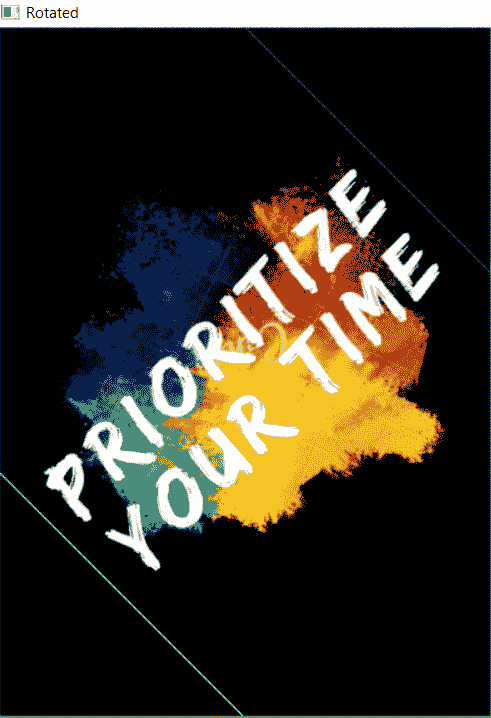

# Python 中按角度旋转图像的两种方法

> 原文：<https://www.askpython.com/python/examples/rotate-an-image-by-an-angle-in-python>

嘿，伙计们！在这篇文章中，我们将揭示用 Python 将图像旋转一个角度的方法。

通过旋转图像，我们的意思是图像被其中心旋转到指定的角度。

## 技术 1: Python 图像库(PIL)

`PIL -- Python Image Library`是一个包含内置函数的模块，用于操作和处理作为函数输入的图像。

在 Python 中，PIL 提供了内置的`image.rotate(angle) function`来将图像旋转一个角度。

**语法:**

```py
image.rotate(angle)

```

为了加载图像或将图像传递给 rotate()函数，我们需要使用下面的代码片段:

```py
Image.open(r"URL of the image")

```

我们需要使用下面的代码片段来显示图像:

```py
image.show()

```

**例 1:**

```py
from PIL import Image 

img = Image.open(r"C:\Users\HP\OneDrive\Desktop\Penskull Education.png") 

rotate_img= img.rotate(125)

rotate_img.show() 

```

在上面的代码片段中，我们将输入图像旋转了 125 度。

**输入图像:**


**Input Image**

**输出:**


**125 degree** **– rotation**

**例 2:**

```py
from PIL import Image 

img = Image.open(r"C:\Users\HP\OneDrive\Desktop\Penskull Education -- 01.png") 

rotate_img= img.rotate(45)

rotate_img.show() 

```

在本例中，图像旋转了 45 度。

**输出:**


**45 degree – rotation**

* * *

## 技术 2: OpenCV 在 Python 中将图像旋转一个角度

`Python OpenCV`是一个处理与计算机视觉相关的实时应用的模块。它包含大量的内置函数来处理用户输入的图像。

OpenCV 与另一个名为“`imutils`”的图像处理库配合得很好，可以操作和处理图像。

在 Python 中,`imutils.rotate() function`用于将图像旋转一个角度

**语法:**

```py
imutils.rotate(image, angle=angle)

```

**语法:使用 OpenCV** 读取图像作为输入

```py
cv2.imread(r"image path/URL")

```

**语法:使用 OpenCV** 显示图像

```py
cv2.imshow("output--msg",image)

```

**举例:**

```py
import cv2
import imutils
image = cv2.imread(r"C:\Users\HP\OneDrive\Desktop\Penskull Education.png")

rot = imutils.rotate(image, angle=45)
cv2.imshow("Rotated", rot)
cv2.waitKey(0)

```

**输出:**



Rotation Using OpenCV

* * *

## 结论

因此，在本文中，我们讨论了使用不同的库在 Python 中将输入图像旋转一个角度的各种方法。

我强烈建议读者在 Python 中浏览[裁剪图像，以了解更多关于 Python 中可用于操作图像的功能。](https://www.askpython.com/python/examples/crop-an-image-in-python)

* * *

## 参考

*   [Python imutils–官方文档](https://pypi.org/project/imutils/)