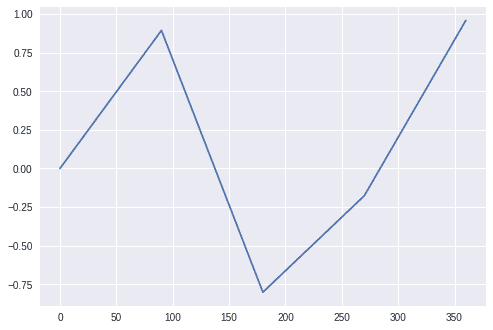
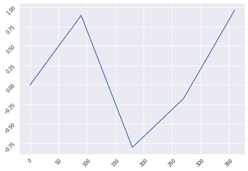
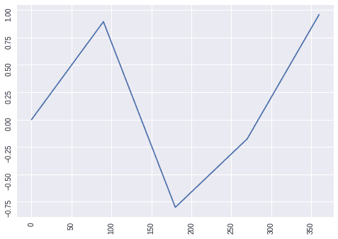

# 在 Python Matplotlib 中旋转刻度标注

> 原文：<https://www.askpython.com/python-modules/matplotlib/rotate-tick-labels>

嘿伙计们！本文将向您展示如何在 Python 中旋转 Matplotlib 图中的刻度标签。

刻度是代表轴上的数据点的**值。Matplotlib 自动标记轴上的数据点，但它也允许我们用自己的刻度和刻度标签创建自己的轴。**

* * *

## 旋转 Matplotlib 中的刻度标签

我们首先创建一个法线图，在本教程中，我们将使用一些随机的 x 角度构建正弦图，并将 x 值的正弦值绘制为 y 值。

```py
import matplotlib.pyplot as plt
import numpy as np
plt.style.use('seaborn')
x = [0, 90, 180, 270, 360]
y = np.sin(x)
plt.plot(x,y)
plt.show()

```



Normal Plot Rotate Ticks Matplotlib

### 将刻度旋转 45 度

让我们看看如何旋转 x 轴和 y 轴。为了修改图表中的轴水平，我们使用了`xticks()`和`yticks()`。在这种情况下，两者都用于独立调整轴。

```py
import matplotlib.pyplot as plt
import numpy as np
plt.style.use('seaborn')
x = [0, 90, 180, 270, 360]
y = np.sin(x)
plt.plot(x,y)
plt.xticks(rotation = 45)
plt.yticks(rotation = 45)
plt.show()

```



Rotated Ticks Plot Matplotlib

正如您在上面可能注意到的，两个轴上的刻度标签(数字)现在倾斜到 45 度。你可以摆弄这个数字，让它们更倾斜。

### 将门票旋转 90 度

旋转刻度的另一种方法是使用`gca()`和`tick params()`同时旋转两个轴，而不使用单独的语句。

```py
x = [0, 90, 180, 270, 360]
y = num.sin(x)
plt.plot(x,y)
ln = plt.gca()
ln.tick_params(axis='both', labelrotation = 90)
plt.show()

```



Rotated Ticks Plot Method2 Matplotlib

* * *

## **结论**

恭喜你！您刚刚学习了如何使用两种不同的方法旋转 matplotlib 图中的刻度标签。希望你喜欢它！😇

喜欢这个教程吗？无论如何，我建议你看一下下面提到的教程:

1.  [绘制数学函数——如何用 Python 绘制数学函数？](https://www.askpython.com/python/examples/plot-mathematical-functions)
2.  [使用 Python 从 Excel 表格中绘制数据](https://www.askpython.com/python/examples/plot-data-from-excel-sheet)
3.  [3 个 Matplotlib 绘图技巧使绘图有效](https://www.askpython.com/python-modules/matplotlib/matplotlib-plotting-tips)
4.  [Python:绘制平滑曲线](https://www.askpython.com/python-modules/matplotlib/smooth-curves)

感谢您抽出时间！希望你学到了新的东西！！😄

* * *