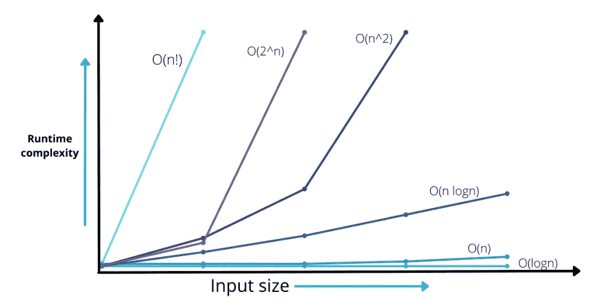
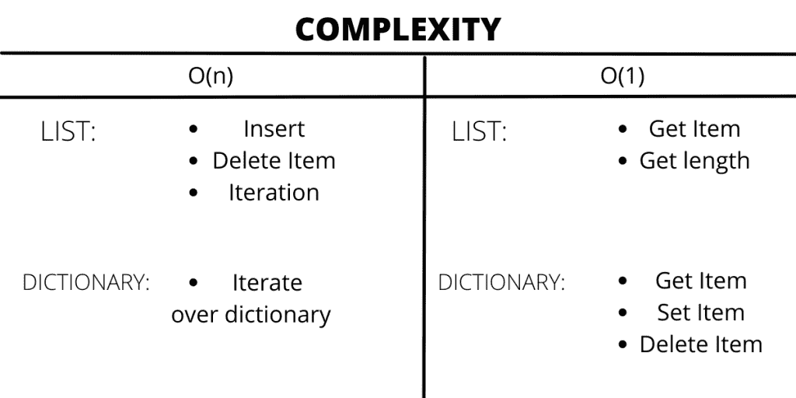
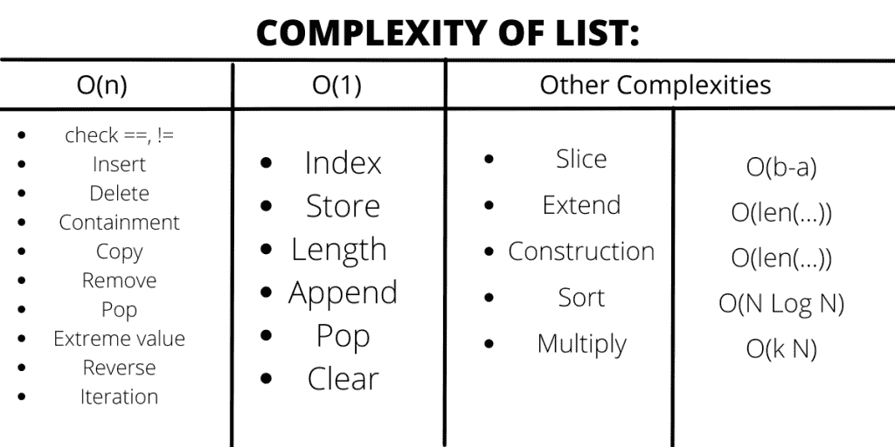
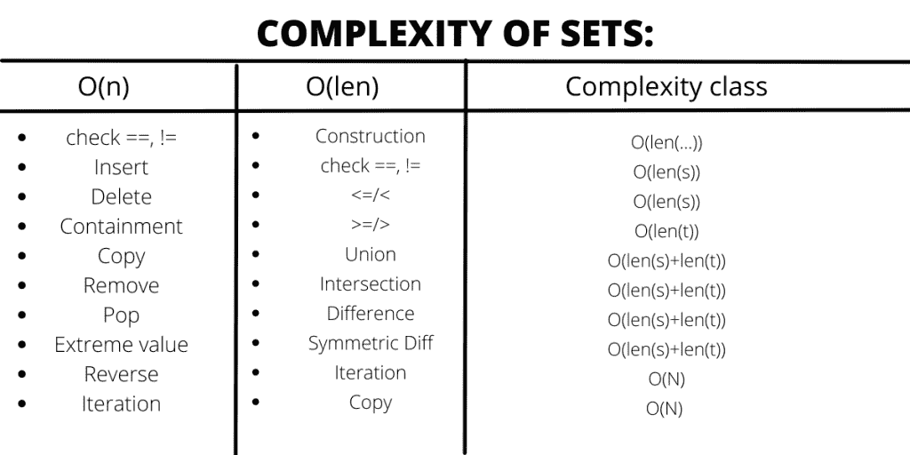
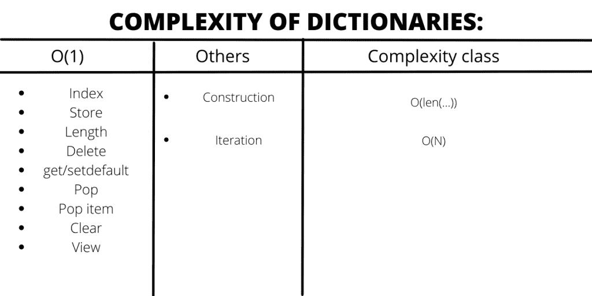

# Python 中数据结构的运行时复杂性

> 原文：<https://www.askpython.com/python/examples/runtime-complexities-of-data-structures>

在本文中，我们将探讨与编程算法相关的不同类型的运行时复杂性。我们将着眼于时间和空间的复杂性，不同的案例场景，以及特定的时间复杂性。我们还将研究不同 python 操作的时间复杂性。

## 编程中的运行时复杂性是什么意思？

当应用算法时，每个数据结构执行各种各样的动作。像遍历一组元素、在组中的某个位置添加一个项目、删除、更新或生成一个元素或整个组的克隆等操作。这些操作只是一些基本的常规操作。我们在编程中使用的所有类型的数据结构都对应用程序的性能有重大影响。这是因为数据结构操作过程具有不同的时间和空间复杂性。

### 1.空间的复杂性

术语“空间复杂度”表示一个算法可以占用的大小或存储空间的数量。它包括辅助空间以及由作为输入提供的数据占用的空间。算法需要的额外空间或非永久空间称为辅助空间。
关于输入大小的算法所消耗的总空间称为其空间复杂度。

### 2.时间的复杂性

当操作占用的时间可以通过测量来知道完成期望的过程需要多长时间时，就被称为时间复杂度。它通常被表示为“O”或 Big-O 符号化，用于量化时间复杂度。计算流程能力的方法依赖于输入的大小，称为“O”或 Big-O 符号。

根据输入的大小计算运算效率的方法称为 Big-O 表示法。

**类型:**

在这里，我们将讨论不同类型的运行时复杂性:

**常数时间或 O(1)**

我们要研究的第一个复杂性是这个。在算法占用与输入元素无关的时间的点上，该算法被表示为 O(1)或常数时间(n)。

这里，完成一个动作所花费的时间是一致的，与输入集合的大小无关。这意味着不管处理多少个输入分量，算法的操作程序都将持续花费相等的时间。例如，读取一个序列的第一个成员总是 O(1)，不管这个序列有多大。

**对数时间或 O(log n)**

我们要研究的第二个复杂性是这种类型的过程，其中作为输入提供的数据随着过程的每个阶段而减少，这里讨论的算法具有对数时间复杂性。一般来说，O(log n)过程涉及像二叉树和二分搜索法这样的算法。

**线性时间或 O(n)**

我们将评估的第三个过程是，当算法所用的时间与作为输入提供的数据量之间存在直接的线性关系时，它具有线性时间复杂度。在这个特定的场景中，算法需要评估输入数据中的所有对象，这是最合适的时间复杂度。

**准线性时间或(n log n)**

在这种情况下，输入元素也具有对数时间复杂度，但是各个过程被分成几个部分。像合并排序、tim 排序或堆排序这样的排序操作是最佳排序算法的几个例子。作为输入提供的数据被分成许多子列表，直到单个元素留在每个子列表中，然后这些子列表被合并成一个有组织的列表。结果时间复杂度为 O (nlogn)。

**二次时间或 O(n^2)**

第五个和第六个过程在性质上相似，但在程度上非常不同。这里操作所花费的时间与作为组中存在的输入而提供的数据的平方相当，因此该过程的时间复杂度是二次的。当算法需要对输入数据的每个元素执行线性时间运算时，时间复杂度依赖于元素的平方。例如，O(n2)发生在冒泡排序中。

****【指数时间】或【o(2^n】****

当算法的扩展随着对输入数据集的每一次添加而加倍时，它被认为具有指数时间复杂度。在第六个过程中，算法的扩展随着对输入数据组的每次累加而加倍，并且其时间复杂度被表示为指数。众所周知，强力方法具有这种程度的时间复杂度。例如，我们可以在斐波纳契数的递归计算中找到 O(2 n)时间复杂度。

**阶乘时间(n！)**

我们要查看的最后一个过程是计算一个操作中每个可能的变化所花费的时间，它是输入集合中对象大小的阶乘，因此这个过程被表示为 an (n！)复杂。例如，堆的算法计算 n 个对象的所有可能的变化。所有的算法在性能上都非常慢，具有 O(n！)时间复杂度。

Runtime Complexities

### 数据结构时间复杂性中的事例类型:

****最佳情况场景:**** 最佳情况场景:我们在最佳情况研究中确定算法执行时间的下一圈。当组中的数据结构和对象(除了参数之外)处于最佳水平时，最佳情况就会发生。因此，只进行小规模操作。在线性搜索中，例如，最好的情况可能是 x(被搜索的对象)出现在列表的顶部。在最好的情况下，动作的数量保持不变(不依赖于输入元素的数量)。因此，在这种情况下，它的时间复杂度为 O(1)。

**一般情况场景:**当我们将复杂性描述为依赖于作为输入提供的数据以及它的分布有多均匀时，就会出现这种情况。我们考虑所有潜在的输入，并计算在平均情况分析中计算所有输入所需的时间。要找出答案，只需将输入数除以所有计算值的乘积。

**最坏情况:**涉及定位一个项目的过程，该项目被定位为一个大尺寸组中的最后一个项目，例如一个列表，算法从第一个项目开始在整个组中迭代。例如，当 x 不在列表中时，类似线性搜索的算法，迭代将 x 与所有条目进行比较。这将导致运行时间为 O(n)。

### python 中不同数据结构的时间复杂度:

Complexity Of Sets

Most dictionary operations are O(1)

### 结论

希望这篇文章能帮助你理解不同的时间复杂度，以及哪种 python 数据结构占用什么时间复杂度。理解了复杂性的基本概念后，现在你可以发现数据结构的时间复杂性，并观察一系列操作中的复杂性。