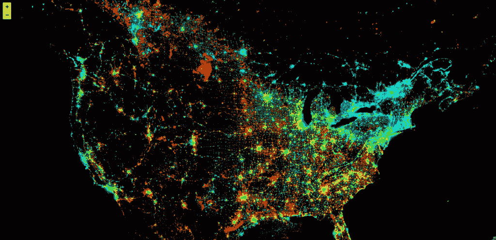
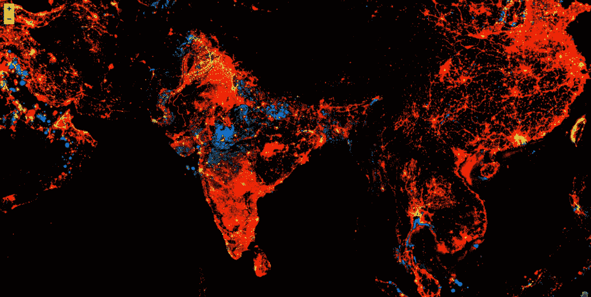
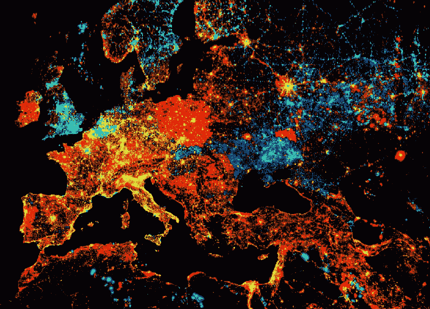

# 使用谷歌地球引擎和 Python 的卫星图像

> 原文：<https://www.askpython.com/python/examples/satellite-imagery-google-earth>

在本文中，我们将学习如何使用 Python 来处理卫星影像并使其可视化。本教程是对地理空间分析世界的粗略介绍。它是为至少对 python 有初级知识的人准备的。

## 使用 Python 中的 Google Earth 引擎的卫星图像

谷歌地球引擎是卫星图像和计算的最佳来源之一。这是一个科学分析和地理空间数据集可视化的平台，面向学术、非营利、商业和政府用户。Earth Engine 托管卫星图像，并将其存储在公共数据档案中，其中包括四十多年前的历史地球图像。

谷歌提供了一个 API，通过很少的代码就可以很容易地与地球引擎通信，这很好。该 API 被创建为与 JavaScript API 有相似之处，并且不是很 pythonic 化。因此，在第一次浏览 API 时，您可能会遇到一些小困难。

### 1.安装 ee 库

注意:Google earthengine-api 已经安装在 Colab 环境中。因此，如果您使用 Google Colab 平台运行 python，您可以安全地跳过这一步。

如果您在本地机器上运行，您需要首先在本地机器上安装 earthengine-api。安装 earthengine-api 的 [pip 命令](https://www.askpython.com/python-modules/python-pip)是:

```py
pip install earthengine-api --upgrade

```

### 2.导入和验证您自己

```py
# Import the earth-engine module
import ee

```

目前只有注册用户可以访问谷歌地球引擎。所以你需要注册谷歌地球引擎来使用这项服务。

此外，当您第一次在本地机器上使用 Google earth-engine 时，您需要验证自己是注册用户。

```py
ee.Authenticate()

```

一般来说，本地安装的身份验证是一次性步骤，它会生成一个持久授权令牌，而 Colab 等 VM 服务会限制令牌的生命周期。

最后，您需要初始化 API。

```py
ee.Initialize()

```

我们现在已经准备好使用地球引擎 API 了。

### 3.加载影像数据集

如前所述，地球引擎中有大量的数据集可用。为我们的任务选择正确的数据集非常重要。每个数据集都涵盖了地球的不同方面。例如树木覆盖、水体等。在本教程中，我们将使用 [DMSP OLS:夜间灯光时间序列](https://developers.google.com/earth-engine/datasets/catalog/NOAA_DMSP-OLS_NIGHTTIME_LIGHTS)数据集，其中包含不同国家的夜间灯光时间序列数据。

每个数据集都是图像的集合。因此数据集的命名约定是 ImageCollection，我们将在本文的其余部分使用这个命名约定。

```py
# Load the Nighttime Image Collection

collection = ee.ImageCollection('NOAA/DMSP-OLS/NIGHTTIME_LIGHTS')

```

### 4.使用图像集合

区别普通照片和卫星图像的最重要的方面是图像的光谱远远超出了正常的 0-255 范围。这些图像具有不同的波段，可以与正常图像的通道(RGB)进行比较。每个波段捕捉不同的电磁波谱。

现在我们来看看图像集合中的每幅图像都有哪些波段:

```py
# Extract the first image
first_image = collection.first()

# Display band information about the image
first_image.bandNames().getInfo()

```

**输出:**

```py
['avg_vis', 'stable_lights', 'cf_cvg', 'avg_lights_x_pct']

```

我们需要`stable_lights`波段进行可视化。从图像集中的每幅图像中选择一个波段非常耗时，但幸运的是 earth-engine 提供了一种从图像集中选择一个波段的方法。

```py
collection = collection.select('stable_lights')

```

现在，图像集合中的每个图像都有一个单独的波段。为了可视化随时间的变化，将需要另一个波段来代表时间。

```py
first_image = collection.first()

# Get number of years after 1991 from the first image
year = ee.Date(first_image.get('system:time_start')).get('year').subtract(1991)

# Turn it into a band
img1 = ee.Image(year).byte().addBands(first_image)

# A new band appears in the new image
img1.bandNames().getInfo()

```

**输出:**

```py
['constant', 'stable_lights']

```

我们需要对集合中的每张图片都这样做。因此，我们创建一个函数，并将其映射到集合上。

```py
def createTimeBand(img):
    year = ee.Date(img.get('system:time_start')).get('year').subtract(1991)
    return ee.Image(year).byte().addBands(img)

# Map it to the collection to create a new collection
collection = collection.map(createTimeBand)

```

### 5.想象夜晚的灯光

现在我们已经准备好显示我们的 ImageCollection，我们需要一个 UI 来显示图像。有很多用户界面选项可用，如叶，matplotlib，PIL 等。

在本教程中，我们选择了叶。Folium 是一个基于[leafle . js](https://leafletjs.com/)(用于移动友好交互式地图的开源 JavaScript 库)的 python 库，你可以用它来制作交互式地图。Folium 支持 WMS、GeoJSON 图层、矢量图层和切片图层，这使得我们可以非常方便和直接地可视化使用 python 处理的数据。

如果您没有安装 lyum，可以使用以下 pip 命令进行安装:

```py
pip install folium --upgrade

```

```py
# Import the folium library
import folium

```

现在我们需要定义如何在 follow 中显示 google earth 图像。这里有一个函数，使用起来非常方便。

```py
# Define a method for displaying Earth Engine image tiles to folium map.
def add_ee_layer(self, ee_image_object, vis_params, name):
  map_id_dict = ee.Image(ee_image_object).getMapId(vis_params)
  folium.raster_layers.TileLayer(
    tiles = map_id_dict['tile_fetcher'].url_format,
    attr = 'Map Data © <a href="https://earthengine.google.com/">Google Earth Engine</a>',
    name = name,
    overlay = True,
    control = True
  ).add_to(self)

# Add EE drawing method to folium.
folium.Map.add_ee_layer = add_ee_layer

```

现在我们可以创建一个地图，给出初始坐标和缩放因子。如果你理解错了一点也不要担心。Folium 是交互式的，这意味着您可以在可视化地图的同时更改位置和缩放。

```py
# Create the night map
night_map = folium.Map(location=[37.5010, -102.1899], zoom_start=4.5)

```

我们需要为显示图像设置一些参数，例如每个图像的波段和颜色偏好。这是您可能喜欢的默认设置。

```py
#  visualize the y-intercept in green, and positive/negative slopes as red/blue.

params = {
    'bands' :  ['scale', 'offset', 'scale'],
    'min' : 0,
    'max' : [0.18, 20, -0.18],
}

```

在我们观想之前，我们还有最后一步。我们需要使用线性拟合方法来减少图像，该方法计算带有常数项的一元线性函数的最小二乘估计。

```py
night_light = collection.reduce(ee.Reducer.linearFit())

```

将图像和参数添加到地图并显示地图。

```py
# Add the image layer to the night_map
night_map.add_ee_layer(night_light, params, 'test')

# Display the map
display(map)

```



Fig 1: Here is a beautiful representation of change of America night light from 1991



Fig 2: Here is a representation of change of night light in India and parts of south Asia since 1991



Fig 3: Change of night lights in the European countries

### 结论

关于使用谷歌地球引擎可视化夜间光线变化的文章，我们已经到了最后。下一步，您可以尝试使用不同的波段，甚至不同的数据集。如果你看得更远，谷歌已经推出了许多其他教程，如[检测哨兵 1 号图像的变化](https://developers.google.com/earth-engine/tutorials/community/detecting-changes-in-sentinel-1-imagery-pt-1)，让你开始更深入的地理空间分析方法。