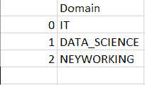

# 如何在 Python 中将一个数据帧保存为 csv 文件？

> 原文：<https://www.askpython.com/python-modules/pandas/save-dataframe-as-csv-file>

大家好！在本文中，我们将关注于将数据帧保存为 CSV(逗号分隔值)文件的技术。

让我们开始吧！

* * *

## 什么是 Python 熊猫模块？

[Python](https://www.askpython.com/) 有许多来处理数据并提供不同的功能。

[Python Pandas 模块](https://www.askpython.com/python-modules/pandas/python-pandas-module-tutorial)帮助我们处理数据集方面的大量数据。因此，通过使用 Pandas 模块，我们可以操纵和处理大型数据集的数据值。

Pandas 以数据帧的形式处理数据值和元素。一个`DataFrame` 由可以改变和突出显示的行和列组成。

所以，现在让我们来关注在 Pandas 模块中创建一个数据帧。

* * *

## 用 Python 创建数据帧

看看下面的代码吧！

```py
import os
import pandas
Domain = ["IT", "DATA_SCIENCE", "NETWORKING"] 

domain_dict = {'Domain': Domain} 

data_frame = pandas.DataFrame(domain_dict) 

```

因此，我们使用`pandas.DataFrame() function`从传递的数据值中以字典的形式创建一个数据帧，如上所示。

**输出:**

```py
        Domain
0	IT
1	DATA_SCIENCE
2	NETWORKING

```

创建数据帧后，现在是将数据帧保存为 CSV 文件的时候了。看看下面的部分。

* * *

## 将数据帧保存为 CSV 文件

我们经常会遇到这样的情况，我们需要以一种简单、易读、可共享的形式保存废弃或分析产生的大量数据。

现在，我们可以将数据帧保存到一个 **csv 文件**中，如下所述。

**语法:**

```py
dataframe.to_csv('file.csv') 

```

`pandas.to_csv() function`使我们能够将数据帧保存为 CSV 文件。我们需要将文件名作为参数传递给函数。

让我们看看下面的例子。

```py
import pandas
Domain = ["IT", "DATA_SCIENCE", "NEYWORKING"] 

domain_dict = {'Domain': Domain} 

data_frame = pandas.DataFrame(domain_dict) 

data_frame.to_csv('DEMO.csv') 

```

**输出:**



**DEMO -csv File**

* * *

## 结论

到此，我们就结束了这个话题。如果你遇到任何问题，欢迎在下面评论。

在那之前，学习愉快！！