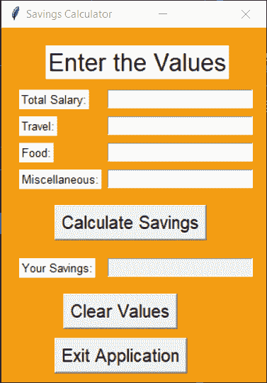
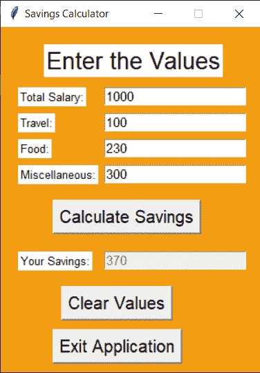
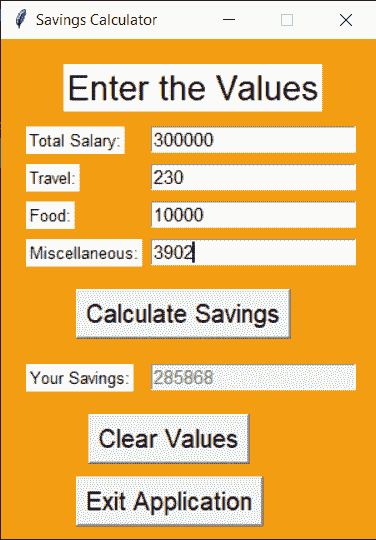

# Python Tkinter:简单的节省计算器

> 原文：<https://www.askpython.com/python-modules/tkinter/savings-calculator>

你好，初学者！今天让我们使用 [Python Tkinter 模块](https://www.askpython.com/python/tkinter-gui-widgets)来构建一个简单的 GUI 节省计算器。

该应用程序接受一个人的工资以及一些支出，如旅行、食品和杂项。该应用程序将确定节省了我的人。

要创建一个应用程序，我们需要做以下事情:

1.  导入必要的库，在我们的例子中是`tkinter`库
2.  创建主窗口
3.  向主窗口添加任意数量的小部件(按钮、条目和标签)
4.  将事件功能应用于按钮

## 用 Python 设计节约计算器

应用程序的设计包括创建和配置主窗口。它还包括在屏幕上添加所有必要的小部件。

相同的代码如下所示。

```py
import tkinter as tk
window = tk.Tk()
window.geometry("300x400")
window.config(bg="#F39C12")
window.resizable(width=False,height=False)
window.title('Savings Calculator')

l1 = tk.Label(window,text="Enter the Values",font=("Arial",20),fg="Black",bg="White")

l2 = tk.Label(window,text="Total Salary:",font=("Arial",10),fg="Black",bg="White")
e1 = tk.Entry(window,font=("Arial",11))

l3 = tk.Label(window,text="Travel:",font=("Arial",10),fg="Black",bg="White")
e2 = tk.Entry(window,font=("Arial",11))

l4 = tk.Label(window,text="Food:",font=("Arial",10),fg="Black",bg="White")
e3 = tk.Entry(window,font=("Arial",11))

l5 = tk.Label(window,text="Miscellaneous:",font=("Arial",10),fg="Black",bg="White")
e4 = tk.Entry(window,font=("Arial",11))

b1 = tk.Button(window,text="Calculate Savings",font=("Arial",15))

l6 = tk.Label(window,text="Your Savings:",font=("Arial",10),fg="Black",bg="White")
e5 = tk.Entry(window,font=("Arial",11),state='disabled')

b2 = tk.Button(window,text="Clear Values",font=("Arial",15))
b3 = tk.Button(window,text="Exit Application",font=("Arial",15))

l1.place(x=50,y=20)
l2.place(x=20,y=70)
e1.place(x=120,y=70)
l3.place(x=20,y=100)
e2.place(x=120,y=100)
l4.place(x=20,y=130)
e3.place(x=120,y=130)
l5.place(x=20,y=160)
e4.place(x=120,y=160)
b1.place(x=60,y=200)
l6.place(x=20,y=260)
e5.place(x=120,y=260)
b2.place(x=70,y=300)
b3.place(x=60,y=350)

window.mainloop()

```

如果您对我们使用的任何小工具有任何问题或疑问，您可以参考这里的教程。应用程序的最终设计如下所示。



Final Design Savings Calculator

## 向应用程序添加功能

为了增加功能，我们需要同时考虑`entry`和`button`小部件。

### 入口盒的工作

对于每个[输入框](https://www.askpython.com/python-modules/tkinter/tkinter-entry-widget)，我们创建变量来存储输入框的值。为了创建一个变量来存储整数值，我们使用了`StringVar`函数。

在为每个输入框分配一个唯一的变量后，我们给输入框声明添加一个`textvariable`属性来连接变量和输入框。

相同的代码如下所示。代码中所做的更改已经为您突出显示。

```py
import tkinter as tk
window = tk.Tk()
window.geometry("300x400")
window.config(bg="#F39C12")
window.resizable(width=False,height=False)
window.title('Savings Calculator')

v1 = tk.StringVar()
v2 = tk.StringVar()
v3 = tk.StringVar()
v4 = tk.StringVar()
v5 = tk.StringVar()

l1 = tk.Label(window,text="Enter the Values",font=("Arial",20),fg="Black",bg="White")

l2 = tk.Label(window,text="Total Salary:",font=("Arial",10),fg="Black",bg="White")
e1 = tk.Entry(window,font=("Arial",11),textvariable=v1)

l3 = tk.Label(window,text="Travel:",font=("Arial",10),fg="Black",bg="White")
e2 = tk.Entry(window,font=("Arial",11),textvariable=v2)

l4 = tk.Label(window,text="Food:",font=("Arial",10),fg="Black",bg="White")
e3 = tk.Entry(window,font=("Arial",11),textvariable=v3)

l5 = tk.Label(window,text="Miscellaneous:",font=("Arial",10),fg="Black",bg="White")
e4 = tk.Entry(window,font=("Arial",11),textvariable=v4)

b1 = tk.Button(window,text="Calculate Savings",font=("Arial",15))

l6 = tk.Label(window,text="Your Savings:",font=("Arial",10),fg="Black",bg="White")
e5 = tk.Entry(window,font=("Arial",11),state='disabled',textvariable=v5)

b2 = tk.Button(window,text="Clear Values",font=("Arial",15))
b3 = tk.Button(window,text="Exit Application",font=("Arial",15))

l1.place(x=50,y=20)
l2.place(x=20,y=70)
e1.place(x=120,y=70)
l3.place(x=20,y=100)
e2.place(x=120,y=100)
l4.place(x=20,y=130)
e3.place(x=120,y=130)
l5.place(x=20,y=160)
e4.place(x=120,y=160)
b1.place(x=60,y=200)
l6.place(x=20,y=260)
e5.place(x=120,y=260)
b2.place(x=70,y=300)
b3.place(x=60,y=350)

window.mainloop()

```

### 按钮的工作

在我们的应用程序中，我们有三个按钮。因此，我们将为按钮定义三种不同的功能。所有三种功能的代码定义如下。

```py
def exit():
    window.destroy()

def clear_all():
    e1.delete(0,tk.END)
    e2.delete(0,tk.END)
    e3.delete(0,tk.END)
    e4.delete(0,tk.END)
    e5.config(state='normal')
    e5.delete(0,tk.END)
    e5.config(state='disabled')

def cal_savings():
    e5.config(state='normal')
    e5.delete(0,tk.END)
    e5.config(state='disabled')
    salary = int(e1.get())
    total_expenditure = int(e2.get())+int(e3.get())+int(e4.get())
    savings = salary - total_expenditure
    e5.config(state='normal')
    e5.insert(0,savings)
    e5.config(state='disabled')

```

对于第一个函数，我们只需销毁我们创建的窗口。对于第二个功能，我们删除所有输入框的内容。

对于第三个函数，我们将所有支出值相加，并取总工资和支出之间的差值。但在此之前，我们将清除输出输入框，为新值腾出空间。

然后，我们将计算出的值放入输出输入框中。创建函数后，我们将参数`command`添加到按钮声明中。

这就对了。你都准备好了！

## 在 Tkinter 中实现节省计算器

下面给出了该应用程序的完整代码。

```py
def exit():
    window.destroy()

def clear_all():
    e1.delete(0,tk.END)
    e2.delete(0,tk.END)
    e3.delete(0,tk.END)
    e4.delete(0,tk.END)
    e5.config(state='normal')
    e5.delete(0,tk.END)
    e5.config(state='disabled')

def cal_savings():
    e5.config(state='normal')
    e5.delete(0,tk.END)
    e5.config(state='disabled')
    salary = int(e1.get())
    total_expenditure = int(e2.get())+int(e3.get())+int(e4.get())
    savings = salary - total_expenditure
    e5.config(state='normal')
    e5.insert(0,savings)
    e5.config(state='disabled')

import tkinter as tk
window = tk.Tk()
window.geometry("300x400")
window.config(bg="#F39C12")
window.resizable(width=False,height=False)
window.title('Savings Calculator')

v1 = tk.StringVar()
v2 = tk.StringVar()
v3 = tk.StringVar()
v4 = tk.StringVar()
v5 = tk.StringVar()

l1 = tk.Label(window,text="Enter the Values",font=("Arial",20),fg="Black",bg="White")

l2 = tk.Label(window,text="Total Salary:",font=("Arial",10),fg="Black",bg="White")
e1 = tk.Entry(window,font=("Arial",11),textvariable=v1)

l3 = tk.Label(window,text="Travel:",font=("Arial",10),fg="Black",bg="White")
e2 = tk.Entry(window,font=("Arial",11),textvariable=v2)

l4 = tk.Label(window,text="Food:",font=("Arial",10),fg="Black",bg="White")
e3 = tk.Entry(window,font=("Arial",11),textvariable=v3)

l5 = tk.Label(window,text="Miscellaneous:",font=("Arial",10),fg="Black",bg="White")
e4 = tk.Entry(window,font=("Arial",11),textvariable=v4)

b1 = tk.Button(window,text="Calculate Savings",font=("Arial",15),command=cal_savings)

l6 = tk.Label(window,text="Your Savings:",font=("Arial",10),fg="Black",bg="White")
e5 = tk.Entry(window,font=("Arial",11),state='disabled',textvariable=v5)

b2 = tk.Button(window,text="Clear Values",font=("Arial",15),command=clear_all)
b3 = tk.Button(window,text="Exit Application",font=("Arial",15),command=exit)

l1.place(x=50,y=20)
l2.place(x=20,y=70)
e1.place(x=120,y=70)
l3.place(x=20,y=100)
e2.place(x=120,y=100)
l4.place(x=20,y=130)
e3.place(x=120,y=130)
l5.place(x=20,y=160)
e4.place(x=120,y=160)
b1.place(x=60,y=200)
l6.place(x=20,y=260)
e5.place(x=120,y=260)
b2.place(x=70,y=300)
b3.place(x=60,y=350)

window.mainloop()

```

**输出:**对应用程序的各种数值进行了测试。其中一些如下所示。



Output1 Salary Calculator



Output2 Salary Calculator

## 结论

恭喜你！你成功地学会了如何建立自己的工资计算器。希望你喜欢它！

感谢您的阅读！编码快乐！