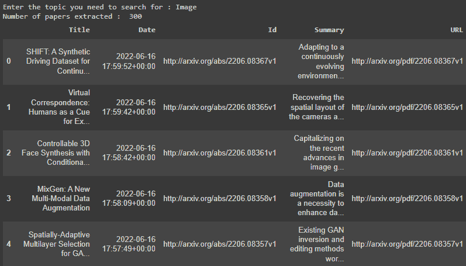
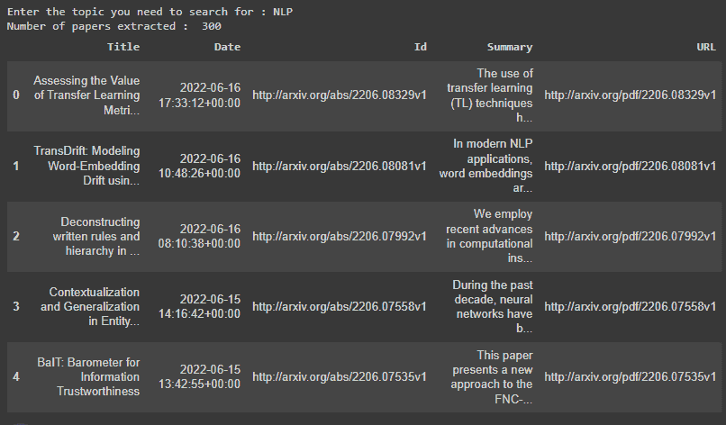

# 用 Python 刮 ArXiv 最新论文

> 原文：<https://www.askpython.com/python/examples/scrape-arxiv-papers-python>

你好研究员！！你一定听说过研究和收集 ArXiv 文件的任务有多乏味。你猜怎么着？！我们可以在 Python 编程语言的帮助下自动完成任务，并快速轻松地获得相关论文。

今天在本教程中，我们的目标是构建这样一个 python 代码，只需几行代码，我们就可以在几分钟内获得所需的研究论文！我们还在等什么？让我们开始吧！

***也读: [Python 硒介绍及设置](https://www.askpython.com/python-modules/selenium-introduction-and-setup)***

* * *

## 代码刮 ArXiv 最新论文

任何程序的第一步都是安装并导入所有必要的模块/库到我们的程序中。

为了抓取 ArXiv 研究论文，我们需要安装`ArXiv` python 库。使用下面的 python `pip`命令也可以做到这一点。

```py
pip install arxiv

```

接下来，让我们导入程序所需的两个模块，即`pandas`和`ArXiv`模块。pandas 模块将需要以数据帧的形式保存最终数据集。我们还会询问用户关于研究者需要使用`input`功能的论文的话题。

```py
import pandas as pd
import arxiv

topic = input("Enter the topic you need to search for : ")

```

一旦我们安装并导入了所有必要的库，我们也有了需要研究的主题。我们将利用`Search`函数来获取所需的论文以及论文的所有细节。

```py
search = arxiv.Search(
  query = topic,
  max_results = 300,
  sort_by = arxiv.SortCriterion.SubmittedDate,
  sort_order = arxiv.SortOrder.Descending
)

```

该函数将接受许多参数。让我们理解一下我们在上面的代码中使用的那些。

`query`用于指定要搜索的主题。`max_results`用于指定结果数(默认值:10，最大值:30，000)。`sort_by`用于指定将用于对输出进行排序的因子(提交日期、最后更新日期或相关性)。`sort_order`用于设置提交文件的顺序(升序或降序)。

***也读:[使用 Selenium 从网页中获取数据【完全指南】](https://www.askpython.com/python-modules/fetch-website-data-selenium)***

但是这段代码不会导致文件或任何信息显示出来。为此，我们需要一个循环。我们在这里要做的是浏览我们收到的所有 300 篇论文，然后将所有论文的一些信息保存在一个列表中，该列表稍后将使用`pandas`库传输到`dataframe`。

我们可以收集关于某篇论文的以下信息:论文 id、论文标题、论文摘要、论文涉及的作者、论文的 URL 以及论文所属的类别。

```py
all_data = []
for result in search.results():
  temp = ["","","","",""]
  temp[0] = result.title
  temp[1] = result.published
  temp[2] = result.entry_id
  temp[3] = result.summary
  temp[4] = result.pdf_url
  all_data.append(temp)

column_names = ['Title','Date','Id','Summary','URL']
df = pd.DataFrame(all_data, columns=column_names)

print("Number of papers extracted : ",df.shape[0])
df.head()

```

代码片段执行后，结果将是一个数据帧中的 300 篇研究论文数据。



ArXiv Scraped Data

## 使用 Python 抓取 ArXiv 最新论文的完整代码

让我们看看下面的刮刀的完整代码。

```py
import pandas as pd
import arxiv

topic = input("Enter the topic you need to search for : ")

search = arxiv.Search(
  query = topic,
  max_results = 300,
  sort_by = arxiv.SortCriterion.SubmittedDate,
  sort_order = arxiv.SortOrder.Descending
)

all_data = []
for result in search.results():
  temp = ["","","","",""]
  temp[0] = result.title
  temp[1] = result.published
  temp[2] = result.entry_id
  temp[3] = result.summary
  temp[4] = result.pdf_url
  all_data.append(temp)

column_names = ['Title','Date','Id','Summary','URL']
df = pd.DataFrame(all_data, columns=column_names)

print("Number of papers extracted : ",df.shape[0])
df.head()

```

让我们看看我们刚刚开发的同一铲运机的另一个输出。



ArXiv Scraped Data 2

***也读:[如何用 Scrapy](https://www.askpython.com/python/scrape-yahoo-finance-python-scrapy)*** 用 Python 刮雅虎财经数据