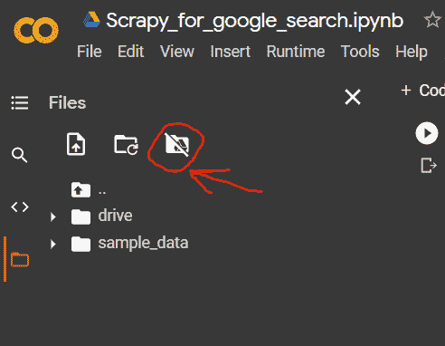
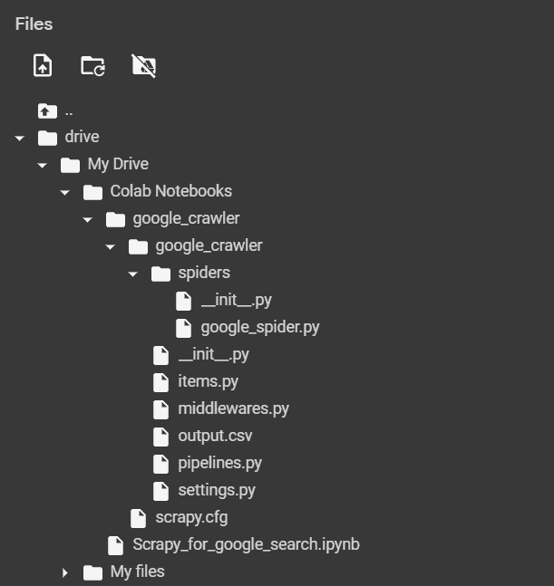
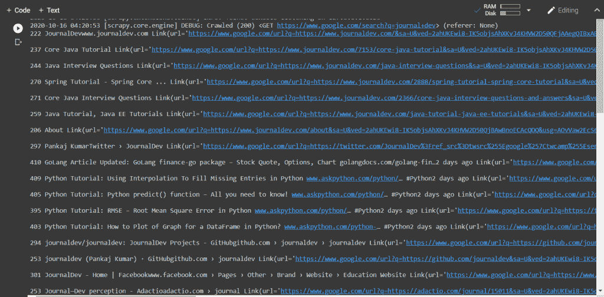
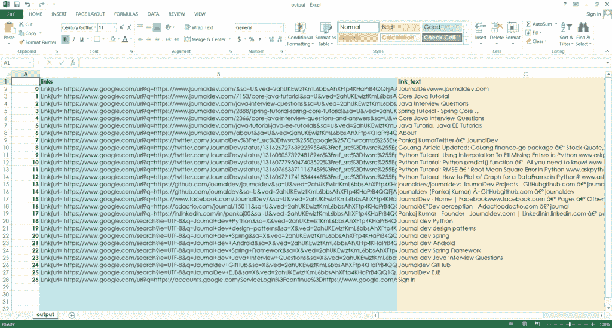
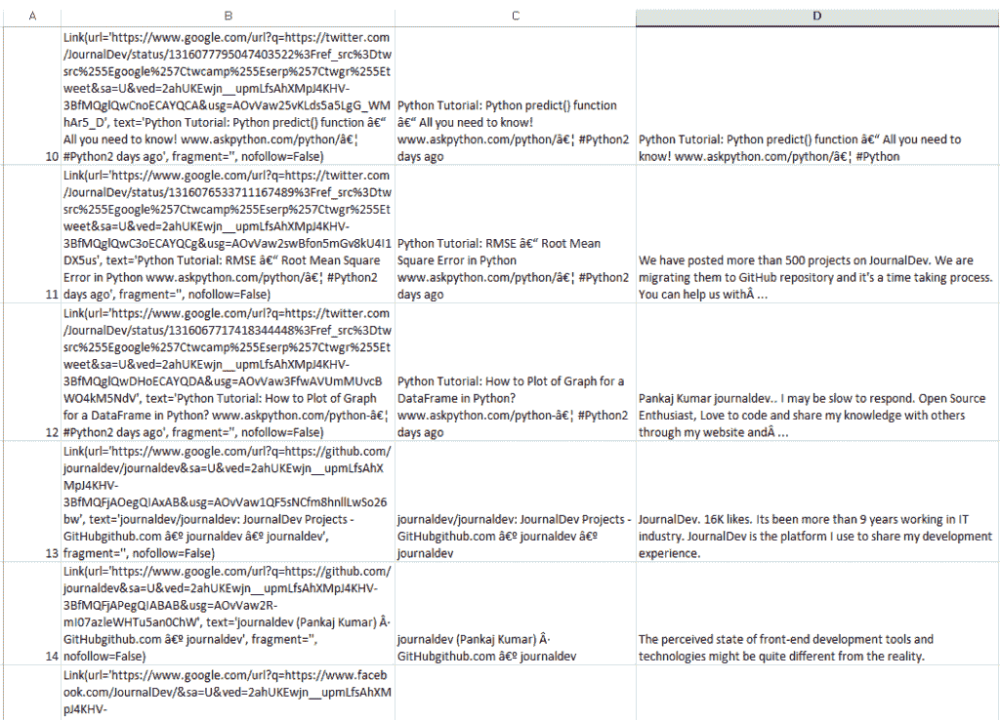

# 如何使用 Python Scrapy 抓取谷歌搜索结果

> 原文：<https://www.askpython.com/python-modules/scrape-google-search-results-python-scrapy>

你有没有遇到过这样的情况:第二天你有一场考试，或者一场演讲，你在谷歌搜索页面上一页一页地浏览，试图寻找对你有帮助的文章？

在这篇文章中，我们将探讨如何将这个单调的过程自动化，这样您就可以将精力投入到更好的任务中。

在这个练习中，我们将使用 Google collaboratory 并在其中使用 Scrapy。当然，你也可以将 Scrapy 直接安装到你的本地环境中，过程是一样的。

## 寻找批量搜索或 API？

下面的程序是实验性的，向你展示了我们如何用 Python 抓取搜索结果。但是，如果你批量运行，谷歌防火墙可能会屏蔽你。如果你正在寻找批量搜索或围绕它建立一些服务，你可以看看 [Zenserp](https://zenserp.com/) 。

Zenserp 是一个 google 搜索 API，它解决了抓取搜索引擎结果页面所涉及的问题。当抓取搜索引擎结果页面时，你会很快遇到代理管理问题。Zenserp 会自动轮换代理，并确保您只收到有效的响应。

它还支持图片搜索、购物搜索、图片反向搜索、趋势等，让您的工作变得更加轻松。您可以[在这里](https://zenserp.com/)尝试一下，只需打开任何搜索结果并查看 JSON 响应。

## 正在初始化 Google 协作室

前往[https://colab.research.google.com/](https://colab.research.google.com/)，用您的谷歌账户登录。转到文件>创建新笔记本。然后点击这个图标。点击确认按钮:



Mount Drive In Colab

这需要几秒钟时间。然后在代码区域中，键入:

```py
!pip install scrapy

```

这将在 Google colab 中安装 Scrapy，因为它不是内置的。接下来，我们导入我们的包:

```py
import scrapy
import pandas

```

还记得你是如何安装硬盘的吗？是的，现在进入名为“drive”的文件夹，导航到您的 Colab 笔记本。点击右键，选择**复制路径**。

现在，在代码编辑器中，输入:

```py
%cd "/content/drive/My Drive/Colab Notebooks/"

```

现在我们准备初始化我们的 scrapy 项目，它将保存在我们的 Google Drive 中以供将来参考。

进入代码编辑器:

```py
!scrapy startproject google_crawler

```

这将在您的 colab 笔记本中创建一个零碎的项目回购。如果您不能跟随，或者在某个地方出现了失误，项目被存储在其他地方，也不用担心。我们可以简单地移动它:

```py
!mv google_crawler "/content/drive/My Drive/Colab Notebooks/"

```

一旦完成，我们将开始建造我们的蜘蛛。

## 构建 Python Scrapy 蜘蛛

打开 google_crawler repo。你会发现一个“**蜘蛛”**的文件夹在里面。这是我们放置新蜘蛛代码的地方。

因此，在这里单击文件夹创建一个新文件，并将其命名为。我们从包导入开始:

```py
import scrapy 
from scrapy.linkextractors import LinkExtractor
import pandas as pd

```

您现在不需要更改类名。让我们稍微整理一下。

删除 allowed_domains 行，因为我们不需要它。换个名字。

下面是文件系统的样子(供参考):



File System For Scrapy

这是我们蜘蛛的名字，你可以用各种参数存储任意多的蜘蛛。在 start_urls 列表中，我们可以添加我们的 google 搜索:

```py
class firstSpider(scrapy.Spider): 
  name = "basic" 
  start_urls = [ 
    "https://www.google.com/search?q=journal+dev"
   ]

```

现在，让我们创建我们的解析函数，并使用我们的链接提取器来获取链接:

```py
def parse(self, response):
    xlink = LinkExtractor()
    for link in xlink.extract_links(response):
      print(link)

```

在代码编辑器中，使用以下命令运行它:

```py
!scrapy crawl basic

```

我们看到这里有很多链接，其中许多主要是 Google.com 搜索，所以我们可以用一个 **if** 条件过滤掉它们:

```py
def parse(self, response):
    xlink = LinkExtractor()
    for link in xlink.extract_links(response):
      if len(str(link))>200 or 'Journal' in link.text:
        print(len(str(link)),link.text,link,"\n")

```

瞧啊。在这里，我们再次运行蜘蛛，我们只得到与我们的网站相关的链接以及文本描述。



Google Search Results Scraped Successfully

我们到此为止。

## 将其放入数据帧中

然而，一个终端输出大部分是无用的。如果你想用它做更多的事情(比如浏览列表中的每个网站，或者把它们给某人)，那么你需要把它输出到一个文件中。为此，我们将使用 **[熊猫](https://www.askpython.com/python-modules/pandas/python-pandas-module-tutorial)** :

```py
def parse(self, response):
    df = pd.DataFrame()
    xlink = LinkExtractor()
    link_list=[]
    link_text=[]
    for link in xlink.extract_links(response):
      if len(str(link))>200 or 'Journal' in link.text:
        print(len(str(link)),link.text,link,"\n")
        link_list.append(link)
        link_text.append(link.text)
    df['links']=link_list
    df['link_text']=link_text
    df.to_csv('output.csv')

```

现在，如果我们运行这个，我们会得到一个名为" **output.csv** "的输出文件:



Spider Output For Google Search Of Journal Dev

## 提取元描述

我们可以更进一步，也可以访问文本下面的描述:


Description Below Search Links

所以我们将修改解析函数。我们使用 response.xpath(//div/text())来获取出现在 **div** 标签中的所有文本。然后通过简单的观察，我在终端上打印了每篇文章的长度，发现超过 100 的很可能是描述。因为它们的获取顺序与链接的顺序相同，所以我们可以将它们排列起来:

```py
  def parse(self, response):
    df = pd.DataFrame()
    xlink = LinkExtractor()
    link_list=[]
    link_text=[]
    divs = response.xpath('//div')
    text_list=[]
    for span in divs.xpath('text()'):
      if len(str(span.get()))>100:
        text_list.append(span.get())
    for link in xlink.extract_links(response):
      if len(str(link))>200 or 'Journal'in link.text:
        #print(len(str(link)),link.text,link,"\n")'''
        link_list.append(link)
        link_text.append(link.text)
    for i in range(len(link_text)-len(text_list)):
      text_list.append(" ")
    df['links']=link_list
    df['link_text']=link_text
    df['text_meta'] = text_list
    df.to_csv('output.csv')

```

所以现在如果我们运行代码，我们会得到第四列:



Descriptions Extraction – Metadata Div/Span From Css

就是这样！

如果你错过了这些，你可以在这里查看所有代码:[](https://github.com/arkaprabha-majumdar/google-crawler)

**感谢您的阅读。查看其他文章，继续编程。干杯。**