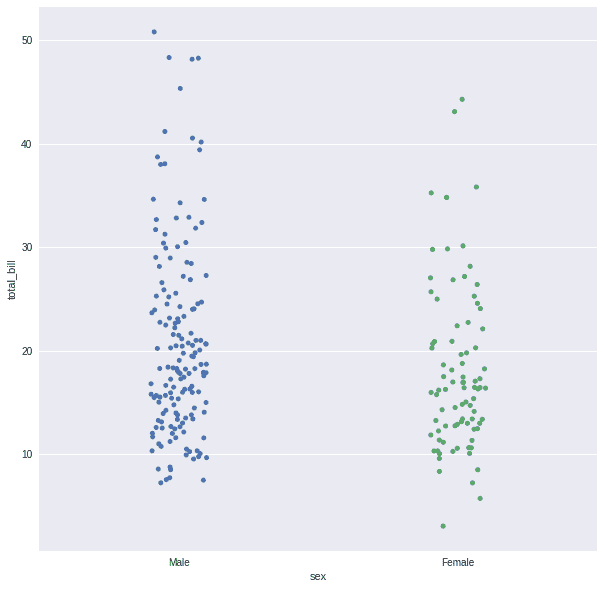
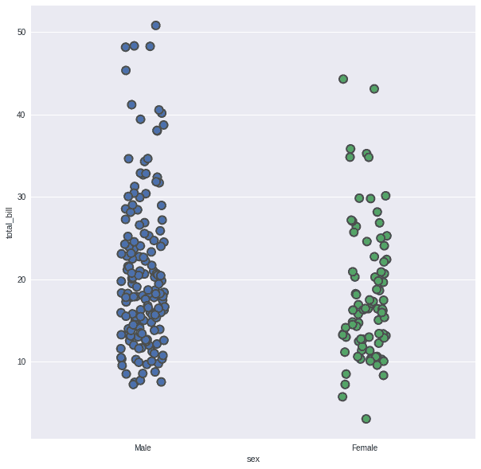
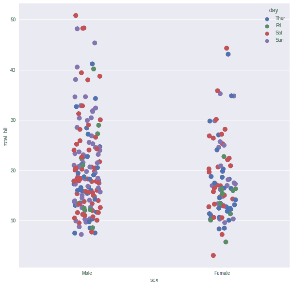
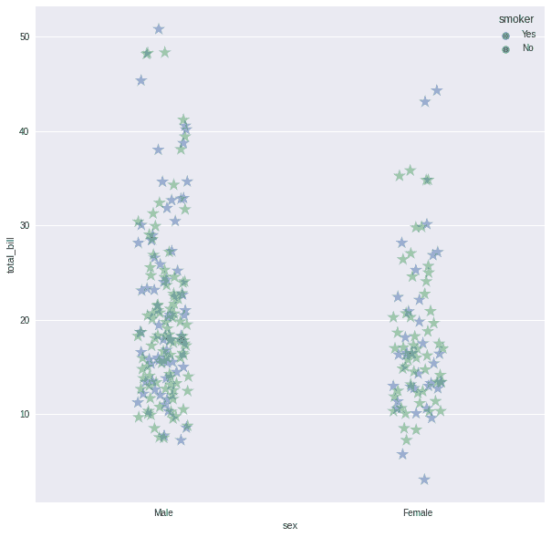

# Python 中的 Seaborn stripplot()方法——快速指南

> 原文：<https://www.askpython.com/python-modules/seaborn-stripplot-method>

嘿程序员们！在今天的教程中，我们将探索 Python 中的 Seaborn stripplot()方法。我们开始吧！

## Seaborn stripplot 简介()

Seaborn 是一个非常棒的统计图形可视化工具。它有很好的默认样式和调色板，使统计图表更有吸引力。它是在 matplotlib 软件之上设计的，并与 pandas 数据结构紧密相连。

带状图是完全独立创建的。在所有数据都与基本分布的一些表示一起给出的情况下，它是箱线图或紫线图的一个很好的补充。它用于根据类别生成散点图。

* * *

## 在 Python 中使用 Seaborn stripplot()方法

现在让我们进入编码部分。我将在下面用一个非常简单的例子来演示这个方法，这样你就能理解了。您可以从那里进一步探索该方法，并从官方文档中了解更多高级用例。

### 导入必要的模块/库

```py
import seaborn
import matplotlib.pyplot as plt
plt.style.use("seaborn")

```

### 加载数据集

Tips 数据集是 seaborn 包中包含的示例数据集之一，它用于 seaborn 包的文档中。使用 seaborn load dataset 命令可以很容易地导入它。

```py
tips = seaborn.load_dataset("tips")

```

### 基本可视化

让我们用小费数据集画一个带状图，比较他们支付的性别和总账单。

```py
plt.figure(figsize=(10,10))
seaborn.stripplot(x="sex", y="total_bill", data=tip)
plt.show()

```



Basic Visualization Stripplot

### 围绕数据点绘制轮廓

灰色线条的宽度构成了绘图部分的框架。当我们增加线宽时，点也自动增加。

```py
plt.figure(figsize=(10,10))
seaborn.stripplot(y="total_bill", x="sex", data=tips,linewidth=2,size=10)
plt.show()

```



Border Around Points Stripplot

### 使用色调参数

虽然这些点是用两种颜色绘制的，但是可以使用第三个变量通过给这些点着色来为绘图提供额外的维度。

```py
plt.figure(figsize=(10,10))
seaborn.stripplot(x="sex", y="total_bill", hue="day", data=tips,size=10)
plt.show()

```



Hue Parameter Stripplot

### 使用标记和 alpha 参数

我们将使用 alpha 来控制数据点的透明度，并使用标记来修改它。

```py
plt.figure(figsize=(10,10))
seaborn.stripplot(x="sex", y="total_bill", hue="smoker", data=tips,size=15,marker="*",alpha=0.5)
plt.show()

```



Marker N Alpha Stripplot

* * *

## 结论

恭喜你！您刚刚学习了如何使用 seaborn 库在 Python 中绘制带状图。希望你喜欢它！😇

喜欢这个教程吗？无论如何，我建议你看一下下面提到的教程:

1.  [绘制数学函数——如何用 Python 绘制数学函数？](https://www.askpython.com/python/examples/plot-mathematical-functions)
2.  [使用 Python 从 Excel 表格中绘制数据](https://www.askpython.com/python/examples/plot-data-from-excel-sheet)
3.  [Python:绘制平滑曲线](https://www.askpython.com/python-modules/matplotlib/smooth-curves)
4.  [Python 情节:在 Python 中创建动画情节](https://www.askpython.com/python-modules/matplotlib/animated-plots)

感谢您抽出时间！希望你学到了新的东西！！😄

* * *