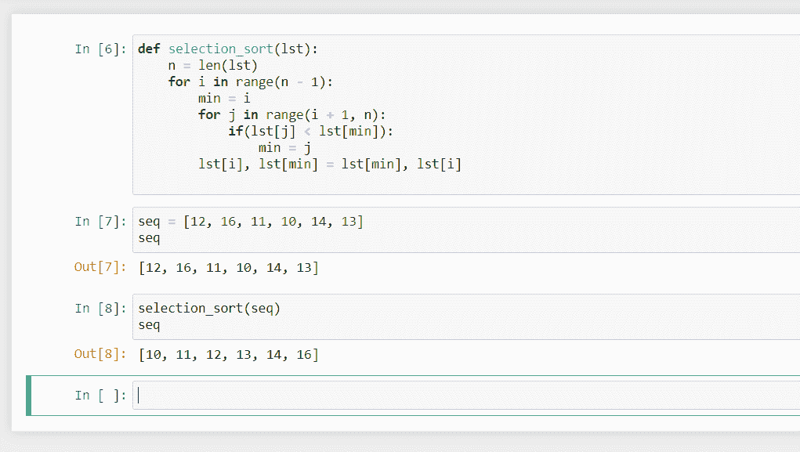

# Python 中的选择排序

> 原文：<https://www.askpython.com/python/selection-sort-in-python>

今天我们将学习一个简单且易于可视化的排序算法，在 Python 中称为选择排序。让我们开始吧。

## 选择排序算法

类似于[插入排序](https://www.askpython.com/python/examples/insertion-sort-in-python)，插入排序算法将列表分为两部分。列表开头的第一部分是已排序的部分，列表末尾的第二部分是未排序的部分。

最初，整个列表是未排序的，但是随着每次迭代，列表中最小的项目被搜索(对于升序列表)并被添加到排序的部分。

这是如何发生的，我们一个接一个地找到未排序部分中最小的项目，并将其与正确位置上的项目交换。

所以在第一次迭代中，最小的项与第一个位置的项交换。在第二次迭代中，第二小的项与第二个位置的项交换。诸如此类…

## 在 Python 中实现选择排序

下面是 Python 中选择排序的一个简单实现。

```py
def selection_sort(lst):
    n = len(lst)
    for i in range(n - 1):
        min = i
        for j in range(i + 1, n):
            if(lst[j] < lst[min]):
                min = j
        lst[i], lst[min] = lst[min], lst[i]

```

请注意，该函数接收一个列表并就地执行排序，修改算法以返回一个排序列表相当简单。

## 解释选择排序算法的步骤

这个算法将列表按升序排序，让我们看看它是如何工作的。

*   变量`n`是列表中的项目数。
*   现在，`i`从`0`到`n - 2`，也就是说`i`从第一项指向倒数第二项。`i`的作用是它会一直指向下一个最小的项会去哪里，所以我们会找到从`i`到列表末尾的最小项，它会被放在`i`。
*   我们现在认为`i`处的项目是最小的，因为如果我们在`i`之后找不到更小的元素，那么`i`就拥有正确的项目。
*   在里面，`j`从`i + 1`到`n - 1`，也就是说`j`会指向`i`之后的所有项目，它会负责找到那个范围内最小的项目。
*   现在我们将`j`处的物品与我们已经找到的最小物品进行比较，如果`j`处的物品更小，那么它将成为我们已经找到的最小物品。
*   在内部循环之后，我们已经找到了从`i`到`n - 1`的最小项目，并且它与在`i`的项目交换，以便它到达它的正确位置。
*   外部循环将继续选择并一个接一个地放置下一个最小的项目，直到整个列表被排序。

现在我们将试着在一个例子上运行这个算法，看看它如何影响序列。

让我们把顺序想成 12，16，11，10，14，13。
**给出列表的大小(n): 6**

12，16，11， 10 ，14，13
10，16， 11 ，12，14，13
10， 11 ，16， 12 ，14，13
15， 11 ， 16
10 ， 11 ， 12 ， 13 ， 14 ， 16

*   绿色的数字是已经排序的数字。
*   蓝色的数字是没有排序的数字中最小的。
*   未着色的要分类。

可以看出，该算法找到最小的项目，然后将它们与正确位置的项目交换。

## 输出

对算法运行相同的列表将产生以下结果:



Selection Sort in action

## 结论

在本教程中，我们看到了选择排序是如何工作的，我们用 Python 实现了该算法，并使用代码的实际输出验证了一个示例的模拟运行。

选择排序，类似于[冒泡](https://www.askpython.com/python/examples/bubble-sort-in-python)和插入排序，复杂度为 O(n² )。这意味着，如果输入大小加倍，执行该算法所需的时间将增加四倍，因此，这是一种低效的排序算法。

它的效率通常不如插入排序，但理解和实现起来要简单得多。我希望你喜欢学习选择排序，下一课再见。