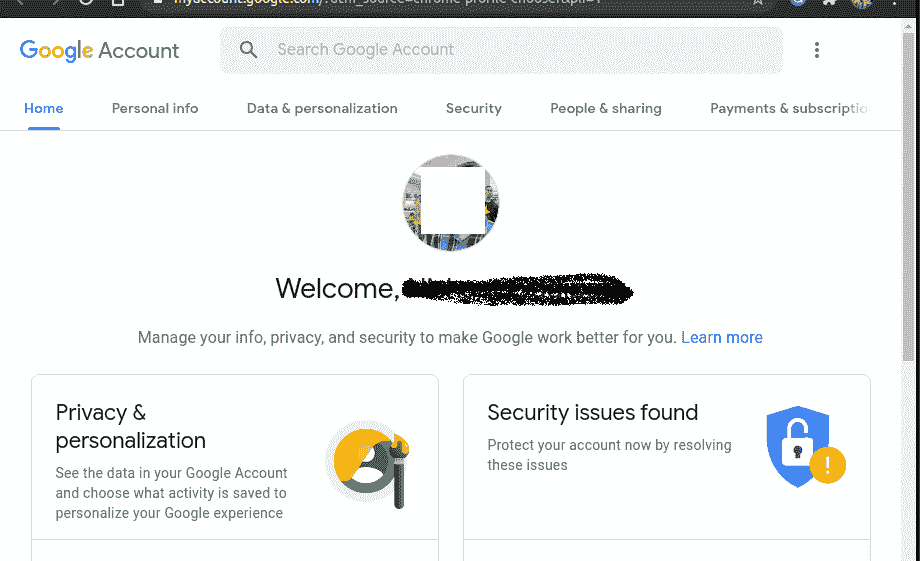
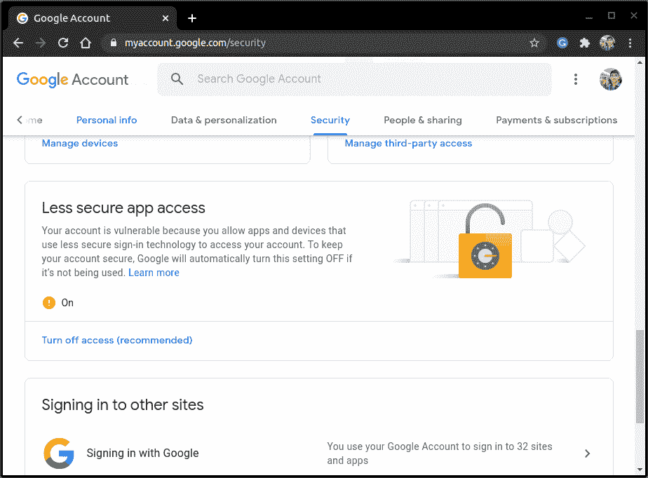
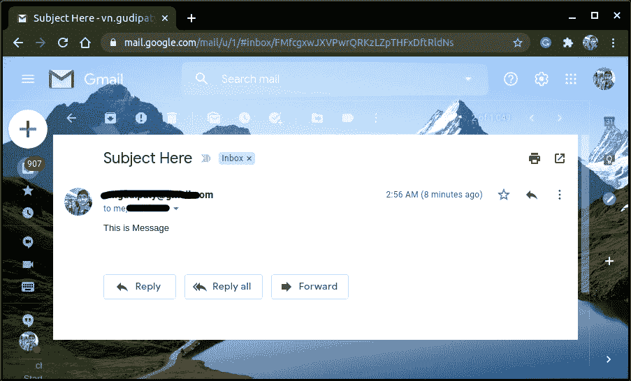
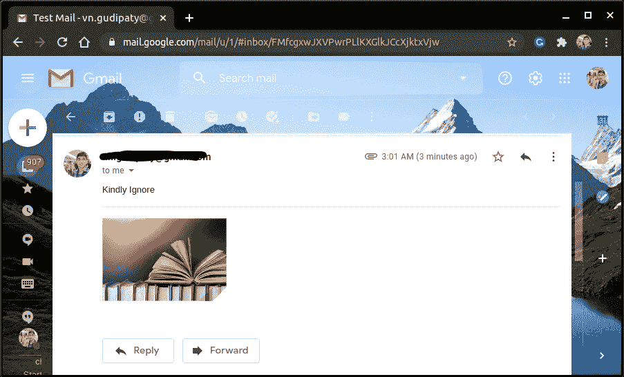

# 使用 Django 发送电子邮件

> 原文：<https://www.askpython.com/django/send-emails-using-django>

在本文中，我们将学习使用 Django 通过 Django 邮件库自动向用户发送电子邮件，Django 邮件库是 Python 的 **smtplib** 模块的扩展。

## **什么是 SMTP？**

SMTP 服务器代表**简单邮件传输协议**，这是一个用于电子邮件传输的社区协议。SMTP 由一组允许软件在互联网上传输邮件的社区准则组成。这是一个使用电子邮件地址向其他用户发送邮件的程序。

**SMTP 服务器**:是从一个客户端向另一个客户端发送/接收或转发邮件的应用程序。

例如，谷歌的 SMTP 服务器地址是**smtp.gmail.com。**同样，苹果的 SMT 服务器有【smtp.apple.com】、等。

## 如何使用 Django 发送电子邮件？

既然我们知道了 SMTP 服务器以及电子邮件是如何生成的，现在让我们制作一个应用程序来使用 Python Django 发送电子邮件。

### 1.Settings.py 的新增内容

在 settings.py 文件中，我们需要添加下面的 email [字典变量](https://www.askpython.com/python/dictionary/python-dictionary-dict-tutorial):

```py
EMAILS = [
    {
        EMAIL_BACKEND = 'django.core.mail.backends.smtp.EmailBackend',
        EMAIL_HOST = 'smtp.gmail.com',
        EMAIL_PORT = 8000,
        EMAIL_HOST_USER = '[email protected]',
        EMAIL_HOST_PASSWORD = 'xyz',
        EMAIL_USE_TLS = True,
        EMAIL_USE_SSL = False,
        }
]

```

确保使用提供商提供的 SMTP 服务器更改 SMTP_HOST。此外，使用您的凭据更改电子邮件和密码。

### 2.TLS 和 SSL 的区别

**TLS** 和 **SSL** 的功能是相同的；它们用于加密服务器/客户端或系统之间的数据和信息。 **TLS(传输层安全)**是 **SSL(安全套接字层)**的后继协议。

TLS 或 **SSL** 取决于你使用的服务器，在 Gmail 的情况下，是 **TLS** 。

在本文中，我将使用 Gmail 本身，因此将选择 **TLS。**根据您的服务器，您可以使用这两者中的任何一种。

## **编写发送电子邮件的代码**

现在我们已经设置好了，让我们来编写发送电子邮件的代码。

### 1.使用 send_mail()单独发送电子邮件

教程的这一部分讲述了给你的收件人发送个人邮件的方法。我们将通过 send_mail()函数来实现这一点。send_mail 的语法是:

```py
send_mail(
    subject = 'This is Subject Message',
    message = 'This is email Message',
    from_email = 'Sender Email ID',
    recipient_list = 'Recipient's Email',
    fail_silently = False,
    html_messages = 'HTML messages',
)

```

在 Views.py 中，添加代码:

```py
from django.core.mail import send_mail

send_mail(
    subject = 'Test Mail',
    message = 'Kindly Ignore',
    from_email = '[email protected]',
    recipient_list = ['[email protected]',],
    fail_silently = False,
)

```

### 2.使用 send_mass_mail()发送多封电子邮件

在本节中，我们将回顾发送批量电子邮件的步骤。这里我们将使用 send_mass_mail()方法。**发送大量邮件**的语法:

```py
send_mass_mail(
    (datatuple),
    fail_silently = False,
)

```

这里的数据元组是包含关于个人电子邮件信息的[元组](https://www.askpython.com/python/tuple/python-tuple)。

```py
message1 = (subject, message, from_email, recipient_list)
message2 = (subject, message, from_email, recipient_list)
message3 = (subject, message, from_email, recipient_list)

send_mass_mail((message1,message2,message),fail_silently =False)

```

在 views.py 中，代码如下所示:

```py
from django.core.mail import send_mail

message1 = ('Subject Here', 'This is Message','[email protected]',['[email protected]','[email protected]'])
message2 = ('Subject Here', 'This is Message','[email protected]',['[email protected]','[email protected]'])

send_mass_mail(
    (message1,message2),
    fail_silently = False,
)

```

### **3。使用 Django Email** Message()方法发送电子邮件

此方法用于发送高级邮件，具有密件抄送、抄送或附件等功能。这个 Django 方法由电子邮件后端处理。

电子邮件后端类需要三个步骤:

1.  **connection.open** ():确保发送邮件的长期连接。
2.  **connection.close()** :停止已建立的连接
3.  **send _ message**():**发送邮件；如果连接尚未打开，那么它会临时打开连接来发送邮件。**

占位符语法是:

```py
email1 = EmailMessage(
    subject = 'This is subject',
    message = 'This is message',
    from_email = '[email protected]',
    to = ['[email protected]',],
    bcc = ['[email protected]'],
    cc = ['[email protected]'],
)

```

因此，在 view.py 中添加以下代码:

```py
from django.core import mail
connection = mail.get.connection()

connection.open()

email = mail.EmailMessage(
    subject = 'Test Mail',
    message = 'Kindly Ignore',
    from_email = '[email protected]',
    to = ['[email protected]',],
    bcc = ['[email protected]'],
)

connection.send_messages(email)
connection.close()

```

**文件附件**:

EmailMessages()方法提供。**attach _ file(‘文件路径’)**随电子邮件发送附件的方法。您可以添加以下代码来附加文件:

```py
email1.attach_file('home/Desktop/books.jpg')

```

## 实施准则

现在我们已经讨论了代码的各个部分，让我们把它们放在一起，看看它是如何工作的。因此，在您的 **views.py** 中添加一个示例脚本(结合上一节中的所有代码):

```py
from django.core.mail import send_mail

#Sending mails individualy
send_mail(
    subject = 'Test Send Mail #1',
    message = 'Kindly Ignore',
    from_email = '[email protected]',
    recipient_list = ['[email protected]',],
    fail_silently = False,
)

#Sending mass mails
message1 = ('Test Subject message1 #2', 'This is Message','[email protected]',['[email protected]','[email protected]'])
message2 = ('Test Subject message2 #2', 'This is Message','[email protected]',['[email protected]','[email protected]'])

send_mass_mail(
    (message1,message2),
    fail_silently = False,
)

#Sending mails using EmailMessage along with attachments
from django.core import mail
connection = mail.get.connection()

connection.open()
email = mail.EmailMessage(
    subject = 'Test Mail',
    message = 'Kindly Ignore',
    from_email = '[email protected]',
    to = ['[email protected]',],
    bcc = ['[email protected]'],
)
email.attach_file('home/Desktop/books.jpg')
connection.send_messages(email)
connection.close()

```

第一次使用 Gmail 发送电子邮件时请注意；由于默认的安全设置，您可能会收到 SMTP 错误。

为此，请转到发件人 gmail 帐户中的**管理您的帐户**



Manage You Account Edited

然后转到顶部面板上的**安全**，打开**低安全访问。**



Less Secure Your Account

就这样，现在试着运行你的代码！它将开始发送电子邮件。在终端中运行服务器:

```py
python manage.py runserver

```

就这样，现在所有的邮件都发出去了！电子邮件将如下所示:



Email



Attachment Email

## **结论**

就这样，编码员们！我们现在可以使用 Django 从我们的 Web 应用程序成功发送电子邮件了。

你可以试着实现上面的代码作为练习。下一篇文章再见！！继续练习！！