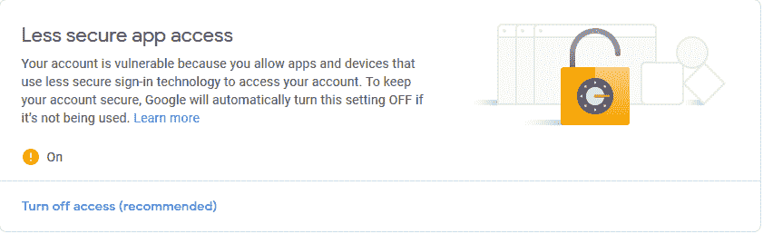
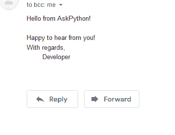

# Python how to–使用 Python 发送电子邮件

> 原文：<https://www.askpython.com/python/examples/sending-emails-using-python>

大家好！在今天的文章中，我们将看看如何使用 Python 发送电子邮件。

## 发送电子邮件–简要概述

通常，发送电子邮件的任务是使用 MTP(邮件传输协议)完成的。目前，有一种称为 SMTP(简单邮件传输协议)的独立协议，它是广泛使用的发送电子邮件的协议。

与其他协议类似，该协议基于客户端-服务器工作。当我们想要发送电子邮件到目标机器时，我们(客户端)需要发送邮件内容到 SMTP 服务器。服务器现在会将其路由到所需的目标机器。

因此，为了发送电子邮件，你需要使用 SMTP 服务器。虽然您可能有一个自定义的 SMTP 服务器，但我们将使用 Gmail 的免费 SMTP 服务器通过 Gmail 发送电子邮件！

* * *

## 使用 Python 发送电子邮件的先决条件设置

在阅读本教程的其余部分之前，我建议你建立一个虚拟的 gmail 帐户，你可以用它来测试发送电子邮件。

设置好帐户后，您还需要做一件事。

默认情况下，您的 Gmail 帐户未配置为允许来自安全性较低的应用程序(如 SMTP)的访问。我们需要为我们的帐户启用此访问权限。

您可以进入您的 gmail 帐户配置页面，从您的谷歌帐户启用访问。



Less Secure Access Gmail

现在，您已经准备好使用 Python 发送电子邮件了！我们继续吧。

* * *

## 使用 Python SMTP 发送电子邮件

Python 有一个 SMTP 客户端库(`smtplib`)，它将使用这个库向 SMTP 服务器(Gmail)发送电子邮件。

这是标准库的一部分，可以直接导入！

```py
import smtplib

```

好了，现在让我们试着写一个发送测试邮件的脚本。

任何使用 SMTP 的电子邮件必须包含以下内容:

*   发件人地址
*   接收者地址
*   主题(可选)
*   邮件的正文

让我们把它们都写下来。

```py
import smtplib

sender_address = "[email protected]" # Replace this with your Gmail address

receiver_address = "[email protected]" # Replace this with any valid email address

account_password = "xxxxxxxxxx" # Replace this with your Gmail account password

subject = "Test Email using Python"

body = "Hello from AskPython!\n\nHappy to hear from you!\nWith regards,\n\tDeveloper"

# Endpoint for the SMTP Gmail server (Don't change this!)
smtp_server = smtplib.SMTP_SSL("smtp.gmail.com", 465)

# Login with your Gmail account using SMTP
smtp_server.login(sender_address, account_password)

# Let's combine the subject and the body onto a single message
message = f"Subject: {subject}\n\n{body}"

# We'll be sending this message in the above format (Subject:...\n\nBody)
smtp_server.sendmail(sender_address, receiver_address, message)

# Close our endpoint
smtp_server.close()

```

**确保用您的 Gmail 帐户信息替换**`sender_address`、`receiver_address`和`account_password`！

我们正在做的是使用 SMTP 服务器访问我们的 Gmail 帐户，使用安全的 SMTP ( `SMTP_SSL`)。我们登录后，可以直接发送消息给接收者，使用`smtp_server.sendmail()`！

现在，如果你输入相同的发件人和收件人帐户，你会收到一封类似我的电子邮件。


Python Test Email

让我们检查一下里面的东西。



Python Test Email Result

事实上，我们刚刚使用 Python 发送了一封合适的电子邮件！

您可以改进代码，使用[上下文管理器](https://www.askpython.com/python/python-with-context-managers)来确保资源总是关闭的。

```py
import smtplib

sender_address = "[email protected]" # Replace this with your Gmail address

receiver_address = "[email protected]" # Replace this with any valid email address

account_password = "xxxxxxxxxx" # Replace this with your Gmail account password

subject = "Test Email using Python"

body = "Hello from AskPython!\n\nHappy to hear from you!\nWith regards,\n\tDeveloper"

# We can use a context manager
with smtplib.SMTP_SSL("smtp.gmail.com", 465) as smtp_server:
    # Login with your Gmail account using SMTP
    smtp_server.login(sender_address, account_password)

    # Let's combine the subject and the body onto a single message
    message = f"Subject: {subject}\n\n{body}"

    # We'll be sending this message in the above format (Subject:...\n\nBody)
    smtp_server.sendmail(sender_address, receiver_address, message)

```

这将给出与之前相同的结果-另一封电子邮件！

* * *

## 结论

在这篇文章中，我们看了如何使用 Python 通过 gmail 的 SMTP 服务器轻松发送电子邮件。

## 参考

*   Python SMTP [文档](https://docs.python.org/3/library/smtplib.html)

* * *