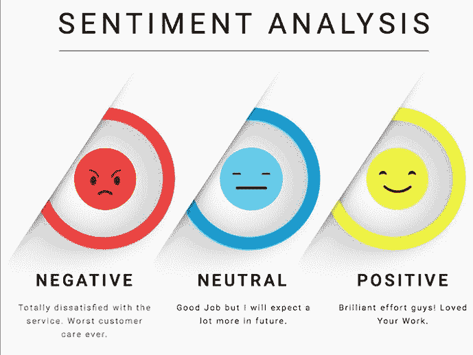

# 使用 Python 进行情感分析

> 原文：<https://www.askpython.com/python/sentiment-analysis-using-python>

欢迎来到使用 Python 进行情感分析的教程。众所周知，人类的情感经常以面部表情、语言交流甚至书面方言或评论的形式表现出来。让我们看看如何使用 Python 来预测这一点。

## 使用 Python 进行情感分析简介

随着机器学习的趋势，不同的技术被应用于数据，以做出类似于人脑的预测。

人工智能对这些任务的阐述，将我们带入了深度学习和自然语言处理的深处。

情感分析是一种自然语言处理技术。

## 什么是自然语言处理？

自然语言处理(NLP)是人工智能的一个子集，机器被训练来分析文本数据。情感分析是一种预测作者情感的 NLP 技术。对于情绪，我们通常指的是积极的、消极的或中性的。



NLP 是一个广阔的领域，情感检测的任务可以使用内置的库来完成，例如 NLTK(自然语言工具包)和各种其他的库。

## 清理文本以进行解析和处理

任何原始形式的文本数据都不能被 NLP 库分析。需要使用各种数据处理技术来清理这些数据，例如:

*   消除 HTML 标签:非结构化的文本包含了大量的噪音，因此我们需要移除 HTML 标签。
*   **消除重音字符:**由于 NLP 主要适用于英语，重音字符的存在毫无意义，因此需要删除。
*   **扩展缩写**:音节在英语口语中经常使用，因此有必要将其扩展为原始形式。
*   **去除特殊字符**:文本中任何非字母数字字符都需要去除。
*   **词汇化/词干化**:需要得出单词的基础形式，即游泳的基础形式是 swim。
*   **去掉停用词:**冠词、连词、介词等停用词需要去掉。

在所有上述过程之后，我们的文本(在 NLP 术语中通常称为语料库)被传递到我们的情感分析模型。

我放了一些经过上述过程转换的例句。

```py
Before: 
Terrible airport with arrogant staff and poor signage.

After:
terrible airport arrogant staff poor signage

```

```py
Before:
The airport is huge and has almost all the facilities making the transit smooth.

After:
airport huge almost facility make transit smooth

```

```py
Before:
The display told me that desks 59-62 were for Silkair, but in reality it was from 52-55.

After:
display tell desk 59 62 silkair reality 52 55

```

我们将在下面的情感分析模型中使用上面经过预处理的句子。

## 使用 Python 执行情感分析

我们将首先使用 Python 对其进行编码，然后传递示例来检查结果。我们将使用 TextBlob 库来执行情感分析。

在下面定义的函数中，文本语料库被传递到函数中，然后 TextBlob [对象](https://www.askpython.com/python/oops/python-classes-objects)被创建并存储到分析对象中。

文本通过`TextBlob()`后获得了一些属性，比如包含极性的情感。然后检查这些极性值。

如果极性大于 0，情感为`positive`，如果极性等于 0，情感为`neutral`，如果极性小于 0，情感为`negative`。

```py
from textblob import TextBlob
def get_tweet_sentiment(text):
        analysis = TextBlob(textt)
        if analysis.sentiment.polarity > 0:
            return 'positive'
        elif analysis.sentiment.polarity == 0:
            return 'neutral'
        else:
            return 'negative' 

```

我们的示例语句的输出如下:

```py
Input corpus:
terrible airport arrogant staff poor signage

Sentiment:
negative

```

```py
Input corpus:
display tell desk 59 62 silkair reality 52 55

Sentiment:
neutral

```

```py
Input corpus:
airport huge almost facility make transit smooth

Sentiment:
positive

```

## 完全码

```py
from textblob import TextBlob
def get_tweet_sentiment(text):
        analysis = TextBlob(textt)
        if analysis.sentiment.polarity > 0:
            return 'positive'
        elif analysis.sentiment.polarity == 0:
            return 'neutral'
        else:
            return 'negative' 

print(get_tweet_sentiment(<your text>))

```

### 我们模型的缺点

我们的情感分析模型无法预测任何讽刺评论的情感。事实上，预测讽刺性的推文不在 NLP 的范围内(截至今天)。

## 结论

我希望这篇文章对使用自然语言处理进行文本情感分析有所启发。请尝试你自己的陈述，并在评论区告诉我们你的反馈。