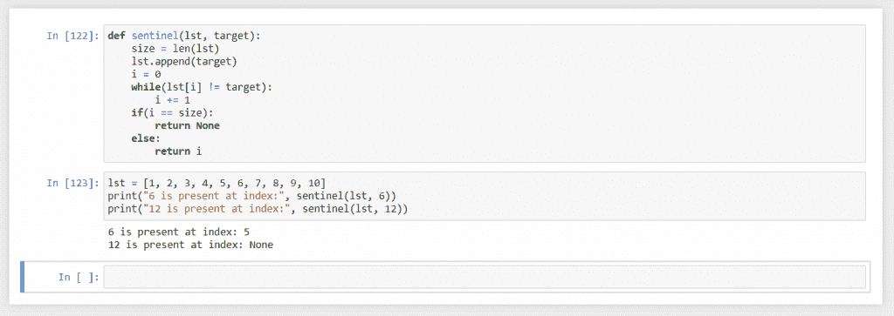

# Python 中的 Sentinel 搜索–简单解释

> 原文：<https://www.askpython.com/python/examples/sentinel-search>

Sentinel Search 是一种搜索算法，用于搜索以顺序方式存储的项目列表。在本教程中，我们将研究该算法如何工作，我们将把它与线性搜索进行比较，我们将使用该算法来看看它是否有效。

## 先决条件:线性搜索

在我们继续进行哨兵搜索之前，我们需要了解它为什么存在，为此我们需要首先了解 [**线性搜索**](https://www.askpython.com/python/examples/linear-search-algorithm) 。

在线性搜索中，我们线性地遍历列表中的每一项，并将其与目标进行比较，最后，我们要么找到所需的项，要么找不到。

在这个过程中，我们在每次迭代中进行两次比较。第一个比较是列表是否结束，第二个比较是当前条目是否匹配目标。但是，如果有一种方法可以减少这些比较，使搜索速度更快呢？这就是哨兵搜索打算做的。

## 什么是哨兵搜索？

类似于线性搜索，哨兵搜索是一种顺序搜索算法。这意味着我们要逐一比较列表中的每一项。但是这个算法比线性搜索更快，因为它减少了我们必须做的比较次数。

在 sentinel search 中，我们首先在列表的末尾插入目标，然后比较列表中的每一项，直到找到所需的项。要么所需的项目在列表中，在这种情况下，它将在我们到达列表末尾之前被找到。或者列表没有目标，所以算法会到达列表的末尾，找到我们插入的目标项。

在这里，我们只需要检查项目是否与目标匹配，不需要检查列表是否为空。这是因为我们无论如何都要找到目标，跳出这个循环。

最后，我们可以检查我们找到的项目是否已经存在或者是我们添加的。这种检查将只发生一次，算法的整个运行时间将大大减少，因为我们在循环的每次迭代中少做一次比较。

## 在 Python 中实现哨兵搜索

让我们看看用 python 写的 sentinel search:

```py
def sentinel(lst, target):
    size = len(lst)
    lst.append(target)
    i = 0
    while(lst[i] != target):
        i += 1
    if(i == size):
        return None
    else:
        return i

```

在上面的代码中，我们从获取列表的[大小开始，然后在列表的末尾追加目标。](https://www.askpython.com/python/list/length-of-a-list-in-python)

之后，我们启动一个 [while-loop](https://www.askpython.com/python/python-while-loop) 来检查当前项目是否与目标相同。既然我们已经把目标放在了最后，循环肯定会结束。

最后，我们检查它是否在最后一个元素结束。如果是，那么目标不在列表中，否则，它在列表中。我们相应地返回适当的值。

## 输出

让我们试着运行代码，看看它是如何工作的:



Sentinel Search Output

## 结论

在本教程中，我们看到了什么是 sentinel search，我们为什么使用它，它与线性搜索有何不同，它在 python 中的实现，最后是它的输出。

希望你学得愉快，下次教程再见。