# Python 中的 sigmoid 激活函数

> 原文：<https://www.askpython.com/python/examples/sigmoid-activation-function>

如果你正在学习神经网络，很有可能你已经遇到了术语**激活功能**。在神经网络中，激活函数决定特定神经元是否会被激活。激活函数将节点的加权和作为输入，并根据激活函数执行一些数学计算，并输出决定神经元是否将被激活的值。

它们有许多激活功能，如

*   继电器
*   [Softmax](https://www.askpython.com/python/examples/calculating-softmax)
*   [tanh](https://www.askpython.com/python/tanh-activation-function)
*   [线性](https://www.askpython.com/python/numpy-linear-algebraic-functions)
*   [泄漏继电器](https://www.askpython.com/python-modules/training-gan-in-pytorch)
*   乙状结肠的

在本教程中，我们将学习**乙状结肠激活功能**。所以让我们开始吧！

* * *

## 什么是 sigmoid 函数——它背后的数学

Sigmoid 是一个**非线性**激活函数。它主要用于我们需要预测某件事的概率的模型中。由于概率存在于 0 到 1 的取值范围内，因此乙状结肠的**范围也是从 **0 到 1** ，包括 0 和 1。让我们来看看 sigmoid 函数的方程。**

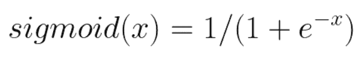

Sigmoid Equation

Sigmoid 通常用希腊符号 sigma 来表示。所以，我们也可以写

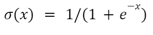

Sigmoid Equation 1

上式中， **e** 为欧拉数。其值约为 **2.718** 。同样的，

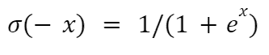

Sigmoid -x Equation 1

事实上，我们可以推导出上述两个方程之间的关系如下

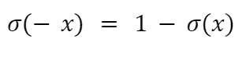

Sigmoid x And -x Relation

我们也可以证明这种关系，如下所示:

**LHS:**


LHS Equation 1

它也可以写成

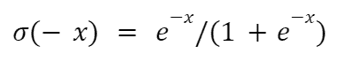

LHS Equation 2

**RHS:**

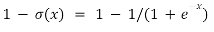

RHS Equation 1

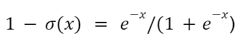

RHS Equation 2

因此，LHS=RHS

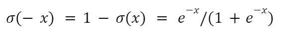

Sigmoid x And -x Relation Equation 2

因此，我们证明了这种关系。

sigmoid 激活函数的另一个性质是它是**可微的**。让我们看看如何区分它。

微分 *sigmoid 方程 1* 我们得到

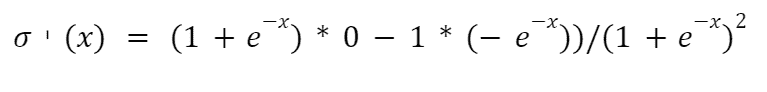

Sigmoid Differentiation Equation 1

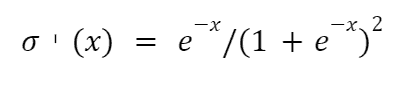

Sigmoid Differentiation Equation 2

所以，从*的 Sigmoid 方程 1* 、*的 Sigmoid x 和-x 关系方程 2* 和*的 Sigmoid 微分方程 2* ，我们可以写出

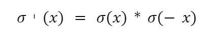

Sigmoid And Its Differentiation Equation 1

或者，

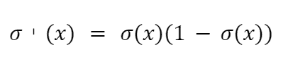

Sigmoid And Its Differentiation Equation 2

唷！那是一大堆数学！现在，让我们看看 sigmoid 函数的图形。

* * *

## 使用 Python Matplotlib 的 Sigmoid 图

```py
#importing the required libraries
from math import exp
from matplotlib import pyplot as plt 

#defining the sigmoid function 
def sigmoid(x):
    return 1/(1+exp(-x))

#input 
input = []
for x in range(-5, 5):
    input.append(x)

#output
output = []
for ip in input:
    output.append(sigmoid(ip))

#plotting the graph
plt.plot(input, output)
plt.title("Sigmoid activation function")
plt.grid()
#adding labels to the axes
plt.xlabel("x")
plt.ylabel("sigmoid(x)")
plt.scatter([0], [0.5], color="red", zorder=5) 
plt.show()

```

**输出:**

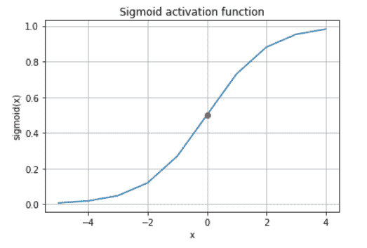

Sigmoid Plot

上面的图让我们了解了 sigmoid 函数的一些性质。它们是:

*   **S 形:**`sigmoid`的图形和`tanh`激活函数的图形一样是 S 形的。
*   **域:**`sigmoid`的域为(-∞，+∞)。
*   **连续:**`sigmoid`函数处处连续。
*   `sigmoid`函数是**单调递增的**。
*   **sigmoid(0)= 0.5**

* * *

## 乙状结肠与 tanh 的关系

我们之前在教程中讨论过 [tanh 激活](https://www.askpython.com/python/tanh-activation-function)功能。

双曲正切的公式是:

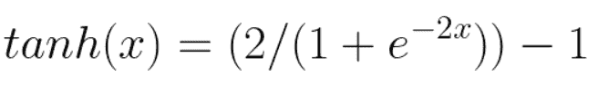

tanh Equation

而且，

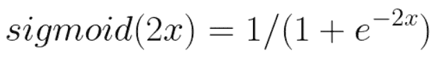

Sigmoid(2x) Equation

这两个功能是相关的:

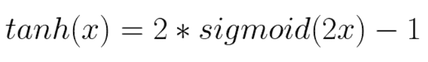

Tanh Sigmoid Relation Equation

* * *

## 摘要

让我们快速回顾一下:sigmoid 激活函数是非线性的、单调的、S 形的、可微分的和连续的。仅此而已！我们已经了解了 sigmoid 激活函数及其性质。

希望这篇教程对你有所帮助。请点击查看更多与 Python 相关的教程[。](https://www.askpython.com/)