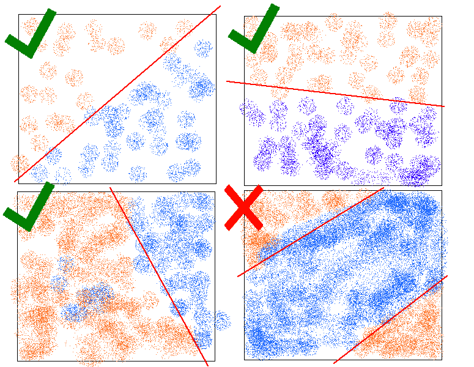

# 构建单一感知器神经网络

> 原文：<https://www.askpython.com/python/examples/single-perceptron-neural-network>

欢迎光临。今天，我们将讨论如何构建一个基本的单感知器神经网络。

我想让这成为我们深入探究一切的系列文章的第一篇——CNN、迁移学习等等。因此，请务必将该网站加入书签，并经常查看。此外，这将包括一些数学，所以系好安全带。

## 什么是感知器？

它是神经网络(NN)的最基本单元。在一个复杂的神经网络中，所有的数据都要经过其中的几个环节，这些环节通常同时进行，并扮演不同的角色。但我们稍后会谈到这一点。

目前，什么是感知机？

在监督学习中，感知器是一种线性分类器。因此，任何可以被一条直线分割的数据集都可以使用感知器进行分类，即任何看起来像这样的数据集:



Linearly Separable Dataset Examples

最后一条不能被认为是线性可分的，因为它不是一条可以近似分离数据库的直线。


Perceptron

## 构建单一感知器神经网络

今天让我们继续构建我们的第一个单感知器神经网络。为此，我们将从创建数据开始。

### 1.创建我们的数据集

首先，我们需要数据集，在我们的例子中是一个 [2D 数组](https://www.askpython.com/python/array/python-array-declaration)。打开你的[代码编辑器](https://www.askpython.com/python/top-best-ides-for-python)，Jupyter 笔记本，或者 Google Colab。

```py
import pandas as pd
import numpy as np
import random

```

让我们制作数据。我在这个例子中考虑一个 20*20 的平面，以保持我们的结果小而简洁。

```py
#Dataset
df = pd.DataFrame()
df['x'] = [random.randint(1,20) for x in range(10)]
df['y'] = [random.randint(1,20) for x in range(10)]
df.head()

```

现在，我们需要给这些贴上标签。所以我们会根据一条线过滤掉(我考虑的是 y=x)。所以线下面的每个点都是 y&lt;x。

```py
label=[]
for i in range(df.shape[0]):
  if df.iloc[i,0] < df.iloc[i,1]:
    label.append(1)
  else:
    label.append(-1)

df['label'] = label
df

```


Dataset With Labels For Neural Nets Perceptron Model

### 2.初始化值的权重

现在我们可以初始化权重。我们不能使用零值，所以我们将对权重采用[随机](https://www.askpython.com/python-modules/python-random-module-generate-random-numbers-sequences)均匀分布:

```py
#weights and bias
weights = [np.round(random.uniform(-0.99,0.99),2) for i in range(2)]

```

**然后，我们将权重乘以输入数据点并求和:**

```py
w = weights.copy()
X = [[df.iloc[i,0],df.iloc[i,1]] for i in range(df.shape[0])]
wx = [X[i][0]*w[0]+X[i][1]*w[1] for i in range(df.shape[0])]

```

现在，我们有了每个点的权重和输入的总和。

那么程序是什么，我们将把所有这些值一次一个地插入到激活函数中，然后基于输出我们将修改权重。

### 3.创建激活函数

现在我们来看激活函数。感知器处理总和，给我们一个标签，我们与原始标签进行比较，确定是否正确。如果不正确，则找到错误并调整权重，使得我们的解* ***在原始方向上移动*** *。

我们将使用 signum 函数:

如果 wx <=0，则输出为 0。否则，输出为 1。

```py
for i in range(df.shape[0]):
  if wx[i]<=0:
    pred = 0
  else:
    pred = 1

```

记住，我们只有两个输入:x 和 y，而不是整个数据帧。因此，我们将扩展这个激活函数，一次接收一个数据点，然后找出误差并调整误差:

```py
for i in range(df.shape[0]):
  if wx[i]<=0:
    pred = -1
  else:
    pred = 1
  if pred != df['label'][i] :
    err = df['label'][i] - pred
    w[0] = w[0] + err
    w[1] = w[1] + err

```

这个现在工作得很好。为了清楚地看到输出，我们将输入一组打印语句:

```py
for i in range(df.shape[0]):
  print('wx : ',wx[i])
  if wx[i]<=0:
    pred = -1
  else:
    pred = 1
  print('label=',df['label'][i])
  print('pred = ',pred)
  if pred != df['label'][i] :
    err = df['label'][i] - pred
    print('err',err)
    print('before', w[0],w[1])
    w[0] = w[0] + err
    w[1] = w[1] + err
    print('after',w[0],w[1])
  else:
    print('w_i', w[0],w[1])

```

现在如果我们运行这个:


Updating Weights Single Perceptron Neural Network

一个简单的打印格式语句给出了最终的重量。


Final Weights Single Perceptron Neural Network

### 4.在另一个数据库上测试我们的模型

类似于我们如何进行[训练-测试-分割](https://www.askpython.com/python/examples/split-data-training-and-testing-set)，我们将在这里使用不同的数据库进行测试。

```py
#Test Dataset
new_df = pd.DataFrame()
new_df['x'] = [random.randint(1,20) for x in range(100)]
new_df['y'] = [random.randint(1,20) for x in range(100)]
new_df.head()

```

然后，我们基于 y=x 线和权重之和*输入生成标签:

```py
label_text = []
for i in range(new_df.shape[0]):
  if new_df.iloc[i,0] < new_df.iloc[i,1]:
    label_text.append(1)
  else:
    label_text.append(-1)
new_wX = w[0]*new_df['x']+w[1]*new_df['y']

```

这是我的:


New Weight Sums Neural Net

那么，现在是关键时刻，我们应用我们的激活函数，然后我们可以比较给定的标签和预测的标签:

```py
new_df['given label'] = label_text
pred_label_text = []

for i in range(new_df.shape[0]):
  if new_wX[i]>=0:
    pred_label_text.append(-1)
  else:
    pred_label_text.append(1)

new_df['predicted labels'] = pred_label_text

```


Predicted Labels For New Dataset

如你所见，我们自己做得很好🙂

## 结论

祝贺您完成本教程。我希望这能让你对“感知机”有更多的了解。与我们保持联系，阅读我们未来的教程。