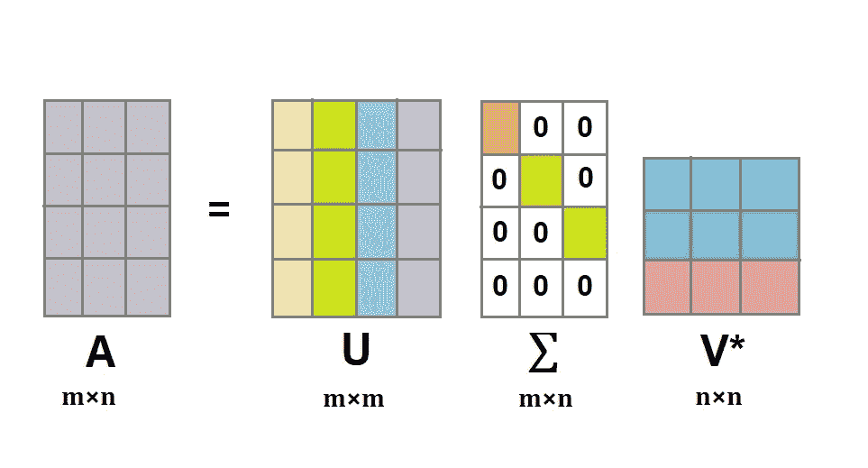
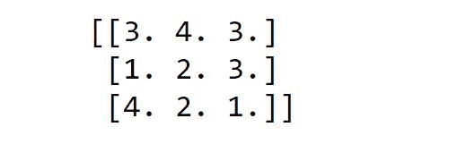
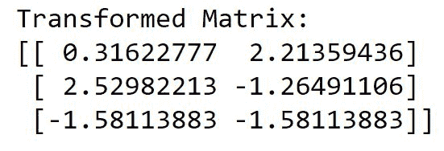

# Python 中的奇异值分解

> 原文：<https://www.askpython.com/python/examples/singular-value-decomposition>

**奇异值分解(SVD)是广泛使用的降维方法之一**。SVD 将一个矩阵分解成另外三个矩阵。

如果我们将矩阵视为在空间中引起线性变换的东西，那么通过奇异值分解，我们将单个变换分解为三个运动。

在本文中，我们将看到实现 SVD 的不同方法。

## 奇异值分解基础

SVD 将一个[单矩阵](https://www.askpython.com/python/python-matrix-tutorial)分别分解成矩阵 U，D，V*。



SVD

**其中，**

*   u 和 V*是正交矩阵。
*   d 是奇异值的对角矩阵。

SVD 也可以看作是将一个复杂的变换分解成 3 个简单的变换(旋转、缩放和旋转)。

**就变换而言**

*   矩阵 U 和 V*导致旋转
*   对角矩阵 D 导致缩放。

所以基本上它允许我们将原始矩阵表示为低秩矩阵的线性组合。只有前几个，奇异值大。

除了前几项之外的其他项可以忽略，而不会丢失太多信息，这就是 SVD 被称为降维技术的原因。

## SVD 在 Python 中的实现

让我们从 Python 中 SVD 的实现开始。我们将使用多个库来演示实现将如何进行。

### 1.使用 Numpy

Python Numpy 具有实现大多数线性代数方法的能力，这使得 SVD 的实现非常容易。

我们将使用具有`svd`类的`numpy.linalg`模块在矩阵上执行 SVD。

```py
import numpy as np

#Creating a matrix A
A = np.array([[3,4,3],[1,2,3],[4,2,1]])

#Performing SVD
U, D, VT = np.linalg.svd(A)

#Checking if we can remake the original matrix using U,D,VT
A_remake = (U @ np.diag(D) @ VT)
print(A_remake)

```



Restored Matrix

d 是 1D 数组而不是 2D 数组。d 是一个大部分值最终为零的对角矩阵，这样的矩阵称为**稀疏矩阵**。为了节省空间，它以 1D 数组的形式返回。

### 2.使用 scikit-learn

我们将使用来自`sklearn.decomposition`模块的`TruncatedSVD`类。

在`TruncatedSVD`中，我们需要指定输出中需要的组件数量，因此我们不需要计算整个分解，只需要计算所需的奇异值，并修整其余部分。

```py
#Importing required modules
import numpy as np
from sklearn.decomposition import TruncatedSVD

#Creating array 
A = np.array([[3,4,3],[1,2,3],[4,2,1]])

#Fitting the SVD class
trun_svd =  TruncatedSVD(n_components = 2)
A_transformed = svd.fit_transform(A)

#Printing the transformed matrix
print("Transformed Matrix:")
print(A_transf)

```



Transformed Matrix

## 结论

在本文中，我们看到了如何使用像 Numpy 和 scikit-learn 这样的库来实现奇异值分解(SVD)。

快乐学习！