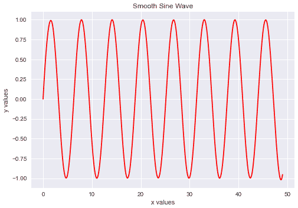
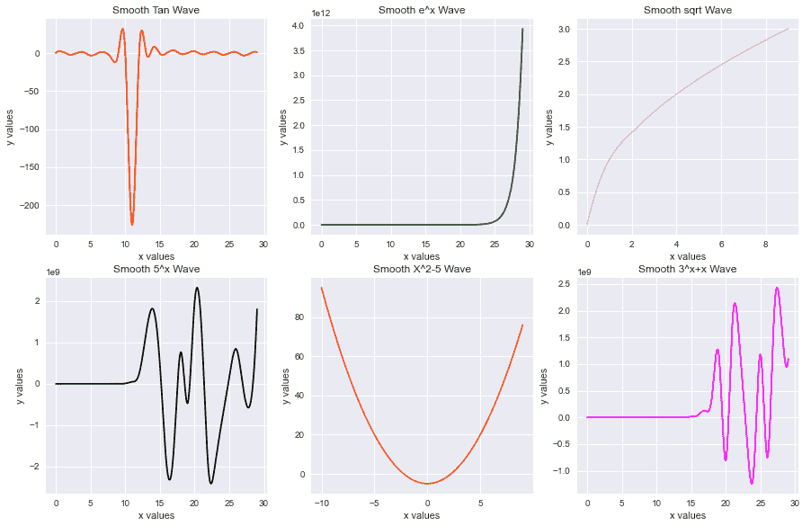

# Python:绘制平滑曲线

> 原文：<https://www.askpython.com/python-modules/matplotlib/smooth-curves>

嘿，同学们！今天我们将学习如何使用 matplotlib 和 SciPy 模块构建平滑曲线。

有时，您希望为[数据可视化](https://www.askpython.com/python-modules/data-visualization-using-python-bokeh)获得平滑曲线，以使绘图看起来更好、更优雅。幸运的是，在 matplotlib 和 [SciPy 模块](https://www.askpython.com/python-modules/python-scipy)的帮助下，同样可以实现。

***推荐阅读:[用 Python 创作动画剧情](https://www.askpython.com/python-modules/matplotlib/animated-plots)***

## **1。导入模块**

第一步是将所需的模块导入我们的程序。我们将要实现目标的模块`**numpy**`、`**matplotlib**` 和**、`SciPy`、**模块，其中 numpy 用于数据准备，matplotlib 用于绘制简单曲线，SciPy 用于帮助绘制平滑曲线。

```py
import numpy as np
from scipy.interpolate import make_interp_spline
import matplotlib.pyplot as plt

```

## **2。数据准备**

为了准备数据，我们将使用 [numpy 数组](https://www.askpython.com/python-modules/numpy/python-numpy-arrays)，因为它们更容易处理。我们将绘制一个正弦波，其中 x 坐标是 x 轴值，y 坐标是 x 的正弦值。

```py
x = np.array([i for i in range(50)])
y = np.array([np.sin(i) for i in x])

```

## **3。制作 B 样条曲线**

为了得到一条平滑的曲线，我们利用`make_interp_spline`函数通过传递 x 和 y 数组得到一条 B 样条曲线。它一起返回曲线的 x 和 y 系数。

我们需要做的下一件事是把系数彼此分开。下面的代码为您做了同样的事情。

```py
B_spline_coeff = make_interp_spline(x, y)
X_Final = np.linspace(x.min(), x.max(), 500)
Y_Final = B_spline_coeff(X_Final)

```

## 4.绘制数据集

现在，最后一步是使用 matplotlib 库和必要的函数和配置来绘制图形，以使图形看起来更好。

```py
plt.style.use('seaborn')
plt.plot(X_Final,Y_Final,color="red")
plt.title("Smooth Sine Wave")
plt.xlabel("x values")
plt.ylabel("y values")
plt.show()

```

最终输出图如下所示。



Smooth B Spline Curve

## 另一个例子

下面的代码在 matplotlib 的`subplot`函数的帮助下绘制了一些更平滑的曲线。

```py
plt.figure(figsize=(15,15))

plt.subplot(3, 3, 1)
x = np.array([i for i in range(30)])
y = np.array([np.tan(i) for i in x])

B_spline_coeff = make_interp_spline(x, y)
X_Final = np.linspace(x.min(), x.max(), 500)
Y_Final = B_spline_coeff(X_Final)

plt.style.use('seaborn')
plt.plot(X_Final,Y_Final,color="red")
plt.title("Smooth Tan Wave")
plt.xlabel("x values")
plt.ylabel("y values")

plt.subplot(3, 3, 2)
x = np.array([i for i in range(30)])
y = np.array([np.exp(i) for i in x])

B_spline_coeff = make_interp_spline(x, y)
X_Final = np.linspace(x.min(), x.max(), 500)
Y_Final = B_spline_coeff(X_Final)

plt.style.use('seaborn')
plt.plot(X_Final,Y_Final,color="green")
plt.title("Smooth e^x Wave")
plt.xlabel("x values")
plt.ylabel("y values")

plt.subplot(3, 3, 3)
x = np.array([i for i in range(10)])
y = np.array([np.sqrt(i) for i in x])

B_spline_coeff = make_interp_spline(x, y)
X_Final = np.linspace(x.min(), x.max(), 500)
Y_Final = B_spline_coeff(X_Final)

plt.style.use('seaborn')
plt.plot(X_Final,Y_Final,color="pink")
plt.title("Smooth sqrt Wave")
plt.xlabel("x values")
plt.ylabel("y values")

plt.subplot(3, 3, 4)
x = np.array([i for i in range(30)])
y = np.array([5**i for i in x])

B_spline_coeff = make_interp_spline(x, y)
X_Final = np.linspace(x.min(), x.max(), 500)
Y_Final = B_spline_coeff(X_Final)

plt.style.use('seaborn')
plt.plot(X_Final,Y_Final,color="black")
plt.title("Smooth 5^x Wave")
plt.xlabel("x values")
plt.ylabel("y values")

plt.subplot(3, 3, 5)
x = np.array([i for i in range(-10,10,1)])
y = np.array([i**2 -5 for i in x])

B_spline_coeff = make_interp_spline(x, y)
X_Final = np.linspace(x.min(), x.max(), 500)
Y_Final = B_spline_coeff(X_Final)

plt.style.use('seaborn')
plt.plot(X_Final,Y_Final,color="orange")
plt.title("Smooth X^2-5 Wave")
plt.xlabel("x values")
plt.ylabel("y values")

plt.subplot(3, 3, 6)
x = np.array([i for i in range(30)])
y = np.array([3**i + i for i in x])

B_spline_coeff = make_interp_spline(x, y)
X_Final = np.linspace(x.min(), x.max(), 500)
Y_Final = B_spline_coeff(X_Final)

plt.style.use('seaborn')
plt.plot(X_Final,Y_Final,color="magenta")
plt.title("Smooth 3^x+x Wave")
plt.xlabel("x values")
plt.ylabel("y values")

plt.show()

```

代码的输出如下所示。



Multiple B Spline Curve

## 结论

恭喜你！今天我们学习了使用 matplotlib 和 SciPy 模块绘制完美的平滑曲线。您也可以尝试各种其他示例。

编码快乐！

感谢您的阅读！