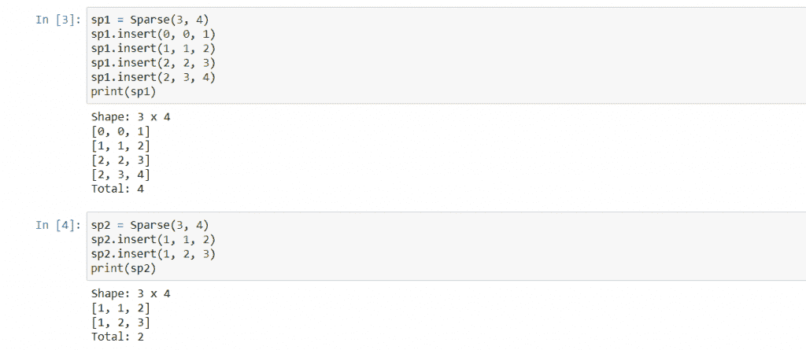
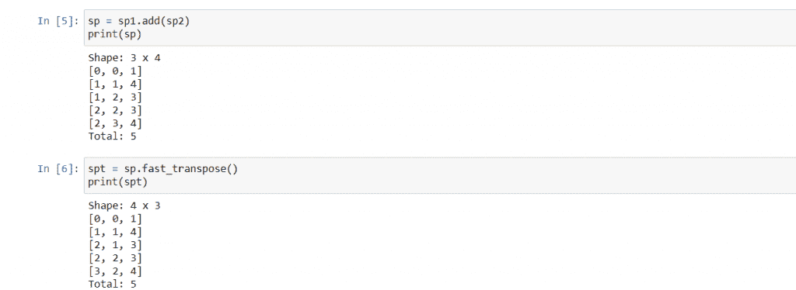

# Python 中的稀疏矩阵–简化

> 原文：<https://www.askpython.com/python/examples/sparse-matrix>

在本文中，我们将了解一种用于在 Python 中实现稀疏矩阵的数据结构。让我们开始吧。

## 什么是稀疏矩阵？

稀疏矩阵是一种有许多零元素的矩阵。也就是说，稀疏矩阵中的大多数项都是零，因此得名，所以稀疏矩阵占用的大部分内存都是零。例如，以下矩阵是一个稀疏矩阵:

```py
A = [
    [0, 4, 0, 0],
    [2, 0, 0, 5],
    [0, 0, 0, 0],
    [0, 0, 0, 1]
]

```

可以看到，除了四项，其余都是零，这些多余的零占用了内存的大量空间。

稀疏矩阵是存储这种矩阵的最佳方式。它本质上是一个非零项的有序列表。稀疏矩阵中的每一行都存储非零元素的行和列，以及非零元素本身。

因此，对于上面的矩阵 A，它的稀疏对应物将如下所示:

```py
A = [
    [0, 1, 4],
    [1, 0, 2],
    [1, 3, 5],
    [3, 3, 1]
]

```

在第一行中，元素是 0、1 和 4，因此第 4 项位于索引 0、1 处。同样，2 在索引 1，0 处；等等。

很明显，这个版本比普通版本占用更少的空间，在矩阵很大的情况下，稀疏矩阵占用的空间明显更少。

为了使用这个矩阵作为稀疏矩阵，我们需要在一个类中实现它，并为输入、打印、加法、减法、乘法等定义方法。

## Python 中的稀疏矩阵

让我们看看 Python 中稀疏矩阵的类定义。

```py
class Sparse:
    def __init__(self, rows, columns):
        self._matrix = []
        self._num = 0
        self._rows = rows
        self._columns = columns

    def __repr__(self):
        prnt = f"Shape: {self._rows} x {self._columns}\n"
        for lst in self._matrix:
            prnt += lst.__repr__() + '\n'
        prnt += f"Total: {self._num}"
        return prnt

    def insert(self, row, column, value):
        if row < 0 | column < 0 | row >= self._rows | column >= self._columns:
            raise ValueError("Invalid row or column")

        if(value == 0):
            raise ValueError("Zeroes are not included in a sparse matrix")

        filled = False
        for i in range(self._num):
            if(self._matrix[i][0] < row):
                continue
            elif(self._matrix[i][0] > row):
                self._matrix.insert(i, [row, column, value])
                self._num += 1
                filled = True
                break
            elif(self._matrix[i][1] < column):
                continue
            elif(self._matrix[i][1] > column):
                self._matrix.insert(i, [row, column, value])
                self._num += 1
                filled = True
                break
            else:
                raise ValueError("The position is already filled")
        if(filled == False):
            self._matrix.append([row, column, value])
            self._num += 1
        return

    def remove(self, row, column):
        if row < 0 | column < 0 | row >= self._rows | column >= self._columns:
            raise ValueError("Invalid row or column")

        for i in range(num):
            if(self._matrix[i][0] == row | self._matrix[i][1] == column):
                return pop(i)
        return None

    def size(self):
        return self._num

    def shape(self):
        return tuple((self._rows, self._columns))

    def display(self):
        print(self)

    def add(self, obj):
        if(isinstance(obj, Sparse) != True):
            raise TypeError("add() method needs an object of type Sparse")

        if(self.shape() == obj.shape()):
            result = Sparse(self._rows, self._columns)
        else:
            raise ValueError("Invalid row or columns")

        i = 0
        j = 0
        k = 0
        while((i < self._num) & (j < obj._num)):
            if(self._matrix[i][0] < obj._matrix[j][0]):
                result._matrix.insert(k, self._matrix[i])
                k += 1
                i += 1
            elif(self._matrix[i][0] > obj._matrix[j][0]):
                result._matrix.insert(k, obj._matrix[j])
                k += 1
                j += 1
            elif(self._matrix[i][1] < obj._matrix[j][1]):
                result._matrix.insert(k, self._matrix[i])
                k += 1
                i += 1
            elif(self._matrix[i][1] > obj._matrix[j][1]):
                result._matrix.insert(k, obj._matrix[j])
                k += 1
                j += 1
            else:
                result._matrix.insert(k, list([self._matrix[i][0], self._matrix[i][1], self._matrix[i][2] + obj._matrix[j][2]]))
                k += 1
                i += 1
                j += 1
        while(i < self._num):
            result._matrix.insert(k, self._matrix[i])
            k += 1
            i += 1
        while(j < obj._num):
            result._matrix.insert(k, obj._matrix[j])
            k += 1
            j += 1

        result._num = k
        return result

    def fast_transpose(self):
        occurrence = []
        index = []

        for i in range(self._columns):
            occurrence.append(0)
        for i in range(self._num):
            occurrence[self._matrix[i][1]] += 1

        index.append(0)
        for i in range(1, self._columns):
            index.append(index[i-1] + occurrence[i-1])

        result = Sparse(self._columns, self._rows)
        result._num = self._num
        for i in range(self._num): result._matrix.append(list())
        for i in range(self._num):
            result._matrix[index[self._matrix[i][1]]] = list([self._matrix[i][1], self._matrix[i][0], self._matrix[i][2]])
            index[self._matrix[i][1]] += 1
        return result

```

上面的定义相当大，所以我们将逐个查看每个函数:

### 1。`__init__`法

对于每个稀疏矩阵，我们首先需要行数和列数，然后将其传递给构造函数，后者创建一个空的稀疏矩阵。

### 2。`__repr__`法

这将返回一个[字符串](https://www.askpython.com/python/string/strings-in-python)，当在对象上调用`print()`时，该字符串将被打印出来。在我们的例子中，我们打印矩阵的形状和大小，以及实际的稀疏矩阵。

### 3。稀疏矩阵中的插入和删除

要在某个位置插入一个非零项，我们只需[遍历矩阵](https://www.askpython.com/python/python-matrix-tutorial)找到新项的正确位置并将其插入。我们首先比较行，然后如果发现行匹配，就比较列。其中一个必须是不同的，否则，我们抛出一个异常。

在做所有这些之前，我们需要验证输入，给定的项目不能为零，并且位置必须位于矩阵内部。

要删除给定位置的一个项目，过程非常简单，只需在矩阵中找到该位置并弹出整行。

### 4。两个稀疏矩阵的相加

添加两个稀疏矩阵非常类似于合并两个排序列表。

这两个矩阵是[基本上是包含其他表示行的列表的列表](https://www.askpython.com/python/list/python-list)。并且这些内部列表在每个列表的第一和第二项(每个值的行和列索引)以升序排列的意义上被排序。

**我们创建了三个指标:`i`、`j`和`k`。**

*   `i`是第一个矩阵中下一个项目的索引。
*   `j`是第二个矩阵中下一个项目的索引。
*   `k`是结果矩阵中下一个项目的索引。

然后我们比较第一个矩阵中的第`i`项和第二个矩阵中的第`j`项。基于其行和列索引，无论哪一项应该首先出现，都被插入到结果矩阵中，并且我们递增各自的索引。

如果这两项有相同的行和列索引，那么它们肯定需要相加，一旦我们这样做了，它们的和就被插入到结果矩阵中。

最后，一个输入矩阵将被完成，此时，我们只需将另一个矩阵的所有项插入到结果矩阵中，我们将得到两个矩阵的和。

### 5。稀疏矩阵的快速转置

转置稀疏矩阵非常简单，我们只需交换行和列的值，然后对稀疏矩阵中的行进行排序。但是这样的操作是非常无效的，而稀疏矩阵的构造方式，我们有一个快得多的方法来转置这个矩阵。

我们将首先创建两个有助于算法的列表。

第一个列表叫做`occurrence`，它将存储每个列索引在稀疏矩阵中出现的次数。因此，它的大小将是稀疏矩阵的列大小，每个索引将代表该列。最初，它将被填充零，稍后，我们将遍历稀疏矩阵并查找每一项的列值，我们将在`occurrence`列表中递增该索引。

第二个列表称为`index`列表。在这个列表中，当原始稀疏矩阵转换为稀疏矩阵时，我们将存储原始稀疏矩阵中每个项目的结果索引。因此，`index[i]`将拥有原始矩阵中列索引为`i`的第一项的新索引。为此，我们首先在索引[0]处存储 0，这意味着原始矩阵中列索引为 0 的第一项将放入转置矩阵的第 0 个索引中。然后为了计算`index[i]`，我们加上`index[i-1]`和`occurrence[i-1]`。

在这之后，我们查看稀疏矩阵中的每一项，我们找到该项的列索引，我们在该索引处查找`index`列表中的值，并且我们使用该值作为转置矩阵中的新索引。
在这之后，我们增加我们使用的索引值，以便具有相同列索引的下一个项目将转置到下一个索引。

这样做，我们可以非常有效地转置一个稀疏矩阵。

## 输出

首先，我们创建两个稀疏矩阵:



现在我们做加法和快速转置运算:



## 结论

在矩阵大部分被零填充的情况下，稀疏矩阵使用更少的存储并且更有效。我们讨论了这些是什么，如何创建它们，然后实现它们，最后，我们通过运行代码得到的输出来确认。