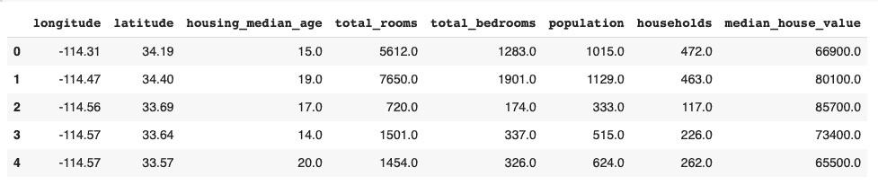
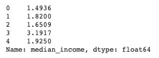
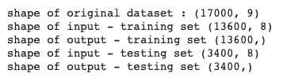

# 如何使用 sklearn 在 Python 中将数据拆分成训练集和测试集？

> 原文：<https://www.askpython.com/python/examples/split-data-training-and-testing-set>

在机器学习中，将数据分成两个不同的集合是一种常见的做法。这两套是**训练套**和**测试套**。顾名思义，训练集用于训练模型，测试集用于测试模型的准确性。

**在本教程中，我们将:**

*   首先，了解分割数据集的重要性
*   然后看看如何在 Python 中将数据分成两组

## 为什么我们需要将数据分成训练集和测试集？

在训练机器学习模型时，我们试图找到一种模式，以最小的误差最好地代表所有的数据点。这样做时，会出现两个常见的错误。这些是**过拟合**和**欠拟合。**

### 欠拟合

欠拟合是指模型甚至不能表示训练数据集中的数据点。在欠拟合的情况下，即使在训练数据集上进行测试，您也会得到较低的精度。

拟合不足通常意味着您的模型过于简单，无法捕捉数据集的复杂性。

### 过度拟合

当您的模型表示训练数据集有点太精确时，就会出现过度拟合的情况。这意味着你的模型太接近了。在过度拟合的情况下，您的模型将无法在新的看不见的数据上表现良好。过度拟合通常是模型过于复杂的标志。

过度装配和装配不足都是不可取的。

### 我们应该在训练数据上测试吗？

理想情况下，您不应该在训练数据上进行测试。您的模型可能会过度适应训练集，因此在处理新数据时会失败。

**训练数据集中的良好准确性不能保证您的模型在看不见的数据上成功。**

这就是为什么建议将训练数据与测试数据分开。

基本思想是将测试集用作看不见的数据。

在训练集上训练数据之后，应该在测试集上测试模型。

如果您的模型在测试集上表现良好，您可以对您的模型更有信心。

## Python 中如何拆分训练和测试数据集？

最常见的分割比例是 **80:20。**

也就是说，80%的数据集进入训练集，20%的数据集进入测试集。

拆分数据之前，请确保数据集足够大。训练/测试分割适用于大型数据集。

让我们用一些代码来弄脏我们的手。

### 1.导入整个数据集

我们在整个教程中使用[加州住房数据集](https://developers.google.com/machine-learning/crash-course/california-housing-data-description)。

让我们从使用[熊猫](https://www.askpython.com/python-modules/pandas/python-pandas-module-tutorial)将数据导入到[数据帧](https://www.askpython.com/python-modules/pandas/dataframes-in-python)开始。

你可以使用 [pip 命令](https://www.askpython.com/python-modules/python-pip)安装 pandas:

```py
pip install pandas

```

使用以下方法将数据集导入 pandas 数据框架:

```py
import pandas as pd
housing = pd.read_csv("/sample_data/california_housing.csv")
housing.head()

```


Housing Dataframe

**让我们把 median_income 列当作输出(Y)。**

```py
y= housing.median_income

```

同时，我们必须从数据集中删除该列，以形成输入向量。

```py
x=housing.drop('median_income',axis=1)

```

你可以使用。head()方法来看看输入和输出是什么样子的。

```py
x.head()

```



Input X

```py
y.head()

```



Output Y

现在我们已经准备好了输入和输出向量，我们可以将数据分成训练集和测试集。

### 2.使用 sklearn 拆分数据

为了分割数据，我们将使用来自 sklearn 的 **[train_test_split](https://scikit-learn.org/stable/modules/generated/sklearn.model_selection.train_test_split.html)** 。

train_test_split 根据提供的比率将您的数据随机分布到训练集和测试集中。

让我们看看它是如何在 python 中实现的。

```py
x_train,x_test,y_train,y_test=train_test_split(x,y,test_size=0.2)

```

这里我们使用 80:20 的分割比例。*20%的测试数据集用末尾的 0.2 表示。*

若要比较不同测试集和定型集的形状，请使用以下代码:

```py
print("shape of original dataset :", housing.shape)
print("shape of input - training set", x_train.shape)
print("shape of output - training set", y_train.shape)
print("shape of input - testing set", x_test.shape)
print("shape of output - testing set", y_test.shape)

```

这给出了以下输出。



## 完整的代码

这种分割训练和测试数据的完整代码如下:

```py
import pandas as pd
housing = pd.read_csv("/sample_data/california_housing.csv")
print(housing.head())

#output
y= housing.median_income

#input
x=housing.drop('median_income',axis=1)

#splitting
x_train,x_teinst,y_train,y_test=train_test_split(x,y,test_size=0.2)

#printing shapes of testing and training sets :
print("shape of original dataset :", housing.shape)
print("shape of input - training set", x_train.shape)
print("shape of output - training set", y_train.shape)
print("shape of input - testing set", x_test.shape)
print("shape of output - testing set", y_test.shape)

```

## 结论

在本教程中，我们了解了将数据分成训练集和测试集的重要性。此外，我们将数据集导入到 pandas 数据框架中，然后使用 **sklearn** 将数据分成训练集和测试集。