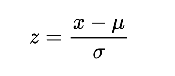
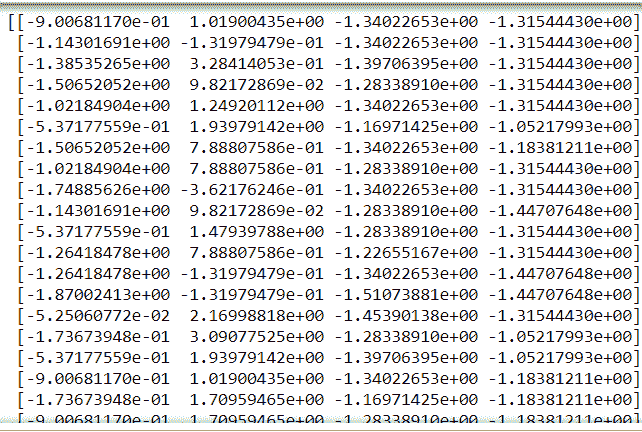

# 用 Python 标准化机器学习数据的两种简单方法

> 原文：<https://www.askpython.com/python/examples/standardize-data-in-python>

嘿，读者们。在本文中，我们将重点关注在 Python 中标准化数据的 **2 项重要技术。所以，让我们开始吧！！**

* * *

## 为什么我们需要在 Python 中标准化数据？

在深入研究标准化的概念之前，了解标准化的必要性是非常重要的。

所以，你看，我们用来为一个特定的问题陈述建立模型的数据集通常是从各种来源建立的。因此，可以假设数据集包含不同尺度的变量/特征。

为了让我们的机器学习或深度学习模型能够很好地工作，数据在特征方面具有相同的规模是非常必要的，以避免结果中的偏差。

因此，**特征缩放**被认为是建模前的重要步骤。

特征缩放可大致分为以下几类:

*   [归一化](https://www.askpython.com/python/examples/normalize-data-in-python)
*   标准化

**标准化**用于`normally distributed`的数据值。此外，通过应用标准化，我们倾向于使数据集的平均值为 0，标准差等于 1。

也就是说，通过标准化这些值，我们得到了数据分布的以下统计数据

*   **平均值= 0**
*   **标准差= 1**



**Standardization**

因此，通过这种方式，数据集变得不言自明并且易于分析，因为**平均值下降到 0** ，并且它碰巧具有**单位方差**。

* * *

## 在 Python 中标准化数据的方法

现在，让我们在下一节重点关注实现标准化的各种方法。

### 1.使用预处理. scale()函数

`preprocessing.scale(data) function`可用于将数据值标准化为平均值等于零且标准差为 1 的值。

这里，我们已经使用下面的代码行将 **[虹膜数据集](https://archive.ics.uci.edu/ml/datasets/iris)** 加载到环境中:

```py
from sklearn.datasets import load_iris

```

此外，我们已经将 iris 数据集保存到如下创建的数据对象中。

```py
from sklearn import preprocessing
data = load_iris()

# separate the independent and dependent variables
X_data = data.data
target = data.target

# standardization of dependent variables
standard = preprocessing.scale(X_data)
print(standard)

```

在分离因变量和响应/目标变量后，我们将`preprocessing.scale() function`应用于因变量以标准化数据。

**输出:**



**Standardization-Output**

* * *

### 2.使用 StandardScaler()函数

Python `sklearn library`为我们提供了`StandardScaler() function`来对数据集执行标准化。

在这里，我们再次利用虹膜数据集。

此外，我们创建了一个 StandardScaler()对象，然后应用`fit_transform() function`对数据集应用标准化。

```py
from sklearn.datasets import load_iris
from sklearn.preprocessing import StandardScaler

data = load_iris()
scale= StandardScaler()

# separate the independent and dependent variables
X_data = data.data
target = data.target

# standardization of dependent variables
scaled_data = scale.fit_transform(X_data) 
print(scaled_data)

```

**输出**:


**Standardization-Output**

* * *

## 结论

到此，我们就结束了这个话题。如果你遇到任何问题，欢迎在下面评论。

在那之前，请继续关注并快乐学习！！🙂