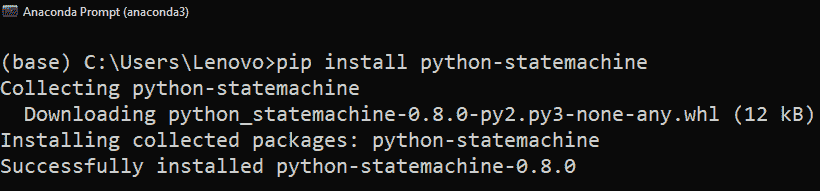

# 使用 Python 设计状态机[快速指南]

> 原文：<https://www.askpython.com/python-modules/state-machines-python>

你好。在这篇文章中，我们将学习一些计算机科学的基础知识。当然，不是整个课程！只是计算理论的一部分。本课题是关于有限自动机的设计。我们将在下一部分讨论所有的术语。所以，让我们开始吧。

## Python 中的状态机是什么？

状态机是一种行为模型，它定义了对象如何响应事件。在 Python 中，状态机通常被实现为**有限状态机(FSM)** 。FSM 是一种数学计算模型，可用于设计数字逻辑电路和计算机程序。它由一组状态、这些状态之间的转换以及转换发生时执行的操作组成。

有限状态机(FSM)是一种数学计算模型，可用于设计数字逻辑电路和计算机程序。它由一组状态、这些状态之间的转换以及转换发生时执行的操作组成。FSM 可以表示为有向图，状态表示为节点，转换表示为边。边用触发转换的事件标记，动作与边相关联。

## 什么是 TOC 和自动机？

自动机理论和 TOC 都用于研究机器的行为，但它们采用不同的方法。自动机理论关注的是抽象机器本身，而 TOC 关注的是使用那台机器可以解决的问题。

自动机理论是对抽象机器和自动机以及可以使用它们解决的计算问题的研究。自动机理论也与形式语言理论密切相关，因为自动机经常被用作形式语言的计算模型。计算理论(TOC)是数学的一个分支，研究算法及其效率。它涉及算法、数据结构和复杂性理论的设计和分析。

计算理论是我们设计一些基于基本输入和输出的虚拟机的主题。从最底层开始，工作从接受固定长度的字符串开始。这些机器的基本术语是自动机。

**自动机有两种类型:**

1.  ***确定性有限自动机。***
2.  ***【非确定性有限自动机】(NDFA)。***

### 对确定性有限自动机(DFA)的理解

确定性有限自动机(DFA)是一种特殊类型的有限状态机，它根据确定性算法接受或拒绝一个称为输入字符串的符号字符串。DFA 可以表示为有向图，状态表示为节点，转换表示为边。边用触发转换的事件标记，动作与边相关联。

### 理解非确定性有限自动机(NDFA)

非确定性有限自动机(NDFA)是一种特殊类型的有限状态机，它可以基于非确定性算法接受或拒绝输入字符串。NDFA 可以表示为有向图，状态表示为节点，转换表示为边。边用触发转换的事件标记，动作与边相关联。

一个基本的自动机是由五个单元组成的元组:

```py
Automata = (Q, F, δ, q0, Σ)

```

1.  **Q** =所有状态的集合。
2.  **F** =所有最终状态的集合。
3.  **δ** =将状态的移动与每个输入进行映射的转换函数或映射函数。
4.  **q0** =初始状态。
5.  **σ**=输入符号的有限集合。

### 基本 DFA 的示意图


Automata diagram

本机接受字符串**“aa”**。这里的图表是 DFA 最简单的表示。让我们理解它的参数:

1.  这里 Q = {q0，q1，q2}。一组最终状态。
2.  q0 是初始状态。
3.  q2 是最终状态
4.  **σ**= { a }是所有输入符号的集合。

该机器由三种状态组成–Q0、q1 和 q2。最初，当我们给一个状态输入时，它**转换/移动**到另一个状态。转移函数( **δ** )跟踪所有这些活动。当期望的字符串达到特定状态时，我们将其定义为该机器的**最终状态**。

### 自动机的应用

自动机理论是对抽象机器和可以用它们解决的计算问题的研究。自动机用于各种应用，包括验证、模型检查、调度和数据库更新。这里有三个自动机的应用

1.  ***游戏开发***
2.  ***人工智能* e**
3.  ***编译器设计***

现在让我们跳到使用 Python 的状态机库构建状态机。

## 使用 Python 构建状态机

我们将使用 Python 编写我们自己的状态机。这将与在纸上画它是一样的。此外，我们将使用一些特殊的操作来检查转换。

### 1.安装状态机库

打开您的命令提示符并键入 [pip 命令](https://www.askpython.com/python-modules/python-pip):

```py
pip install python-statemachine

```



Installing Python Statemachine

#### **工具和技术**

1.  ***Python 版本:* 3.8.x 以上。**
2.  ***支持库:*****python-state machine**。
3.  ***好的 IDE*** **: VSCode，Spyder 等。**

**代码:**

```py
from statemachine import StateMachine, State

class LightBulb(StateMachine):

    # creating states
    offState = State("off", initial = True)
    onState = State("on")

    # transitions of the state
    switchOn = offState.to(onState)
    switchOff = onState.to(offState)

bulb = LightBulb()
print(bulb.current_state)

```

**输出:**

```py
State('off', identifier='offState', value='offState', initial=True)

```

**说明:**

1.  我们先将`state machine`模块和 **`State class`** 一起导入。
2.  我们首先创建一个类别为**的灯泡**。然后，为了继承这些属性，将**状态机**放在括号内。
3.  我们创造了两种状态。
    1.  **offState** :表示最初灯泡是关闭的。将初始参数设置为真。
    2.  **onState** :打开灯泡。
4.  **然后，创建两个转场:**
    1.  **开关 On** :从 off 状态转换到 On 状态。
    2.  **关闭**:从 on 状态转换到 Off 状态。
5.  创建我们类的一个实例，即**灯泡**。
6.  然后，为了检查当前状态，我们简单地调用灯泡对象的 **current_state** 属性。
7.  我们看到灯泡的当前状态是**“关”**。

## 状态机的动态属性

当我们创建一个状态机时，该模块为该状态机中的每个状态创建一组特殊的属性。我们可以使用实例和属性来检查该属性是否适用于该状态。在上面的代码中，我们有两个这样的状态。所以，创建的属性也是**真**。

**检查属性的代码:**

```py
bulb.is_offState # returns True
bulb.is_onState # returns False

```

### 检查状态和转换的数量

让我们看看如何从 State 类中提取转换和所有状态。当我们的类只有两种状态时，这可能看起来没有用。但是考虑具有多种可能状态的类，这时候这些技术就很方便了。

**代码检查状态数:**

在自动机中，我们需要保存所有当前状态的记录。为此，我们使用下面的[列表理解](https://www.askpython.com/python/list/python-list-comprehension)。

```py
a = [s.identifier for s in bulb.states]
print(a)

```

**输出:**

```py
['offState', 'onState']

```

**说明:**

1.  我们使用列表理解将所有状态存储在一个列表中。
2.  **然后使用“标识符”属性，运行一个 for 循环。**
3.  使用 **states** 属性获取每个状态。我们需要使用灯泡类的实例**灯泡**对象来调用它。
4.  将该列表分配给一个变量**“a”。**
5.  然后打印出来。我们得到了所有的州。

**检查转换的代码:**

自动机总是从一种状态转移到另一种状态。简单来说，我们称之为过渡。因此，为了记录它们，我们的状态机有了**转换**属性。

```py
b = [s.identifier for s in bulb.transitions]
print(b)

```

**输出:**

```py
['switchOff', 'switchOn']

```

**说明:**

所有代码都与州代码相同。我们只是对**灯泡**对象使用“过渡”关键字。

## 结论

这样，我们就可以用 Python 构建一个简单的状态机。当我们设计人工智能算法或游戏时，这些机器是要研究的重要概念之一。对于逻辑构建，状态机也是很好的页面主题。所以，我们在这里结束这个话题。

**参考**

您可以通过访问此链接查看更多信息:[https://pypi.org/project/python-statemachine/](https://pypi.org/project/python-statemachine/)