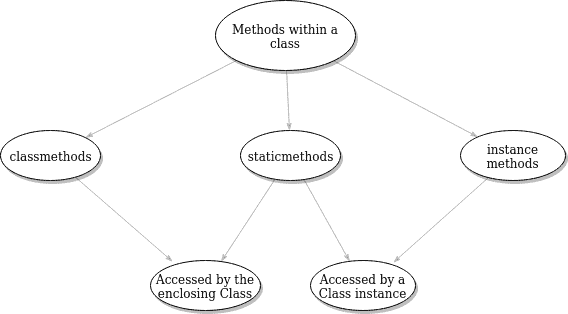

# Python 中的@staticmethod

> 原文：<https://www.askpython.com/python/staticmethod-in-python>

## @staticmethod 装饰器

python**@ static method**decorator 用于将类方法标记为静态方法，这意味着无需先实例化类即可调用。它只是定义了一个普通的函数，出于可读性的目的，这个函数逻辑上包含在类中。这里，我们不需要通过`[self](https://www.askpython.com/python/python-self-variable)`将类实例作为第一个参数传递，这与其他类函数不同。

```py
class Student():
       def __init__(self, mark):
           self.mark = mark

       @staticmethod
       def find_min(mark):
           return min(mark, 100)

print(Student.find_min(20))

```

输出

`20`

* * *

## 通过类实例访问

静态方法也可以通过类实例或对象来访问。例如:

```py
class Bank():
       def __init__(self, balance):
           self.balance = balance

       @staticmethod
       def find_interest(loan_money, interest_rate):
           return loan_money * (1 + interest_rate)

bank = Bank(1000)
print(bank.find_interest(bank.balance, 0.3))

```

输出:

```py
1300

```

* * *

## 重写静态方法

静态方法定义即使在任何继承之后也不会改变，这意味着它可以被重写，类似于其他类方法。

```py
class ATM(Bank):
    def __init__(self, balance):
        super().__init__(balance)

    @staticmethod
    def find_interest(loan_money):
        return loan_money * 1.4

atm = ATM(1000)
print(atm.find_interest(atm.balance))

```

输出

```py
1400

```

* * *

## @staticmethod vs @classmethod

类方法是通过包含它的类调用的，而不是从实例调用的。这就是为什么 classmethod 被定义为`class_method(cls, param1, param2)`，它不包含`self`，这意味着它不能使用类实例来调用。静态方法既可以从类实例调用，也可以从类调用。

* * *

## @staticmethod 与实例方法

实例方法只能从类实例中调用，这就是为什么任何实例方法都是形式为`instance_method(self, param1, param2)`的原因，其中`self`关键字表示调用方法的类实例。`@staticmethod`既可以从类实例中调用，也可以从类中调用。



Comparison between @classmethod, @staticmethod and instance methods

这里有一个例子来把这一切放在一起。

```py
class Bank():
    def __init__(self, balance):
        self.balance = balance

    @staticmethod
    def find_interest(loan_money, interest_rate):
        return loan_money * (1 + interest_rate)

    @classmethod
    def find_interest_classmethod(cls, loan_money):
        return loan_money * 1.4

    def find_interest_instancemethod(self, loan_money):
        if self.balance <= 100:
            return loan_money * 1.2
        else:
            return loan_money * 1.5

class ATM(Bank):
    def __init__(self, balance):
        super().__init__(balance)

    @staticmethod
    def find_interest(loan_money):
        return loan_money * 1.3

atm = ATM(1000)
print('Using staticmethod ->', atm.find_interest(atm.balance))
print('Using classmethod from the parent class ->', Bank.find_interest_classmethod(atm.balance))
print('Using classmethod from the inherited subclass ->', ATM.find_interest_classmethod(atm.balance))
print('Using a regular instance method ->', atm.find_interest_instancemethod(atm.balance))

```

**输出**:

```py
Using staticmethod -> 1300.0
Using classmethod from the parent class -> 1400.0
Using classmethod from the inherited subclass -> 1400.0
Using a regular instance method -> 1500.0

```

* * *

## 结论

Python 静态方法属于该类。它们在创建不需要实例变量的函数时很有用。本文向我们展示了@staticmethod 的用例，以及它们与其他装饰器(即@classmethod 装饰器)的比较。我们还比较了静态方法、类方法和常规实例方法，并展示了如何使用它们来使类代码更易于维护。

## 参考

Python 官方文档:[https://docs . python . org/3/library/functions . html # static method](https://docs.python.org/3/library/functions.html#staticmethod)