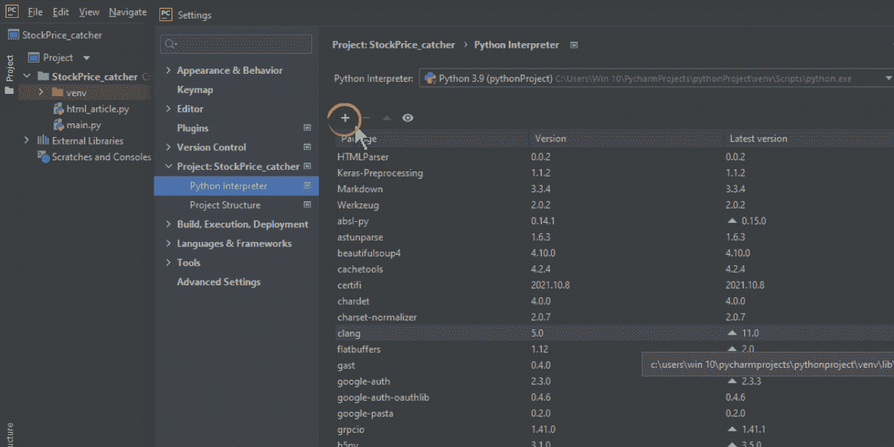
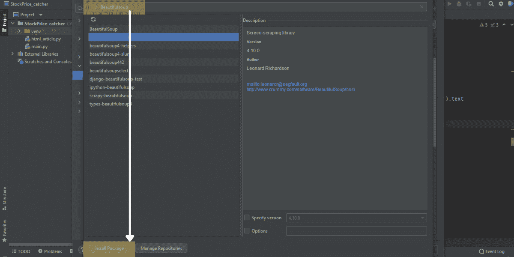
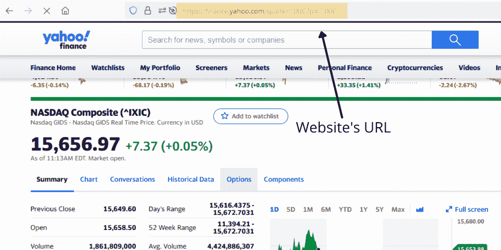
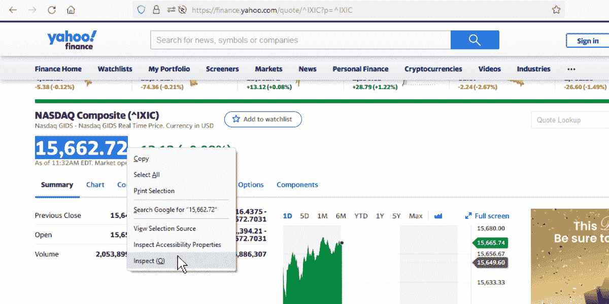
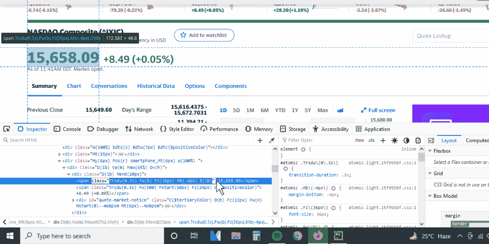
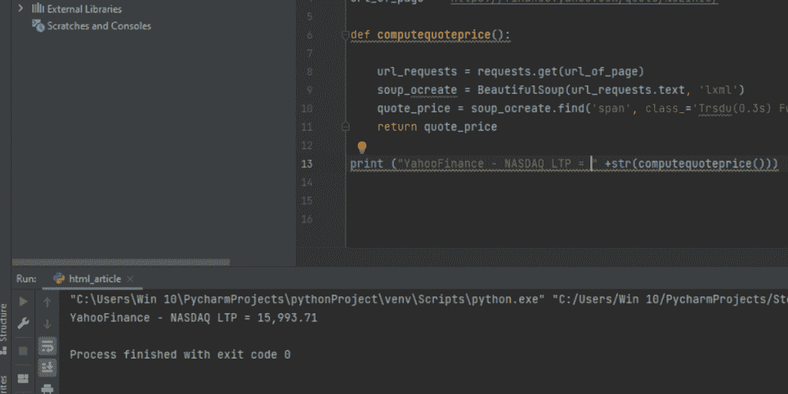
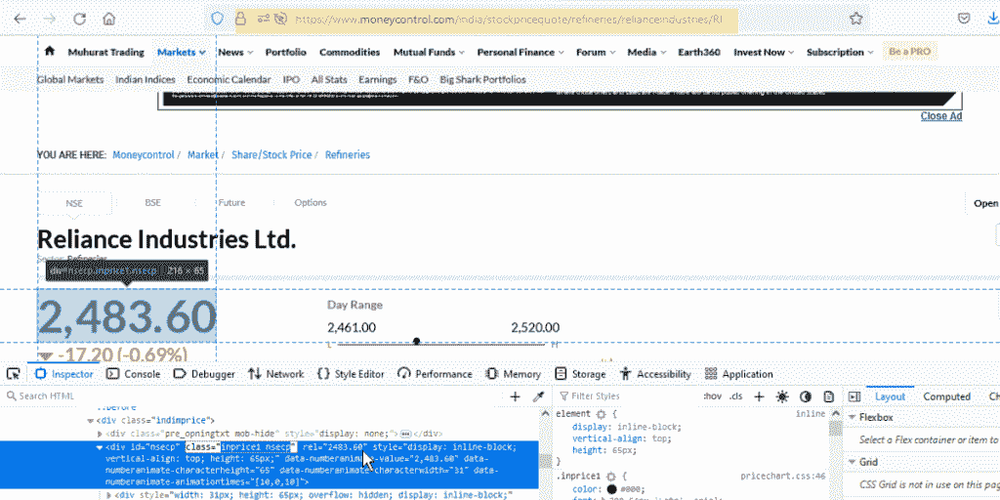
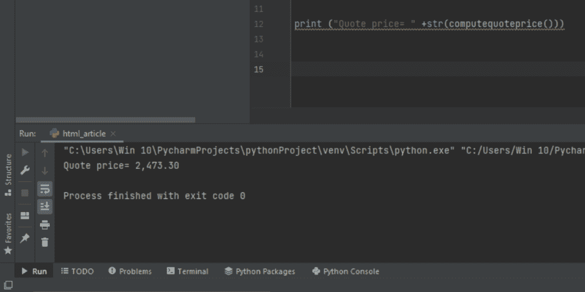

# 用 Python 以 HTML 格式获取股票价格——完整指南

> 原文：<https://www.askpython.com/python/examples/stock-price-as-html>

有多少次，我们投资了一只股票，然后在一个晴朗的日子里，我们听到了关于这只股票的猜测性消息，我们把手机、电脑、经纪人都扭打在一起，想得到一个提醒。我们倾向于通过在手机上反复输入股票名称或点击长长的列表来查看不同的价格。最终，你的大部分时间得到的会更少。

但是有很多简单的方法可以让我们从你最喜欢的股票筛选网站上删除股票价格，这也需要一些 python 代码。在本文中，我们将介绍使用 Beautifulsoup 作为 python 库从 page 的 HTML 代码中抓取数据的开发。

## 什么是 Beautifulsoup，我们为什么要使用它？

[美汤](https://www.askpython.com/python/beautiful-soup-web-scraping)是 2004 年发布的 screen screening python 库，用于使用 HTML 或 XML 源代码从网站中提取数据。

尽管有更好的 web 报废库，如 scrappy 和 [selenium](https://www.askpython.com/python/examples/python-automate-facebook-login) ，但我们在本文中使用 Beautifulsoup，因为它非常用户友好且易于学习。Beautifulsoup 很难从 java 脚本等网站中提取复杂的数据，但通过它可以轻松完成较小规模的简单数据提取。

## 在 Python 中使用 BeautifulSoup

有许多方法可以做到这一点，这取决于什么样的机器或操作系统，你正在运行。我们将在 windows 操作系统和 PyCharm IDE 中为广大读者介绍安装部分。此外，在 PyCharm IDE 中，安装包和创建环境是非常简单的

在我们开始之前，Python 和 [Python pip](https://www.askpython.com/python-modules/python-pip) 必须安装在您的机器上。

打开 cmd 并输入:

```py
pip install beautifulsoup4 

```

python 库将自动安装在您的机器上。一旦完成，我们需要安装解析器。解析器支持 beautifulsoup 的 python 库，这是解析 HTML 和 XML 代码所必需的。

```py
pip install lxml
pip install requests

```

### 在 PyCharm 中安装 Beautifulsoup

与其他 IDE 相比，在 PyCharm 中安装 python 包相对容易，没有任何麻烦，所以我们将继续使用它。

*   创建一个新项目，并向其附加一个 python 文件(使用。py 扩展名)添加到它。
*   然后进入“文件”>“设置”,在左窗格中点击你刚刚创建的项目的标题。
*   “Python 解释器”选项会打开一个新窗口，其中包含该项目所需的所有解释器。
*   找到“Package”列正上方的加号，然后单击它。



Plus sign above the package column

*   当你点击它时，一个新的窗口会弹出一个很长的 Python 解释器列表。
*   您必须搜索“Beautifulsoup4 ”,然后在页面底部单击“安装包”。



Install the beautifulsoup4 Package

Beautifulsoup4 现在将安装在您的 PyCharm 系统中。

为了从 HTML 中获取股票价格，我们首先需要两样东西:

*   网站的 URL
*   股票价格属性的检验要素

在这篇文章中，我们将从两个不同的网站中选取例子，来了解如何识别要检查的正确属性。

### 提取雅虎财务数据

在第一个例子中，我们将通过雅虎财经网站获取纳斯达克的实时价格。为了做到这一点，谷歌‘纳斯达克雅虎金融’。搜索引擎会直接把你带到纳斯达克的报价页面。在那里我们需要复制页面的 URL。



Websites URL

其次，我们将要求报价的属性。要获取它，选择报价，右键单击并点击 inspect。



Inspect Element

当 inspect 菜单弹出时，必需的属性将会突出显示。在下面的例子中，我们突出显示了所需的 HTML 代码片段，我们只需要选择并复制其中的基本数据。我们只需要双引号内的代码。

**注意:**当我们将光标移动到嵌入式代码上时，它会显示与之链接的元素。在下图中，当光标在嵌入报价的 HTML 代码上时，虚线在报价的旁边。



Copying Attributes

### 使用 Python BeautifulSoup 提取雅虎财务数据

让我们进入提取股票数据的代码。

```py
from bs4 import BeautifulSoup
import requests

url_of_page = 'https://finance.yahoo.com/quote/%5EIXIC/'

def computequoteprice():

    url_requests = requests.get(url_of_page)
    soup_ocreate = BeautifulSoup(url_requests.text, 'lxml')
    quote_price = soup_ocreate.find('span', class_='Trsdu(0.3s) Fw(b) Fz(36px) Mb(-4px) D(ib)').text
    return quote_price

print ("Quote price= " +str(computequoteprice()))

```



正如您在上面的代码中看到的，网站的 url 存储在变量“URL”中。同样，属性也用于变量“价格”。该代码转到网站的 URL，并从该页面请求所有 HTML 数据。然后使用“soup.find”代码在 HTML 代码中专门搜索 span id，class 包含我们要从页面中获取的报价的属性。

### 货币控制

让我们再举一个不同网站的例子。这里，信实工业的股票价格将取自 moneycontrol.com。步骤是相同的，除了 HTML 属性的不同。Yahoo finance 使用“span”作为 id，而 money control 使用“div”作为 id。

注意:识别属性的正确 id 是很重要的，不同的网站使用不同的 id，但是整个过程是相似的。



Moneycontrol.com inspect element

### 使用 Python BeautifulSoup 从 Moneycontrol 中提取股票价格的代码

```py
from bs4 import BeautifulSoup
import requests

url_of_page = 'https://www.moneycontrol.com/india/stockpricequote/refineries/relianceindustries/RI'

def computequoteprice():
    url_requests = requests.get(url_of_page)
    soup_ocreate = BeautifulSoup(url_requests.text, 'lxml')
    quote_price = soup_ocreate.find('div', class_='inprice1 nsecp').text
    return quote_price

print ("Quote price= " +str(computequoteprice()))

```



## 结论

在这篇文章中，我们已经了解了如何从股票筛选网站上轻松获取股票价格。我们还了解了 beautifulsoup 库，如何安装以及如何工作。要了解更多关于股价报废的信息，你可以谷歌一下“AskPython stocks scrappy”。