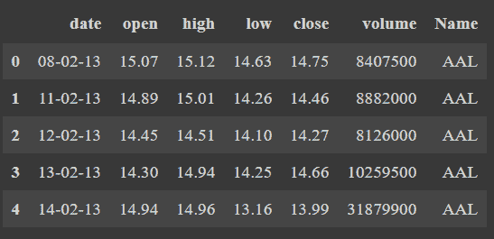
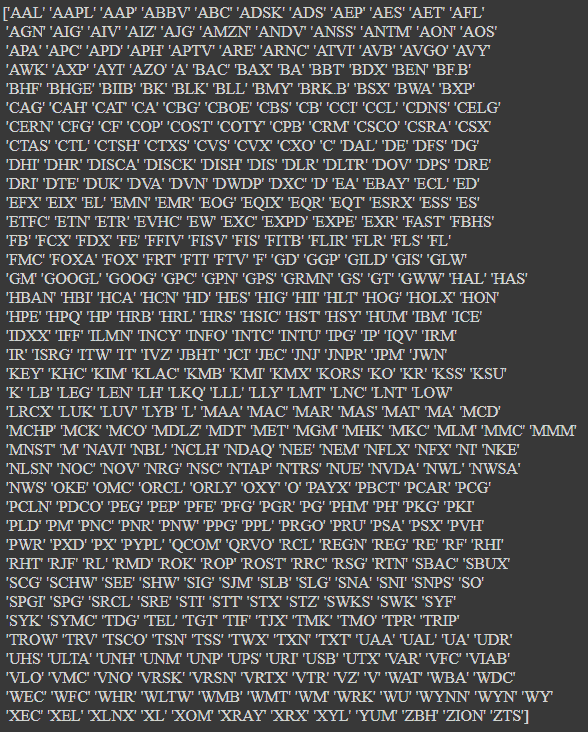
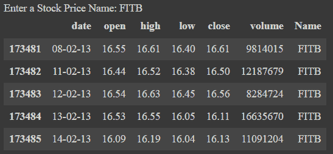
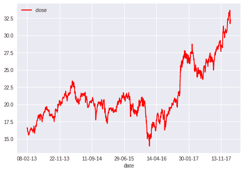
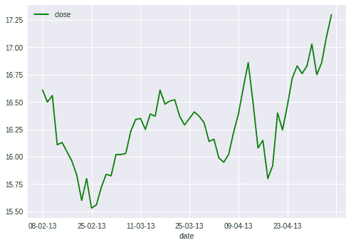
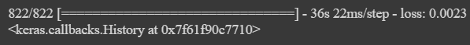
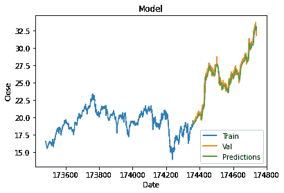
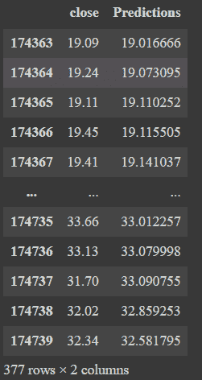

# 使用 Python 进行股票价格预测

> 原文：<https://www.askpython.com/python/examples/stock-price-prediction-python>

你好。今天我们将学习如何使用 Python 编程语言预测不同类别的股票价格。

股票市场预测是试图确定在交易所交易的公司股票或其他金融工具的未来价值的行为。

成功预测一只股票的未来价格可以产生可观的利润。在这个应用程序中，我们使用 LSTM 网络通过过去 60 天的股价来预测收盘股价。

对于应用程序，我们使用了称为长短期记忆(LSTM)的机器学习技术。LSTM 是一种用于深度学习领域的人工递归神经网络(RNN)架构。

与标准的前向神经网络不同，LSTM 有反馈连接。它不仅可以处理单个数据点(如图像)，还可以处理整个数据序列(如语音或视频)。

LSTM 被广泛应用于序列预测问题，并且非常有效

## 股票价格预测在 Python 中的实现

### 1.导入模块

第一步是导入项目中所有必需的模块。

```py
import numpy as np
import pandas as pd
import matplotlib.pyplot as plt
from keras.models import Sequential
from keras.layers import Dense, LSTM
import math
from sklearn.preprocessing import MinMaxScaler

```

对于这个项目，我们将使用像 [numpy](https://www.askpython.com/python-modules/numpy/numpy-universal-functions) 、 [pandas](https://www.askpython.com/python-modules/pandas/python-pandas-module-tutorial) 和 [matplotlib](https://www.askpython.com/python-modules/matplotlib/python-matplotlib) 这样的基本模块。除此之外，我们将使用`keras`的一些子模块来正确地创建和构建我们的模型。

我们还需要 sklearn 的基本计算和预处理模块的数学模块，以更好、更简单的方式处理数据。

### 2.数据的加载和准备

对于该项目，我们将使用`all_stocks_5yrs` csv 文件，该文件包含 5 年的股票数据，有 7 列，如下所示。

1.  **日期**–日期格式为:“年-月-日”
2.  **开盘**–股票在公开市场的价格
3.  **高位**-当日最高价
4.  **低**-当日最低价格
5.  **收盘**–收盘时股票的价格
6.  **成交量**–交易的股票数量
7.  **名称**-股票代码的名称

```py
data=pd.read_csv("all_stocks_5yr..csv")
data.head()

```

`head`函数显示数据集的前五行。



First_five_rows_stock_data

### 3.理解数据

#### 3.1 获得唯一的股票名称

从整个数据集中，我们将首先借助于`unique`函数提取所有唯一的股票分笔成交点名称。在数据集中，我们有 444 个不同的股票名称。

```py
all_stock_tick_names = data['Name'].unique()
print(all_stock_tick_names)

```



All Stock Names Stock Data

#### 3.2 提取特定股票名称的数据

我们将通过从用户处获取股票名称的输入并收集该特定股票名称的所有数据来尝试理解股票数据是如何工作的。

```py
# 1\. Getting a stock name
stock_name = input("Enter a Stock Price Name: ")

# 2\. Extrating all the data having the name same as the stock name entered
all_data = data['Name'] == stock_name

# 3\. Putting all the rows of specific stock in a variable
final_data = data[all_data]

# 4\. Printing first 5 rows of the stock data of a specific stock name
final_data.head()

```



Stock Data FITB Stock Name

#### 3.3 可视化股票数据

为了可视化数据，我们将首先绘制所有数据点的 FITB 股票的日期与收盘价格。

为了使可视化更简单，我们将绘制相同的图，但只针对前 60 个数据点。

```py
#  Plotting date vs the close market stock price
final_data.plot('date','close',color="red")

# Extract only top 60 rows to make the plot a little clearer
new_data = final_data.head(60)

#  Plotting date vs the close  market stock price
new_data.plot('date','close',color="green")

plt.show()

```



Date Vs Close Price FITB



Date Vs Close Price FITB First 60

### 4.创建新的数据框架和训练数据

为了使我们的研究更容易，我们将只考虑`closing market price`并使用 Python 预测收盘价。整个列车数据准备如以下步骤所示。添加评论供您参考。

```py
# 1\. Filter out the closing market price data
close_data = final_data.filter(['close'])

# 2\. Convert the data into array for easy evaluation
dataset = close_data.values

# 3\. Scale/Normalize the data to make all values between 0 and 1
scaler = MinMaxScaler(feature_range=(0, 1))
scaled_data = scaler.fit_transform(dataset)

# 4\. Creating training data size : 70% of the data
training_data_len = math.ceil(len(dataset) *.7)
train_data = scaled_data[0:training_data_len  , : ]

# 5\. Separating the data into x and y data
x_train_data=[]
y_train_data =[]
for i in range(60,len(train_data)):
    x_train_data=list(x_train_data)
    y_train_data=list(y_train_data)
    x_train_data.append(train_data[i-60:i,0])
    y_train_data.append(train_data[i,0])

    # 6\. Converting the training x and y values to numpy arrays
    x_train_data1, y_train_data1 = np.array(x_train_data), np.array(y_train_data)

    # 7\. Reshaping training s and y data to make the calculations easier
    x_train_data2 = np.reshape(x_train_data1, (x_train_data1.shape[0],x_train_data1.shape[1],1))

```

这里，我们创建一个数据集来训练包含 60 天收盘价(60 个数据点)的数据，以便我们可以预测第 61 天的收盘价。

现在 x_train 数据集将包含总共 60 个值，第一列将包含从索引 0 到 59 的值，第二列将包含从索引 1 到 60 的值，依此类推

y_train 数据集将包含位于索引 60 的第一列的第 61 个值，对于第二列，它将包含位于索引 61 的第 62 个值，依此类推。

将独立和非独立训练数据集分别转换为 x_train_data 和 y_train_data，转换为 NumPy 数组，以便它们可以用于训练 LSTM 模型。

此外，由于 LSTM 模型需要三维数据集中的数据，使用 shape()函数，我们将以三维形式对数据进行整形。

### 5.建立 LSTM 模型

LSTM 模型将具有两个具有 50 个神经元的 LSTM 层和两个密集层，一个具有 25 个神经元，另一个具有一个神经元。

```py
model = Sequential()
model.add(LSTM(units=50, return_sequences=True,input_shape=(x_train_data2.shape[1],1)))
model.add(LSTM(units=50, return_sequences=False))
model.add(Dense(units=25))
model.add(Dense(units=1))

```

### 6.编译模型

LSTM 模型是使用均方误差(MSE)损失函数和 adam 优化器编译的。

```py
model.compile(optimizer='adam', loss='mean_squared_error')
model.fit(x_train_data2, y_train_data1, batch_size=1, epochs=1)

```

使用 fit()函数(train 的另一个名称),我们正在训练数据集。这里，batch_size 是单个批次中存在的训练样本的总数，而 epochs 是整个数据集通过神经网络向前和向后传递时的迭代次数。



Compiled LSTM Stock Price Predict

### 7.根据测试数据测试模型

下面的代码将从收盘价列中获取 training_data_len 以上的所有行。然后将 x_test 数据集转换为 NumPy 数组，以便它们可以用于训练 LSTM 模型。

由于 LSTM 模型期望的是三维数据集中的数据，使用 shape()函数，我们将以三维的形式对数据集进行整形。

使用 predict()函数，使用测试数据从模型中获取预测值。scaler.inverse_transform()函数正在取消缩放。

```py
# 1\. Creating a dataset for testing
test_data = scaled_data[training_data_len - 60: , : ]
x_test = []
y_test =  dataset[training_data_len : , : ]
for i in range(60,len(test_data)):
    x_test.append(test_data[i-60:i,0])

# 2\.  Convert the values into arrays for easier computation
x_test = np.array(x_test)
x_test = np.reshape(x_test, (x_test.shape[0],x_test.shape[1],1))

# 3\. Making predictions on the testing data
predictions = model.predict(x_test)
predictions = scaler.inverse_transform(predictions)

```

### 8.误差计算

RMSE 是[均方根误差](https://www.askpython.com/python/examples/rmse-root-mean-square-error)，它有助于衡量模型的准确性。

```py
rmse=np.sqrt(np.mean(((predictions- y_test)**2)))
print(rmse)

```

该值越低，模型的性能越好。0 值表示模型的预测值与测试数据集中的实际值完全匹配。

我们得到的 rmse 值是 0.6505512245089267，这已经足够好了。

### 9.做预测

最后一步是绘制和可视化数据。为了可视化数据，我们使用这些基本功能，如标题、标签、绘图，根据我们想要的图形外观。

```py
train = data[:training_data_len]
valid = data[training_data_len:]

valid['Predictions'] = predictions

plt.title('Model')
plt.xlabel('Date')
plt.ylabel('Close')

plt.plot(train['close'])
plt.plot(valid[['close', 'Predictions']])

plt.legend(['Train', 'Val', 'Predictions'], loc='lower right')

plt.show()

```



Predictions Made Plot LSTM Stocks

### 10.实际值与预测值的对比



Final Predictions Vs Actual Values LSTM Stocks

## 结论

恭喜你！今天我们学习了如何使用 LSTM 模型预测股票价格！实际(接近)价格和预测(预测)价格的值非常匹配。

感谢您的阅读！