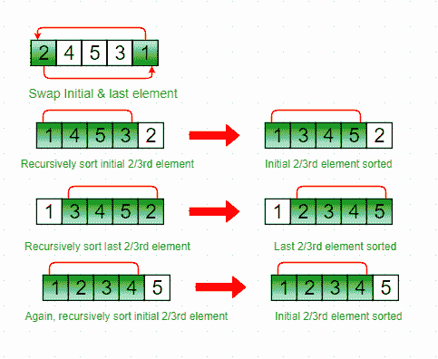

# Python 中的 Stooge 排序——Python 中的分步实现

> 原文：<https://www.askpython.com/python/examples/stooge-sort>

嘿伙计们！在本教程中，我们将讨论`Stooge sort algorithm`，并学习如何用 Python 编程语言实现。

让我们先来介绍一下活宝的分类。

* * *

## 活宝排序简介

`Stooge sort`是一种[递归](https://www.askpython.com/python/python-recursion-function)排序，以时间复杂度差著称。该算法的运行时间比[冒泡排序](https://www.askpython.com/python/examples/bubble-sort-in-python)要慢。但是，它比慢速排序更高效。

该算法简要定义如下:

1.  如果起始位置的值大于结束位置的值，则交换它们。
2.  如果列表中有 3 个或更多元素，那么，
    *   首先，Stooge 排序列表的前 2/3
    *   其次，Stooge 排序列表的最后 2/3
    *   最后，Stooge 再次对列表的前 2/3 进行排序。

* * *

## Stooge 排序算法中包含的步骤

当涉及到 Stooge 排序算法时，涉及到许多步骤。

首先，将数组传递给函数，比较第一个元素**和最后一个元素**，如果第一个元素较小，则交换它们。

接下来，我们考虑数组的大小，如果`size>2`那么数组的各个部分被递归调用来排序数组的第一个、最后一个以及第一个**2/3 部分。**

最后，只需在屏幕上显示排序后的数组。现在我们来看看这个[排序算法](https://www.askpython.com/python/sorting-techniques-in-numpy)的代码实现。



Stooge Sort Demonstration

* * *

## 在 Python 中实现活宝排序

理论说完了，让我们学习如何用 Python 实现 stooge sort。这个例子是为了帮助你更好地理解这个算法的每一步。

```py
def stoogesort(arr, start, end): 

    # Check if there are elements in the array
    if start >= end: 
        return

    # Check first element with the last element
    if arr[start]>arr[end]: 
        temp = arr[start] 
        arr[start] = arr[end] 
        arr[end] = temp 

    # Check if the number of elements are more than 2
    if end-start+1 > 2: 
        temp = (int)((end-start+1)/3) 
        # Recursively call the parts of array to be sorted
        stoogesort(arr, start, (end-temp)) 
        stoogesort(arr, start+temp, (end)) 
        stoogesort(arr, start, (end-temp)) 

# Take Input of the Unorted Array
arr = list(map(int,input("Enter all the numbers of array separated by a space: ").split()))
n = len(arr)

# Print the Unsorted Array
print("The original unsorted array is: ")
for i in range(0, n): 
    print(arr[i], end = ' ')

stoogesort(arr, 0, n-1) 

# Print the Sorted Array
print("\nThe sorted array is: ")
for i in range(0, n): 
    print(arr[i], end = ' ')

```

* * *

## 示例输出

```py
Enter all the numbers of array separated by a space: 23 2 9 -3 0 34 1
The original unsorted array is: 
23 2 9 -3 0 34 1 
The sorted array is: 
-3 0 1 2 9 23 34 

```

```py
Enter all the numbers of array separated by a space: 9 4 -2 -2 4 67 100
The original unsorted array is: 
9 4 -2 -2 4 67 100 
The sorted array is: 
-2 -2 4 4 9 67 100 

```

* * *

## 结论

我希望您喜欢并理解排序算法及其实现。自己试试吧！

您还可以阅读:

*   [Python 中的砖块排序算法【容易实现】](https://www.askpython.com/python/examples/brick-sort-algorithm)
*   [Python 中的选择排序](https://www.askpython.com/python/selection-sort-in-python)
*   [Python 中的插入排序](https://www.askpython.com/python/examples/insertion-sort-in-python)
*   [如何在 Python 中实现快速排序？](https://www.askpython.com/python/examples/quicksort-algorithm)

快乐学习！😇

* * *