# Streamlit 中的主题化–定制 Streamlit 应用外观的两种方法

> 原文：<https://www.askpython.com/python-modules/streamlit-theming>

在我们之前的文章中，我们学习了如何安装 Streamlit，创建一个“Hello World”应用程序 ，以及一些文本元素和小部件。接下来，在本文中，我们将学习 Streamlit 中的主题化。

Streamlit 提供亮暗两种模式。Streamlit 首先检查用户在其操作系统和浏览器中设置的亮或暗模式的偏好。如果是，则使用该首选项。否则，默认情况下将应用灯光主题。

***亦读:[细流简介](https://www.askpython.com/python-modules/introduction-to-streamlit)***

* * *

## 如何更改 Streamlit 应用程序的主题？

现在让我们看看可以用来改变 Streamlit 默认主题的不同方法。

### 更改 Streamlit 应用程序主题的方法 1[GUI 方法]

我们可以从设置中改变主题。
点击应用程序中的“≣”符号，然后点击“设置”选项。这些步骤如下图所示。

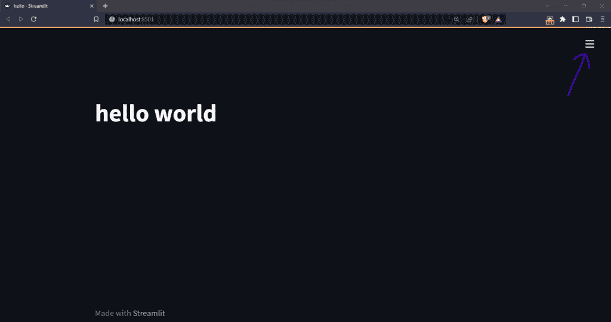

Theme Step 1

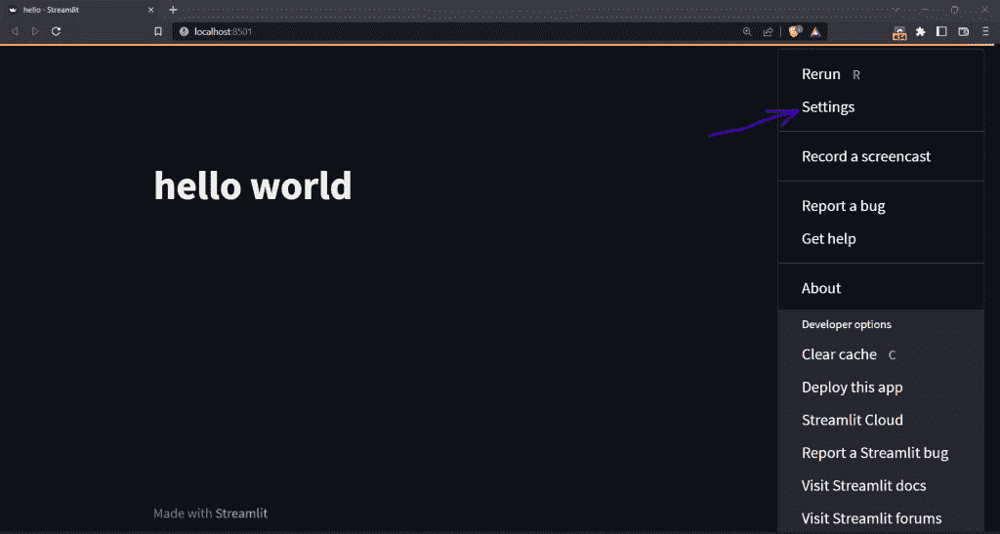

Theme Step 2

你会看到下面的屏幕。

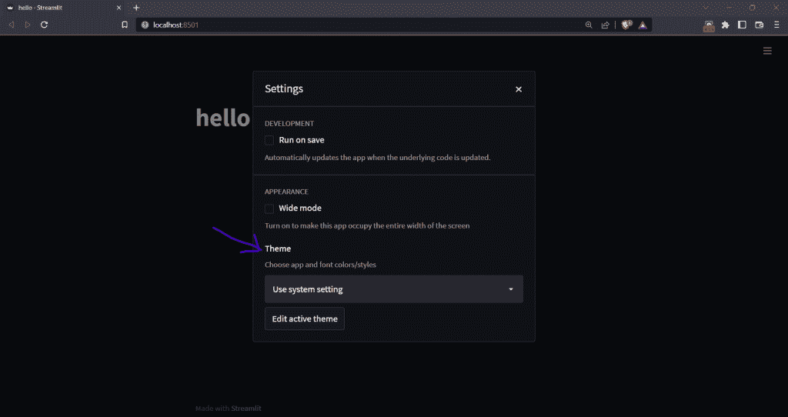

Theme Step 3

现在，在**主题**部分，点击下拉菜单。正如我们在上面的图片中看到的，默认的主题是用户在他们的系统设置中设置的。这是这种情况下的黑暗主题。

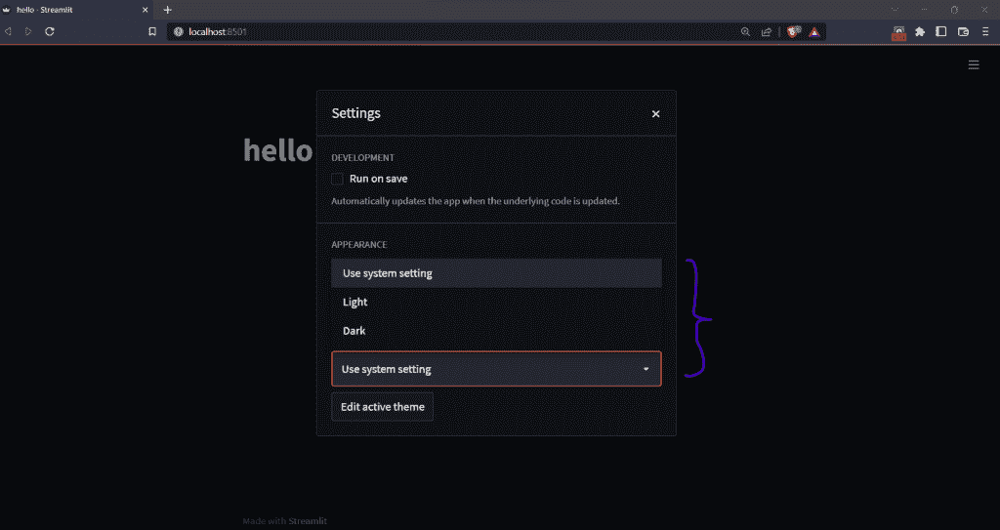

Theme Step 4

有三个选项:`Use system setting`(默认)、`Light`、`Dark`。或者，如果我们想制作自己的主题，我们可以使用'**编辑活动主题**按钮。点击它将引导我们到下面的屏幕。

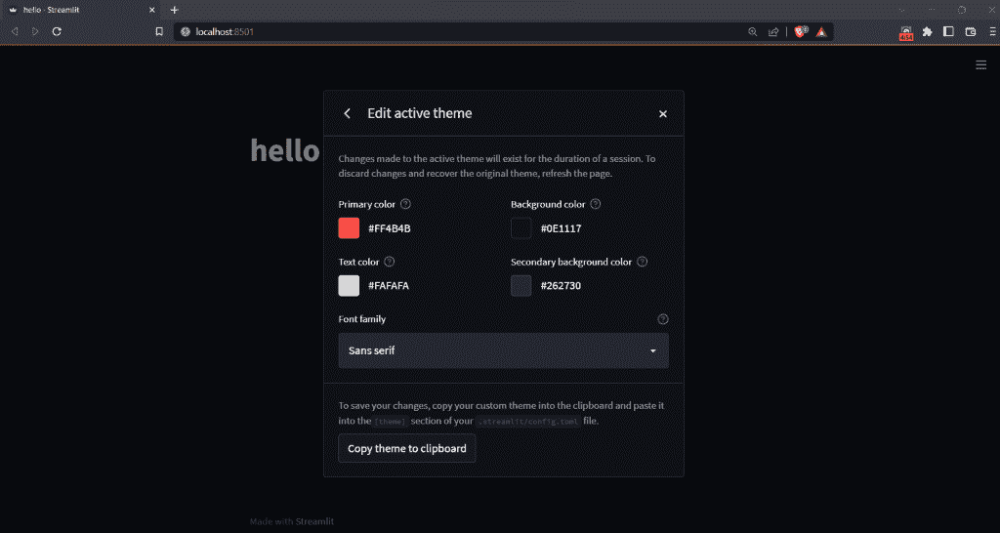

Theme Step 5

在这里，我们有所有的选项来改变文本的不同颜色和字体。一旦你自己创建了一个主题，它将被保存为主题选择器中的一个'*自定义主题*'，并且将被默认应用。

* * *

### 更改 Streamlit 应用程序主题的方法 2[编码方法]

我们也可以在使用`streamlit run`命令启动应用程序时通过命令行设置主题。同样，我们可以在`.streamlit/config.toml`文件的`[theme]`部分定义主题。它可以在以下位置找到

```py
C:\Users\userName\.streamlit\config.toml

```

在 Windows 机器上，以及在

```py
~/.streamlit/config.toml

```

在 Mac OS/Linux 机器上。

`.streamlit/config.toml`文件中的**默认灯光主题**将如下所示:

```py
[theme]
primaryColor="#F63366"
backgroundColor="#FFFFFF"
secondaryBackgroundColor="#F0F2F6"
textColor="#262730"
font="sans serif"

```

而**黑暗主题**会是这样的:

```py
[theme]
primaryColor="#FF4B4B"
backgroundColor="#0E1117"
secondaryBackgroundColor="#262730"
textColor="#FAFAFA"
font="sans serif"

```

* * *

让我们逐一探讨所有这些选项。但在此之前，让我们用我们在之前关于 Streamlit 的入门教程中学到的东西快速开发一个应用程序。

```py
import streamlit as st

# button
st.button('Streamlit Button', help="Click here")

# check box
st.checkbox('Check Box')

# radio button
lang = st.radio(
    "What's your favorite programming language?",
    ('C++', 'Python'))
if lang == 'C++':
    st.write('You selected C++.')
else:
    st.write('You selected Python')

# slider
score = st.slider('Please specify your test score', 0, 100, 10)
st.write("My test score is ", score)

# Using object notation
add_selectbox = st.sidebar.radio(
    "Please choose an option",
    ("Option 1", "Option 2", "Option 3")
)

```

**输出:**

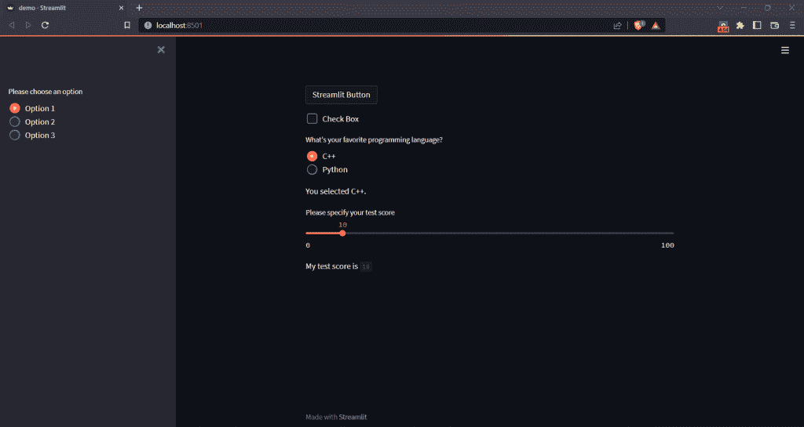

Theme Demo App

上面是一个简单的 Streamlit 应用程序，由不同的小部件组成，如**复选框、按钮、侧边栏、滑块和单选按钮**。我们将使用这个应用程序，并在下面的例子中尝试不同的主题选项。

***注意:所有颜色选项支持 HEX、RGB、HSL 格式，以及网络浏览器支持的*** 颜色名称，如**【绿色】*****【蓝色】。在下面的例子中，我们将使用浏览器支持的颜色名称。***

* * *

### 原色–更改细流应用程序的原色

primaryColor 是指 Streamlit 应用中的强调色。滑块、按钮和复选框(聚焦时)等小部件使用 primaryColor。

**config.toml:**

```py
[theme]
primaryColor="green"
backgroundColor="#0E1117"
secondaryBackgroundColor="#262730"
textColor="#FAFAFA"
font="sans serif"

```

**输出:**

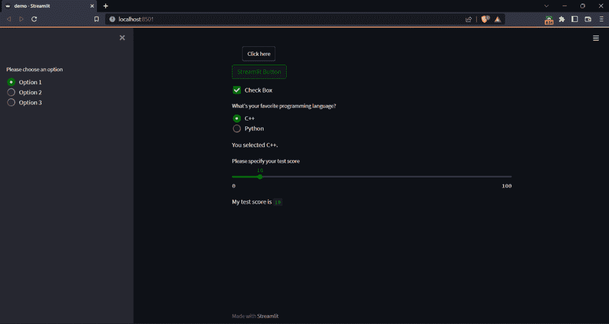

Streamlit PrimaryColor

在上图中，所有处于焦点的小部件都以绿色作为主色，而不是配置文件中指定的默认红色。

### background color–更改细流应用程序的背景颜色

指的是 app 主要内容区域的背景色。

**config.toml:**

```py
[theme]
primaryColor="#FF4B4B"
backgroundColor="pink"
secondaryBackgroundColor="#262730"
textColor="#FAFAFA"
font="sans serif"

```

**输出:**

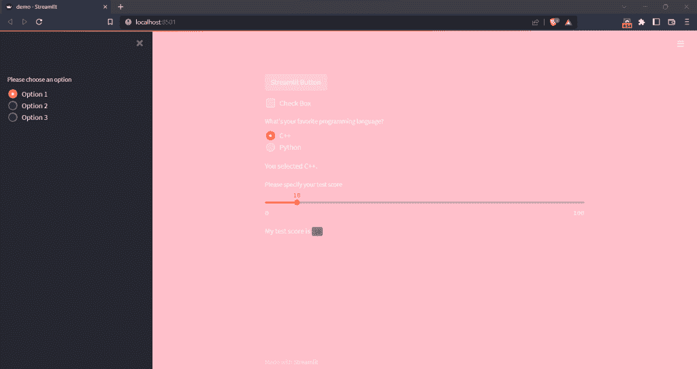

Streamlit BackgroundColor

主要内容区域的背景现在是粉红色的。

### secondaryBackgroundColor–添加辅助背景色

当需要第二种背景色时，使用此选项。Streamlit 中的 Plotly 图表和侧边栏大多使用此选项。

**配置文件**:

```py
[theme]
primaryColor="#FF4B4B"
backgroundColor="#0E1117"
secondaryBackgroundColor="blue"
textColor="#FAFAFA"
font="sans serif"

```

**输出:**

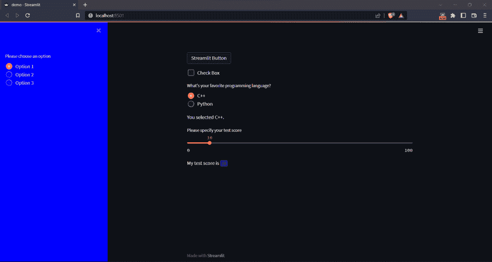

Streamlit SecondaryBackgroundColor

使用`secondaryBackgroundColor`的小部件，比如侧边栏，在这里变成了蓝色。请注意，主要内容区域的背景颜色没有改变。

### text color–设置细流应用程序的文本颜色

它用于更改我们的 Streamlit 应用程序中文本的颜色。

**config.toml:**

```py
[theme]
primaryColor="#FF4B4B"
backgroundColor="#0E1117"
secondaryBackgroundColor="#262730"
textColor="red"
font="sans serif"

```

**输出:**

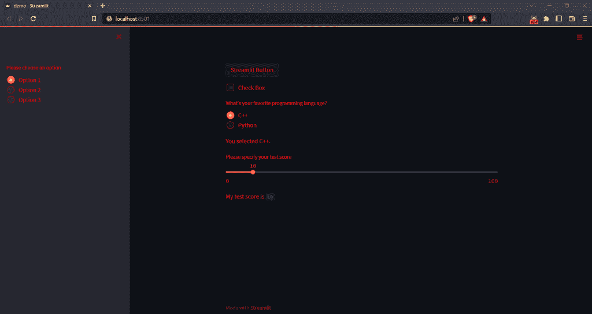

Streamlit TextColor

这里的文本颜色是配置文件中指定的红色。

### 字体–更改细流应用的字体

Streamlit 支持三种字体类型，分别是`sans serif`、`serif`和`monospace`。**默认字体**为`sans serif`。
在**代码块**中，字体类型始终为`monospace`，与此处选择的字体类型无关。

**配置文件**:

【主题】T0【主色调= # ff 4b】
【背景色= # 0e 1117】
【次背景色= # 262730】
【文本颜色= # fafa】
字体=【单幅空间】

**输出:**

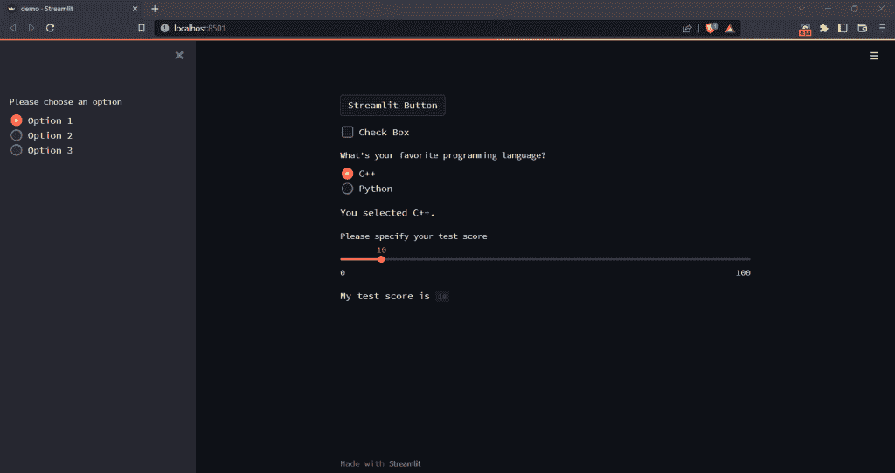

Streamlit Font

在这种情况下，字体系列已更改为`monospace`。

* * *

## 结论

这是 Streamlit 教程系列的第二篇，我们在这里学习了 Streamlit 中的主题化。希望对你有帮助。也请查看本系列中的其他教程。

* * *

## 参考

*   [简化关于主题的官方文档](https://docs.streamlit.io/library/advanced-features/theming)