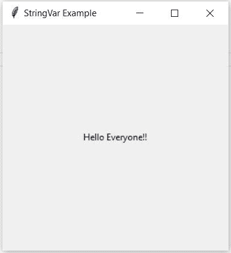

# 带示例的 Tkinter string var–Tkinter 教程

> 原文：<https://www.askpython.com/python-modules/tkinter/stringvar-with-examples>

大家好！在本教程中，我们将了解如何在 Tkinter 中使用 StringVar 函数来存储文本变量和编辑小部件中的文本。我们还将看到一个例子，当文本变量发生变化时，编写回调函数进行通知。所以让我们开始吧。

## 什么是 StringVar()？

Tkinter 包含内置的编程类型，其工作方式类似于普通的 python 变量，具有额外的特性，用于更有效地操纵像`Label`和`Entry`这样的小部件的值，这使它们不同于 python 数据类型。这些变量还包含 getter 和 setter 方法来访问和更改它们的值。`StringVar`就是其中的一个例子。

使用`StringVar()`定义的变量保存一个字符串数据，我们可以在其中设置文本值并检索它。此外，我们可以将这个变量传递给类似条目的小部件的 textvariable 参数。每当`StringVar()`变量的值改变时，小部件将自动用新值更新。

## 定义 StringVar()变量

下面是使用 Tkinter `StringVar()`定义字符串变量的步骤:

*   **主**:是`StringVar`对象关联的一个小部件。如果未指定任何内容，则默认为根窗口。
*   **value** :字符串变量的初始值。默认为“”。
*   **名称**:已定义变量的名称。默认值为 PY_VARnum(如 PY_VAR1、PY_VAR2 等)。

例如，在下面的代码中，我们使用`StringVar()`创建一个字符串变量，并将其赋给`Label`小部件的 textvariable 参数。

```py
import tkinter as tk

master_window = tk.Tk()
master_window.geometry("150x150")
master_window.title("StringVar Example")

string_variable = tk.StringVar(master_window, "Hello Everyone!!")

label = tk.Label(master_window, textvariable=string_variable, height=150)
label.pack()

master_window.mainloop()

```



Defining StringVar

## 设置 StringVar()变量的值

可以通过两种方式将值分配给使用`StringVar()`定义的字符串变量:

*   **在构造函数**中传递值:定义 Tkinter 变量时，可以在构造函数的`value`参数中传递字符串变量的值。

```py
string_variable = tk.StringVar(master=master_window, value="Initial value of string variable")

```

*   **使用`set()`方法**:你可以使用`set()`方法来改变字符串的值。例如:

```py
string_variable = tk.StringVar(master_window)
string_variable.set("Some Text")

```

## 检索 StringVar()变量的值

我们可以对`StringVar()`变量使用`get()`方法来检索变量中的文本值。

```py
import tkinter as tk

master_window = tk.Tk()

string_variable = tk.StringVar(master_window)
string_variable.set("Welcome to AskPython!!")

print(string_variable.get())

```

使用这种方法，当 StringVar 变量被传递给小部件时，我们还可以检索出现在`Entry`小部件中的数据。例如:

```py
import tkinter as tk

master_window = tk.Tk()
master_window.geometry("300x300")
master_window.title("StringVar get() example")

def print_data():
    print(string_variable.get())

string_variable = tk.StringVar(master_window)

label = tk.Label(master_window, text="Enter Data: ")
label.grid(row=0, column=0)

entry = tk.Entry(master_window, textvariable=string_variable)
entry.grid(row=0, column=1)

button = tk.Button(master_window, text="Print data", command=print_data)
button.grid(row=1, column=0, columnspan=2)

master_window.mainloop()

```

## 编写回调来跟踪 StringVar()变量

Tkinter-defined 对象的一个有趣的特性是，每当对象的值被更改、读取或删除时，对象都会得到通知。如果您想在对内部定义的对象进行某些操作时自动更新其他小部件，这个特性会很有帮助。

要在`StringVar()`对象上定义回调，我们可以在`StringVar()`对象上使用`trace()`方法，该方法有两个参数:

*   模式:对`StringVar()`对象的操作类型。
    *   `'w'` (write):当值改变时调用回调
    *   `'r'` (read):读取值时调用回调
    *   `'u'`(未设置):删除值时调用回调
*   回调:当对象上有操作时调用的方法。

让我们考虑一个例子，其中将为在`Entry`小部件中输入的名字生成一条问候消息。当我们通过`Entry`小部件改变`StringVar()`对象中的数据时，将会调用一个方法来同时改变问候消息。

```py
import tkinter as tk

class GreetingApp(tk.Tk):
    def __init__(self):
        super().__init__()
        self.title('Greeting Application')
        self.geometry("300x300")

        self.name_var = tk.StringVar()
        self.name_var.trace('w', self.create_greeting_message)

        self.create_widgets()

    def create_widgets(self):
        self.description_label = tk.Label(self, text="Enter your name:")
        self.description_label.grid(column=0, row=0)

        self.entry = tk.Entry(self, textvariable=self.name_var)
        self.entry.grid(column=1, row=0)
        self.entry.focus()

        self.greeting_label = tk.Label(self)
        self.greeting_label.grid(column=0, row=1, columnspan=2)

    def create_greeting_message(self, *args):
        name_entered = self.name_var.get()

        greeting_message = ""
        if name_entered != "":
            greeting_message = "Hello " + name_entered

        self.greeting_label['text'] = greeting_message

if __name__ == "__main__":
    app = GreetingApp()
    app.mainloop()

```

结果如下:

<https://www.askpython.com/wp-content/uploads/2021/09/Stringvar-Greeting-Example.webm>

## 结论

在本教程中，我们学习了 Tkinter 中的`StringVar()`,以及如何使用它来设置字符串值、检索它以及编写自动更改数据的回调函数。

感谢阅读！！