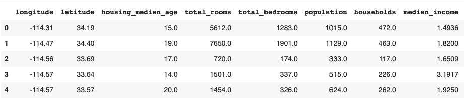
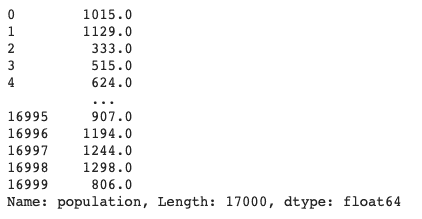
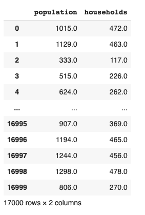
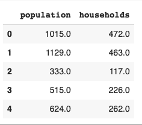
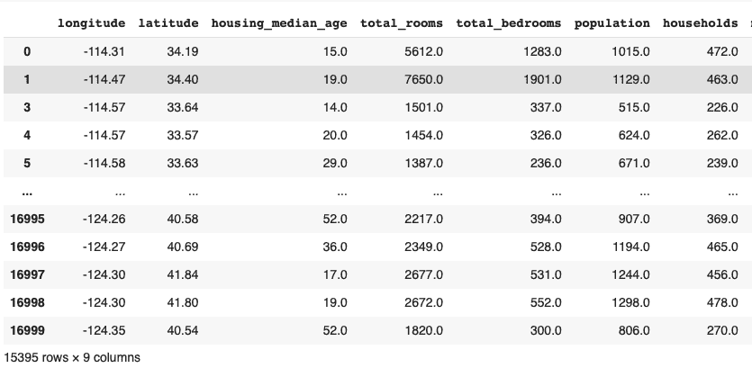
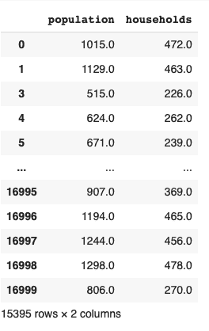
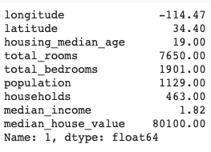
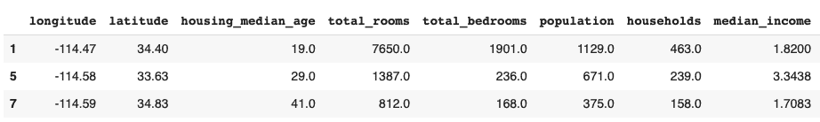
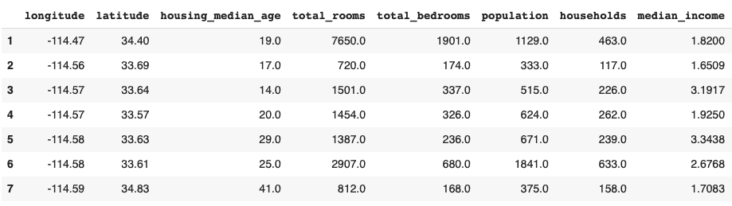
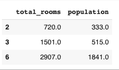

# 如何在 Python 中对数据帧进行子集化？

> 原文：<https://www.askpython.com/python/examples/subset-a-dataframe>

在本教程中，我们将介绍几种可以用来划分数据帧子集的方法。如果要将数据导入 Python，则必须了解数据框。DataFrame 是一个**二维数据结构**，即数据以表格形式排列成行和列。

数据框子集化是从数据框中选择一组所需行和列的过程。

您可以选择:

*   所有行和有限的列
*   所有列和有限的行
*   有限的行和有限的列。

设置数据框的子集非常重要，因为它允许您仅访问数据框的特定部分。当您想要减少数据框中的参数数量时，这很方便。

让我们从导入数据集开始。

## 导入数据以构建数据框架

在本教程中，我们使用的是[加州住房数据集。](https://developers.google.com/machine-learning/crash-course/california-housing-data-description)

让我们从使用 [pandas](https://www.askpython.com/python-modules/pandas/python-pandas-module-tutorial) 将数据导入数据框开始。

```py
import pandas as pd
housing = pd.read_csv("/sample_data/california_housing.csv")
housing.head()

```



Housing Dataframe

我们的 [csv 文件](https://www.askpython.com/python-modules/pandas/save-dataframe-as-csv-file)现在作为熊猫数据帧存储在 housing 变量中。

## 使用索引运算符选择数据帧的子集

索引操作符只是**方括号的一个花哨名字。**您可以仅使用方括号选择列、行以及行和列的组合。让我们来看看实际情况。

### 1.仅选择列

要使用索引运算符选择列，请使用下面的代码行。

```py
housing['population']

```



Population

这行代码选择标签为“population”的列，并显示与之对应的所有行值。

**您也可以使用索引运算符选择多个列。**

```py
housing[['population', 'households' ]]

```



Population And Household

要对数据帧进行子集化并存储，请使用以下代码行:

```py
housing_subset = housing[['population', 'households' ]]
housing_subset.head()

```



这将创建一个单独的数据框作为原始数据框的子集。

### 2.选择行

您可以使用索引运算符根据特定条件选择特定的行。

例如，要选择人口数大于 500 的行，可以使用下面的代码行。

```py
population_500 = housing[housing['population']>500]
population_500

```



population Greater Than 500

您还可以进一步划分数据框的子集。例如，让我们尝试从上面创建的 housing_subset 数据框中过滤行。

```py
population_500 = housing_subset[housing['population']>500]
population_500

```



Subset

请注意，上面的两个输出具有相同的行数(应该是这样)。

## 使用 Python 子集化数据帧。loc()

**。** [**loc** 索引器](https://www.askpython.com/python-modules/pandas/python-loc-function)是从数据帧中选择行和列的有效方法。它还可以用来同时选择行和列。

需要记住的重要一点是**。loc()作用于行和列的标签。**这之后，我们再来看看。基于行和列索引的 iloc()。

### 1.使用 loc()选择行

使用选择单行。loc()使用下面一行代码。

```py
housing.loc[1]

```



Loc

要选择多行，请使用:

```py
housing.loc[[1,5,7]]

```



Loc

您还可以对起始索引和结束索引之间的行进行切片。

```py
housing.loc[1:7]

```



Slicing

### 2.选择行和列

要从数据框中选择特定的行和列，请使用以下代码行:

```py
housing.loc[1:7,['population', 'households']]

```


这一行代码选择从 1 到 7 的行以及对应于标签“人口”和“住房”的列。

## 使用 Python iloc()子集 a 数据帧

**[iloc()函数](https://www.askpython.com/python/built-in-methods/python-iloc-function)** 是**整数位置**的简称。它完全适用于行和列的整数索引。

要使用 iloc()选择行和列的子集，请使用以下代码行:

```py
housing.iloc[[2,3,6], [3, 5]]

```



Iloc

这行代码选择行号 **2、3 和 6** 以及列号 **3 和 5。**

使用 iloc 可以省去您编写完整的行和列标签的麻烦。

在用整数替换标签后，您还可以使用 iloc()单独选择行或列，就像 loc()一样。

## 结论

本教程是关于使用方括号、loc 和 iloc 在 python 中设置数据框的子集。我们学习了如何将数据集导入数据框，以及如何从数据框中过滤行和列。