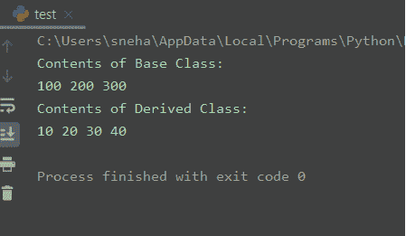
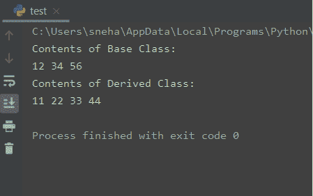

# 了解 Python 中的 super()方法

> 原文：<https://www.askpython.com/python/built-in-methods/super-method-in-python>

## 介绍

今天在本教程中，我们将讨论 Python 中的 super()方法。

在进入主题之前，我们强烈建议浏览一下关于 [Python 继承](https://www.askpython.com/python/oops/inheritance-in-python)的教程。

一旦你了解了 Python 中的继承，我们就可以开始了。

## Python 中的 super()方法

`super`方法返回一个代理对象，该对象将方法调用委托给**类型**的父类或兄弟类。这对于访问在类中被重写的继承方法很有用。

或者简单来说，就是用来调用构造函数，即**超类**的 `__init__()`方法。

下面给出了在 Python 中使用 super 的语法。

```py
super([type[, object-or-type]])

```

在 **Python 3.x** 版本中，我们可以不用传递上述两个参数就可以使用 super。请看下面的代码片段。

```py
class C(B):
    def method(self, arg):
        super().method(arg)

```

这里，`C`是派生类，`B`是基类，方法是带有参数`arg`的用户定义函数。

可以看到，行`super().method(arg)`实际上相当于 Python **3.x** 中的`super( C, self).method(arg)`。这在 Python **2.x** 中是不允许的。因此，在那里使用 super 有点棘手。

## 使用超级()

考虑下面给出的例子。

```py
class Demo:
    a = 0
    b = 0
    c = 0
    def __init__(self,A,B,C):
        self.a = A
        self.b = B
        self.c = C
    def display(self):
        print(self.a, self.b, self.c)

class Newdemo(Demo):
    d = 0
    def __init__(self,A,B,C,D):
        self.a = A
        self.b = B
        self.c = C
        self.d = D

    def display(self):
        print(self.a, self.b, self.c,self.d)

B1 = Demo(100,200,300)
print("Contents of Base Class:")
B1.display()
D1 = Newdemo(10,20,30,40)
print("Contents of Derived Class:")
D1.display()

```

**输出**:



Output

在上面的例子中，从基类`Demo`派生的类没有被有效或健壮地实现。

派生类`Newdemo`显式初始化基类的 A、B 和 C 字段的值。在初始化基类`Demo`中的相同字段时，也发现了相同的重复代码。

这个过程效率很低。这意味着一个**子类**必须被授权访问一个**超类**的成员。

因此，每当子类需要引用它的直接超类时，`super`就会出现。

### Super()来调用超类构造函数

现在让我们对上面的例子应用`super()`方法。

```py
class Demo:
    a = 0
    b = 0
    c = 0
    def __init__(self,A,B,C):
        self.a = A
        self.b = B
        self.c = C
    def display(self):
        print(self.a, self.b, self.c)

class Newdemo(Demo):
    d = 0
    def __init__(self,A,B,C,D):
        self.d = D
        super().__init__(A,B,C) #super to call super Class
        #The __init__() Method

    def display(self):
        print(self.a, self.b, self.c,self.d)

B1 = Demo(12,34,56)
print("Contents of Base Class:")
B1.display()
D1 = Newdemo(11,22,33,44)
print("Contents of Derived Class:")
D1.display()

```

**输出**:



Output

这里，派生类`Newdemo`用参数 **a** 、 **b** 和 **c** 调用`super()`。这导致基类的构造函数`__init__`，即`Demo`被调用。这将初始化 **a** 、 **b** 和 **c** 的值。因此，`Newdemo`类不再自己初始化值。

## 在 Python 2.x 中使用 super

下面给出了在 **Python 2.x** 中调用`super`类构造函数的**语法**，

```py
super(Derived_Class_Name, self).__init__(Parameters_of_Super_Class_Constructor)

```

因此，如果我们想在 Python **2** 中使用它，我们需要对上面的例子做一些小的修改。

首先，我们需要将`object`放在基类中，如下所示。

```py
class Demo(object):
...#other statements

```

其次，在超类调用的站点传递`Newdemo`和`self`。像这样。

```py
super(Newdemo,self).__init__(A,B,C) #super to call super Class
...        #The __init__() Method

```

## 我们为什么需要 super()

在**单继承**有父类和子类的情况下，`super`函数用于隐式引用父类，而不用显式命名。这使得代码在本质上更加高效、可维护和健壮。

接下来，对于一个**多级继承**,`super`方法可以用来隐式引用直接超类。这也使得代码更容易理解和维护。

## 结论

所以在本教程中，我们理解了 Python 中 **super()方法的概念，它的用途和需要。**

任何进一步的问题，请在下面随意评论。

## 参考

*   python Super-Journal Dev Post，
*   [Python 中的‘super’是做什么的？](https://stackoverflow.com/questions/222877/what-does-super-do-in-python-difference-between-super-init-and-expl)–stack overflow 问题，
*   [Python super](https://docs.python.org/3/library/functions.html#super)——官方文档。