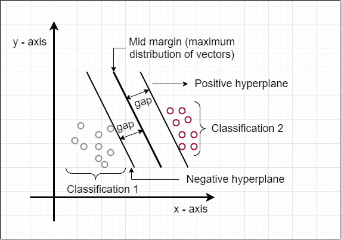
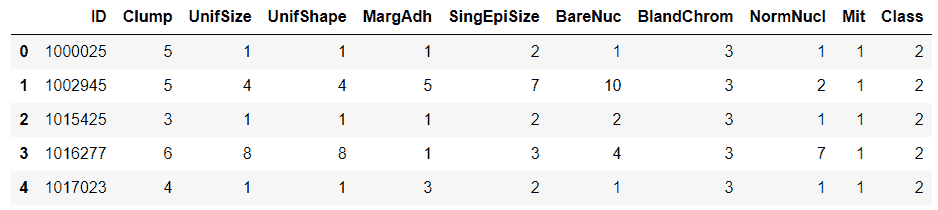
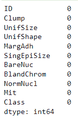
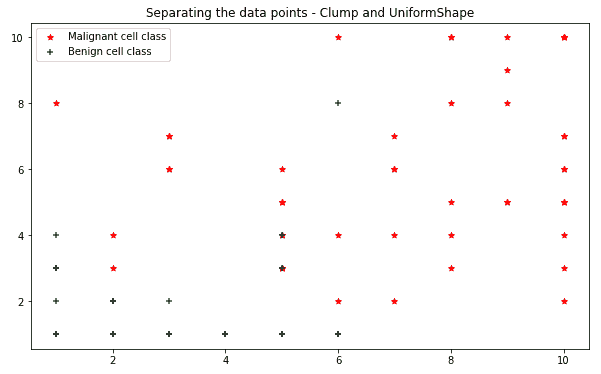

# Python 中的支持向量机

> 原文：<https://www.askpython.com/python/examples/support-vector-machines-in-python>

说到机器学习算法的实现，列表从线性回归到决策树开始。他们有各种各样的类型。主要当涉及沿着线性轴分离数据点时，专家的建议是:

1.  [**K-均值聚类。**](https://www.askpython.com/python/examples/k-means-clustering-from-scratch)
2.  ****支持向量机。****

众所周知，ML 模型有两种类型:

1.  [监督学习](https://www.askpython.com/python/supervised-vs-unsupervised-learning):需要一个指导从程序员那里选择输入数据。
2.  [无监督学习](https://www.askpython.com/python/machine-learning-introduction):无需指导选择输入数据。这是一个自我学习的模型。

## 一般理论

这篇文章的主要目的是让读者了解 SVM 的技巧是如何运作的。在互联网上，数据是原始的。因此，当我们构建数据并将其可视化时，结果要么是**离散分布，要么是**连续分布。据此，支持向量机用于两个目的:

1.  分类:*为离散数据参数。*
2.  回归:*为连续数据参数。*

这是支持向量机被高度用于分类和回归目的的主要原因之一。定义中说:**支持向量机是一组学习算法，帮助我们对数据的性质进行分类和分析。**

#### SVM 的组成部分

1.  支持向量:*这些是主要成分。它们是位于最大边距两侧的简单数据点。*
2.  最大余量:*直到数据分类发生的最大限度。*
3.  最大边缘超平面:*位于正负超平面之间的最大中限边缘。*
4.  正超平面:*边缘平面的右侧。*
5.  负超平面:*边缘平面左侧。*

#### 图表



SVM Diagram Simplified

在这张图中，我们可以清楚地看到，主要空白是根据颜色分隔所有不同的数据点。我们用颜色来表现它们的不同性质。SVM 的主要目的是显示区别，并用尽可能好的边缘线对每个点进行分类。

#### 示例和应用

假设我们有一个类:**车辆**。**我们的任务是从那个班拿运动型多功能车(SUV)。**现在还有各种其他类型。现在，当我们试图按顺序手动排列它们时，可能会花费很多时间。这也产生了一些错误。因此，为了使分类更加稳定，我们可以创建一个支持向量机，它将对来自父车辆类别的所有汽车模型进行分类。它应按照以下步骤工作:

1.  该模型将拍摄样本图像。
2.  然后将其与已提供的车型试验数据进行比较。
3.  之后，它会告诉我们输入图像中的汽车型号。
4.  没有其他算法能比 SVM 更简单。

## 实现支持向量机

在本节中，我们将实现支持向量机的所有必要实现。所以，让我们开始吧！

#### 环境详细信息:

1.  *Python 3.9.7*
2.  *IDE: Jupyter 笔记本*
3.  *环境:蟒蛇 3*
4.  *数据集:癌症数据集(cell_samples.csv)*

导入数据读取和预处理所需的库

```py
import pandas as pd
import numpy as np
import matplotlib.pyplot as plt
from warnings import filterwarnings
filterwarnings("ignore")

```

读取数据集

```py
cancer_data = pd.read_csv("Datasets/cell_samples.csv", sep = ",")
cancer_data.head()

```

**输出:**



Viewing The Dataset

检查空值

```py
cancer_Data.isna().sum()

```



No Null Values

获取数据集的一般信息

```py
print("The shape of the dataset is: ", cancer_data.shape)
print("The size of the dataset is: ", cancer_data.size, " bytes\n")
print("The count of each attribute of the dataset is: \n")
print(cancer_data.count())
print("\nThe datatype of each attribute is: \n")
print(cancer_data.dtypes)

```

**输出:**

```py
The shape of the dataset is:  (699, 11)
The size of the dataset is:  7689  bytes

The count of each attribute of the dataset is: 

ID             699
Clump          699
UnifSize       699
UnifShape      699
MargAdh        699
SingEpiSize    699
BareNuc        699
BlandChrom     699
NormNucl       699
Mit            699
Class          699
dtype: int64

The datatype of each attribute is: 

ID              int64
Clump           int64
UnifSize        int64
UnifShape       int64
MargAdh         int64
SingEpiSize     int64
BareNuc        object
BlandChrom      int64
NormNucl        int64
Mit             int64
Class           int64
dtype: object

```

**将 BareNuc 列转换为整数类型**

```py
cancer_data = cancer_data[pd.to_numeric(cancer_data["BareNuc"], errors = "coerce").notnull()]
cancer_data["BareNuc"] = cancer_data["BareNuc"].astype("int")
cancer_data.dtypes

```

```py
ID             int64
Clump          int64
UnifSize       int64
UnifShape      int64
MargAdh        int64
SingEpiSize    int64
BareNuc        int32
BlandChrom     int64
NormNucl       int64
Mit            int64
Class          int64
dtype: object

```

#### 从数据框中分离出两个类

**对于癌细胞类型分类，我们有两种类型的细胞用于分类:**

1.  恶性:在我们的数据集中值= 4
2.  良性:在我们的数据集中值= 2

我们创建了两个同名的独立数据框。然后，尝试使用数据可视化技术对它们进行分类。仅从核心数据集中取前 50 个值。这使得绘图更容易。

```py
malignant = cancer_data[cancer_data["Class"] == 4][0:50]
benign = cancer_data[cancer_data["Class"] == 2][0:50]

```

```py
plt.figure(figsize = (10, 5))
ax = plt.axes()
ax.set_facecolor("white")
plt.title("Separating the data points - Clump and UniformShape")
plt.scatter(malignant["Clump"], malignant["UnifShape"] , color = "red", marker = "*")
plt.scatter(benign["Clump"], benign["UnifShape"], color = "green", marker = "+")
plt.legend(["Malignant cell class", "Benign cell class"])
plt.show()

```



Scatter Plots

使用 numpy 数组创建独立和从属数据列列表:

```py
dependent_data = cancer_data[["ID", "Class"]]
independent_data = cancer_data[['Clump', 'UnifSize', 'UnifShape', 'MargAdh', 'SingEpiSize',
       'BareNuc', 'BlandChrom', 'NormNucl', 'Mit']]

X_data = np.array(independent_data)
X_data[0:5]

Y_data = np.array(dependent_data["Class"])
Y_data[0:5]

```

**输出:**

```py
array([[ 5,  1,  1,  1,  2,  1,  3,  1,  1],
       [ 5,  4,  4,  5,  7, 10,  3,  2,  1],
       [ 3,  1,  1,  1,  2,  2,  3,  1,  1],
       [ 6,  8,  8,  1,  3,  4,  3,  7,  1],
       [ 4,  1,  1,  3,  2,  1,  3,  1,  1]], dtype=int64)

array([2, 2, 2, 2, 2], dtype=int64)

```

#### 将数据分为训练和测试变量

从 sklearn.model_selection 导入 [train_test_split 函数](https://www.askpython.com/python/examples/split-data-training-and-testing-set)。这将数据分成四个数组:

1.  x _ 火车
2.  x _ 测试
3.  y _ 火车
4.  y _ 测试

其中，训练阵列是二维的，测试阵列是一维的。只需记住取 test_size = 0.2，因为我们只需要总数据集的 20%来测试我们的模型准确性。

```py
from sklearn.model_selection import train_test_split
X_train, X_test, y_train, y_test = train_test_split(X_data, Y_data, test_size = 0.2, random_state = 4)
print(X_train.shape)
print(y_train.shape)
print(X_test.shape)
print(y_test.shape)

```

**输出:**

```py
(546, 9)
(546,)
(137, 9)
(137,)

```

#### 从 sklearn 导入 SVM 并创建分类器实例

首先我们导入模型，然后导入 SVC。它是用于分离支持向量的分类器类。创建一个实例“分类”。给定内核值为“线性”,它将线性分离支持向量。然后，我们使用 fit()函数拟合模型中的 X_train 数据和 Y_train 数据。之后，创建一个实例“y_predict ”,它将所有预测保存在一个一维数组中。

```py
from sklearn import svm
classify = svm.SVC(kernel = "linear")
Classify.fit(X_train, y_train)
y_predict = Classify.predict(X_test)
print(y_predict)

```

输出:

```py
array([2, 4, 2, 4, 2, 2, 2, 2, 4, 2, 2, 4, 4, 4, 4, 2, 2, 2, 2, 2, 4, 2,
       4, 4, 4, 4, 2, 2, 4, 4, 4, 2, 4, 2, 2, 2, 4, 2, 2, 2, 2, 2, 2, 4,
       4, 2, 2, 2, 2, 4, 2, 2, 2, 2, 2, 2, 4, 2, 2, 2, 2, 4, 4, 2, 4, 4,
       4, 2, 2, 2, 4, 4, 2, 2, 2, 4, 2, 2, 4, 4, 2, 2, 2, 2, 4, 4, 2, 4,
       2, 2, 4, 4, 2, 2, 2, 4, 2, 2, 2, 4, 2, 4, 2, 2, 4, 2, 4, 2, 2, 4,
       2, 2, 4, 2, 2, 2, 2, 2, 4, 4, 4, 4, 4, 2, 2, 4, 2, 2, 4, 2, 4, 2,
       2, 2, 2, 2, 4], dtype=int64)

```

因此，我们成功地将所有的癌症患者与非癌症患者分开。值为 4 的细胞是癌性的，值为 2 的细胞是非癌性的。现在，我们已经得到了预测，我们可以对 Y_test 数组运行它们来检查模型的准确性。为此，我们可以准备一份分类报告。

#### 准备分类报告

为此，我们需要从 sklearn.metrics 模块导入 classification_report 函数。然后在 print()函数内部调用它。我们用我们的 Y_test 数组测试它，结果如下:

```py
from sklearn.metrics import classification_report
print(classification_report(y_test, y_predict))

```

**输出:**

```py
                   precision    recall  f1-score   support

           2       1.00           0.94      0.97        90
           4       0.90           1.00      0.95        47

accuracy                           0.96       137
macro avg       0.95      0.97      0.96       137
weighted avg       0.97      0.96      0.96       137

```

结果表明模型的精度很高。对于**恶性等级(值= 4)** :精度分值为:100%。对于**良性类(值= 2)** ，精度分数为:90%

## 结论

因此，通过这种方式，我们成功地使用 Python 实现了支持向量机，并根据给定的输入数据构建了一个预测模型。