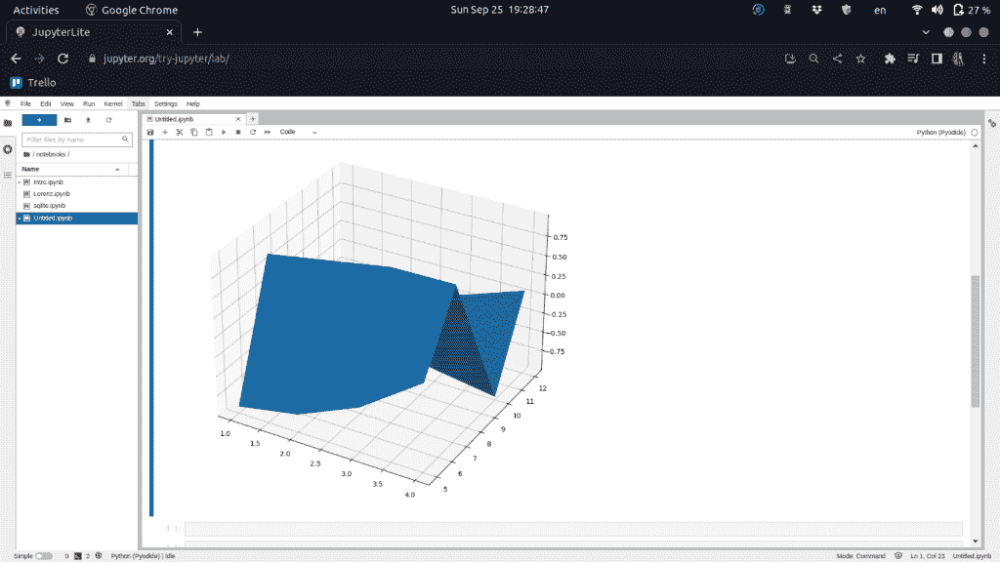

# 如何在 matplotlib 中绘制曲面图

> 原文：<https://www.askpython.com/python-modules/matplotlib/surface-plot-in-matplotlib>

我们之前已经介绍过如何在 matplotlib 中绘制[等高线图。现在是时候学习 matplotlib 中的曲面图了。表面图是以视觉上令人愉悦的格式可视化三维数据的一种很好的方式。不同的颜色编码允许人们理解不同点的数据的可变性。在数学中，我们非常广泛地使用这个。](https://www.askpython.com/python-modules/matplotlib/matplotlib-contour-plot)

## 使用虚拟数据在 matplotlib 中绘制表面图

首先，让我们绘制一些虚拟数据的表面图。我们首先导入所有必需的库:

```py
import pandas as pd
import numpy as np
import matplotlib.pyplot as plt

```

现在让我们创建一些虚拟数据:

```py
x = [1,2,3,4]
y = [5,7,10,12]

```

表面图需要网格数据，因此我们需要将数据转换成正确的格式，为此我们将使用 np.meshgrid 函数:

```py
X, Y = np.meshgrid(x,y)

```

这给了我们以下结果:

```py
[array([[1, 2, 3, 4],
        [1, 2, 3, 4],
        [1, 2, 3, 4],
        [1, 2, 3, 4]]),
 array([[ 5,  5,  5,  5],
        [ 7,  7,  7,  7],
        [10, 10, 10, 10],
        [12, 12, 12, 12]])]

```

我们现在需要创建第三个变量 Z，因为表面图是为三维数据集绘制的。我们将使用 X 和 Y 变量把它们转换成 Z 变量。有几个函数可以使用，但我们将使用一个常用的 z 函数，代码如下:

```py
def z_function(x, y):
    return np.sin(np.sqrt(x**2+y**2))
Z = z_function(X, Y)

```

现在我们有了所有三个变量，我们可以画出我们的表面图。为此，我们执行以下代码:

```py
plt.figure(figsize=(10, 10))
ax = plt.axes(projection='3d')
ax.plot_surface(X, Y, Z)

```

如果我们执行上述代码，将生成下图:



Surface plot using Dummy Data

如果您使用 Jupyter 笔记本，那么您可以在最后一个程序块的开头添加以下命令，然后您甚至可以与图形进行交互:

```py
matplotlib notebook

```

## 使用您自己的数据集(csv 文件)绘制表面图

现在，我们不会总是知道我们需要绘制的函数。事实上，大多数情况下，我们会有一些样本数据，并被要求使用这些数据创建一个曲面图。要做到这一点，让我们看看说明。

首先，我们需要将 csv 文件导入到 python 实例中。为此，我们将使用 [pd.read_csv 函数](https://www.askpython.com/python-modules/pandas/read-csv-with-delimiters):

```py
df = pd.read_csv("name_of_csv.csv")

```

我们可以通过执行以下代码来查看数据集中的所有列:

```py
df.columns

```

我们现在可以设置 x 和 y 变量，并再次创建网格:

```py
x = df['column_name_of_x']
y = df['column_name_of_y']
X, Y = np.meshgrid(x,y)

```

我们需要再次定义我们的 z 函数:

```py
Z = z_function(X, Y)

```

现在剩下的和以前一样，我们初始化坐标轴并绘制数据:

```py
plt.figure(figsize=(10, 10))
ax = plt.axes(projection='3d')
ax.plot_surface(X, Y, Z)

```

最后，让我们添加一些标签，这一天就结束了！

```py
ax.set_xlabel("x-label")
ax.set_ylabel("y-label")

```

## 结论

读者们，就这样吧！现在，您已经对如何使用 matplotlib 绘制曲面图有了基本的了解！如果你期待更多这样的精彩内容，请继续关注 AskPython，一如既往地感谢你的阅读！