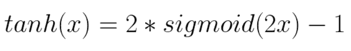
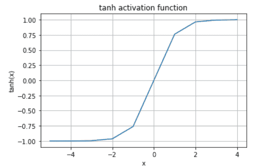

# 双曲正切激活函数

> 原文：<https://www.askpython.com/python/examples/tanh-activation-function>

在深度学习中，神经网络由神经元组成，这些神经元根据它们的权重、偏差和各自的激活功能进行工作。基于输出中的误差来调整权重和偏差。这被称为[反向传播](https://www.askpython.com/python/examples/backpropagation-in-python)。激活函数使这一过程成为可能，因为它们提供梯度以及误差来更新权重和偏差。

激活函数在神经网络中引入了非线性。它们将线性输入信号转换成非线性输出信号。一些激活功能有`Sigmoid`、`ReLu`、`Softmax`、`tanh`等。

在本教程中，我们将学习 **tanh 激活函数**。所以让我们开始吧。

* * *

## tanh 是什么？

激活函数可以是线性的也可以是非线性的。`tanh`是**正切双曲线**的缩写。`tanh`是一个**非线性**激活函数。它是一个**指数函数**，主要用于多层[神经网络](https://www.askpython.com/python/examples/neural-networks)，专门用于隐藏层。

让我们看看双曲正切函数的方程。


tanh Equation 1

这里，' **e** '是欧拉数，也是自然对数的底数。它的值大约为 **2.718** 。
通过简化，我们得到这个等式，


tanh Equation 2

据说双曲正切激活函数的性能比 s 形激活函数好得多。事实上，`tanh`和`sigmoid`激活函数是相互关联的，并且可以从彼此导出。

* * *

## tanh 与 sigmoid 激活函数的关系

`sigmoid`激活函数的方程式为


Sigmoid Equation 1

同样，我们可以写，


Sigmoid Equation 2

因此，从等式 *tanh 等式 1* 和 *sigmoid 等式 2* 我们可以看到这两个等式之间的关系为



tanh Sigmoid Relation Equation

现在，让我们尝试使用 Python 绘制`tanh`函数的图形。

* * *

## 使用 Matplotlib 创建双曲正切图

我们将使用 [matplotlib 库](https://www.askpython.com/python-modules/matplotlib/python-matplotlib)来绘制图表。这是一个巨大的图书馆，我们已经在网站上详细介绍过了。以下是 AskPython 上所有 [matplotlib 教程的列表。](https://www.askpython.com/python-modules/matplotlib/)

```py
#importing the required libraries
from math import exp
import matplotlib.pyplot as plt 

#defining the tanh function using equation 1
def tanh(x):
    return (exp(x)-exp(-x))/(exp(x)+exp(-x))

#input to the tanh function
input = []
for x in range(-5, 5):
    input.append(x)

#output of the tanh function
output = []
for ip in input:
    output.append(tanh(ip))

#plotting the graph for tanh function
plt.plot(input, output)
plt.grid()
#adding labels to the axes
plt.title("tanh activation function")
plt.xlabel('x')
plt.ylabel('tanh(x)')
plt.show()

```

**输出:**



tanh Plot using first equation

从上面可以看出，图形`tanh`是 **S 形**。它可以取值范围从 **-1 到+1** 。此外，注意这里的输出是以零为中心的，这在执行[反向传播](https://www.askpython.com/python/examples/backpropagation-in-python)时很有用。

如果我们不使用直接方程，而是使用`tanh`和`sigmoid`的关系，那么代码将是:

```py
#importing the required libraries
from math import exp
import matplotlib.pyplot as plt 

#defining the sigmoid function
def sigmoid(x):
    return 1/(1+exp(-x))

#defining the tanh function using the relation
def tanh(x):
    return 2*sigmoid(2*x)-1

#input to the tanh function
input = []
for x in range(-5, 5):
    input.append(x)

#output of the tanh function
output = []
for ip in input:
    output.append(tanh(ip))

#plotting the graph for tanh function
plt.plot(input, output)
plt.grid()
#adding labels to the axes
plt.title("tanh activation function")
plt.xlabel('x')
plt.ylabel('tanh(x)')
plt.show()

```

**输出:**


tanh Plot using second equation

上面两幅图完全相同，证明它们之间的关系是正确的。

tanh 函数已经在许多 NLP 应用中使用，包括自然语言处理和语音识别。

* * *

## 摘要

仅此而已！因此，我们在本教程中学习了`tanh`激活功能。如果你有兴趣，你还可以了解一下[乙状结肠激活功能](https://www.askpython.com/?p=35924)。