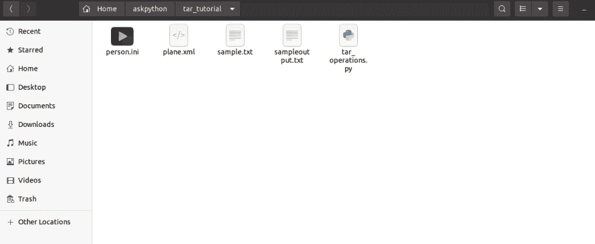
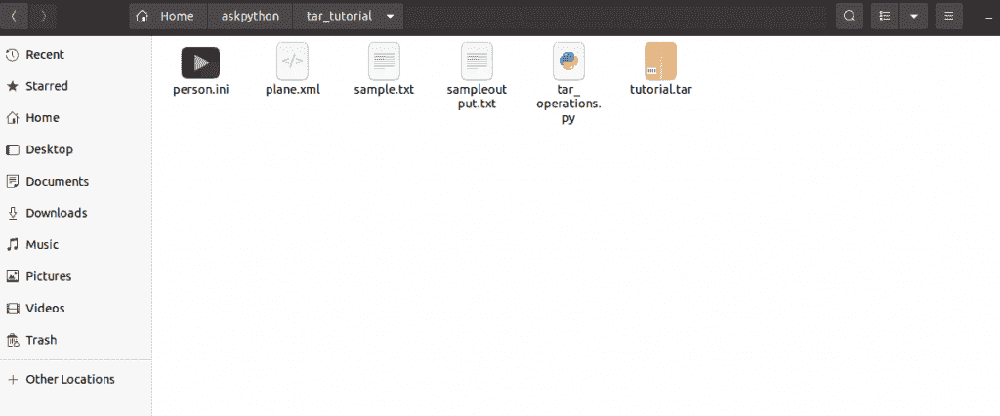
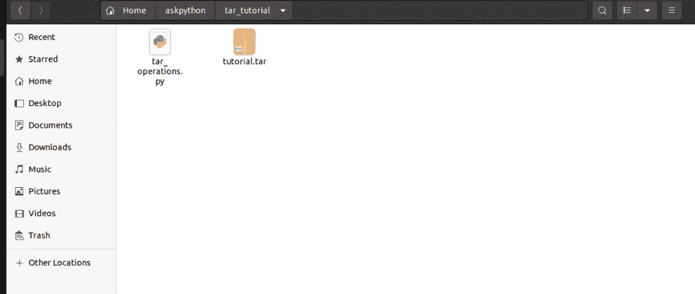
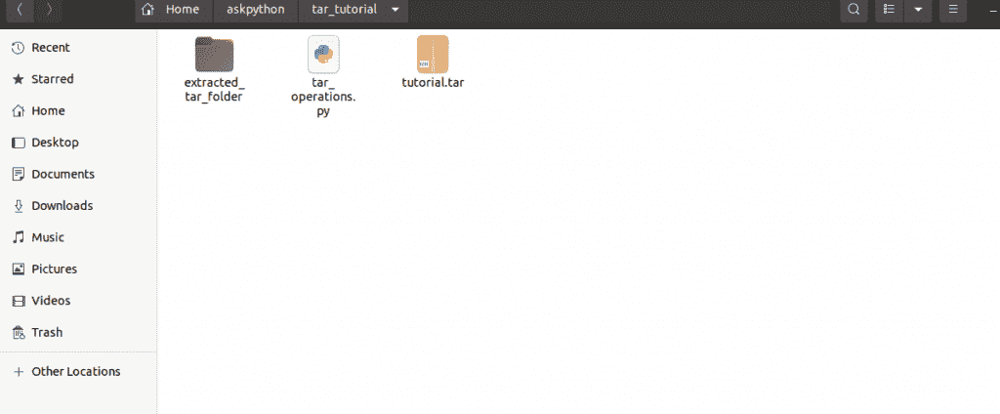

# tarfile 模块——如何在 Python 中处理 tar 文件？

> 原文：<https://www.askpython.com/python-modules/tarfile-module>

在本教程中，我们将了解什么是 tar 文件，并尝试使用 python 编程语言的`tarfile`模块创建和操作 tar 文件。

在本文中，我们将了解如何:

*   使用 tar file 模块创建一个 tar 文件
*   向 tar 文件添加和追加文件
*   获取 tar 文件中的文件列表
*   从 tar 文件中提取文件

## 什么是 tar 文件？

tar 文件中的名称 *tar* 代表磁带归档文件。Tar 文件是归档文件，将许多文件保存在一个文件中。

Tar 文件用于开源软件的分发。一般来说，tar 文件的扩展名是`.tar`，但是当它们被 gzip 之类的其他工具压缩时，它们的扩展名是`tar.gz`。

## 在 Python 中使用 tarfile 模块

现在让我们开始使用 tarfile 模块。如果你对学习 Python 中的 zip 文件更感兴趣，这里的 [zipfile 模块](https://www.askpython.com/python-modules/zipfile-module)教程将会是完美的。

### 1.如何使用 tar file 模块创建一个 tar 文件？

在 Python 中，我们可以使用`tarfile`模块创建 tar 文件。[以写模式](https://www.askpython.com/python/built-in-methods/python-open-method)打开一个文件，然后将其他文件添加到 tar 文件中。下面的屏幕截图显示了创建压缩文件之前文件夹中的文件。



Folder Before Tar Creation

以下代码是用 Python 创建 tar 文件的实现。这里我们使用`open()`方法创建 tar 文件，使用`add()`方法将其他文件添加到 tar 文件中。

```py
#import module
import tarfile

#declare filename
filename= "tutorial.tar"

#open file in write mode
file_obj= tarfile.open(filename,"w")

#Add other files to tar file
file_obj.add("plane.xml")
file_obj.add("sample.txt")
file_obj.add("person.ini")

#close file
file_obj.close()

```

这里的`open()`方法把要创建的 tar 文件的文件名作为第一个参数，把“w”作为以写模式打开文件的参数。`add()`方法把要添加到 tar 文件中的文件的文件名作为参数。

下图显示了运行上述代码时创建的 tar 文件。



Folder After Creating Tar

### 2.如何检查一个文件是否是 tarfile？

我们可以检查一个文件是否以。tar 扩展只是通过使用`tarfile`模块中的`is_tarfile()` 方法。下面的代码显示了代码的实现。

```py
#import module
import tarfile

#declare filename
filename= "tutorial.tar"

#Check for the file being tarfile
#this will give true
flag=tarfile.is_tarfile(filename)
print("tutorial.tar is a tar file?")
print(flag)

#this will give false
flag=tarfile.is_tarfile("plane.xml")
print("plane.xml is a tar file?")
print(flag)

```

上面代码的输出是:

```py
tutorial.tar is a tar file?
True
plane.xml is a tar file?
False

```

### 3.如何使用 tarfile 模块检查 tar 文件的内容？

要检查 tar 文件的内容而不提取它们，我们可以使用`tarfile`模块的`getnames()`方法。`getnames()`方法返回 tar 文件中的文件名列表。

这里我们以“读取”模式打开了文件，因此“r”作为第二个参数被赋予`open()`。方法

```py
#import module
import tarfile

#declare filename
filename= "tutorial.tar"

#open file in write mode
file_obj= tarfile.open(filename,"r")

# get the names of files in tar file
namelist=file_obj.getnames()

#print the filenames
print("files in the tar file are:")
for name in namelist:
    print(name)

#close file
file_obj.close()

```

**上述代码的输出为:**

```py
files in the tar file are:
plane.xml
sample.txt
person.ini

```

### 4.如何将新文件直接追加到 tar 文件中？

我们可以像创建 tar 文件一样，使用`tarfile` 模块中的`add()`方法直接将额外的文件添加到 tar 文件中。

**唯一的区别是我们必须在追加模式下打开文件，因此“a”作为第二个参数传递给`open()`方法。**

```py
#import module
import tarfile

#declare filename
filename= "tutorial.tar"

#open file in append mode
file_obj= tarfile.open(filename,"a")

# print initial content of tarfile
namelist=file_obj.getnames()
print("Initial files in the tar file are:")
for name in namelist:
    print(name)
file_obj.add("sampleoutput.txt")

# print final content of tarfile
namelist=file_obj.getnames()
print("Final files in the tar file are:")
for name in namelist:
    print(name)

#close file
file_obj.close()

```

上述代码的输出是:

```py
Initial files in the tar file are:
plane.xml
sample.txt
person.ini
Final files in the tar file are:
plane.xml
sample.txt
person.ini
sampleoutput.txt

```

### 5.如何在 Python 中从 tar 文件中提取单个文件？

要从压缩文件夹中只提取一个文件，我们可以使用`tarfile`模块的`extractfile()`方法。

这个方法以一个文件名作为参数，并在我们的工作目录中提取文件。

```py
#import module
import tarfile

#declare filename
filename= "tutorial.tar"

#open file in write mode
file_obj= tarfile.open(filename,"r")

#extract a file
file=file_obj.extractfile("sample.txt")
print("Content of the extracted file are")

#print content of extracted file
print(file.read())

#close file
file_obj.close()

```

上述代码的输出是:

```py
Content of the extracted file are
b'This is a sample file for tarfile tutorial in python on askpython.com'

```

### 6.如何使用 tarfile 模块提取 tarball 中的所有文件？

要提取整个 tar 文件而不是单个文件，我们可以使用`tarfile`模块的`extractall()`方法。

下图显示了在提取 tar 文件的内容之前，文件夹的快照。



Folder Before Extracting From Tar\

`extractall()`方法将输出文件夹的名称作为它的参数，并将 tar 文件的全部内容提取到我们工作目录的文件夹中。

```py
#import module
import tarfile

#declare filename
filename = "tutorial.tar"

#open file in write mode
file_obj = tarfile.open(filename,"r")

#extract all files
file = file_obj.extractall("extracted_tar_folder")

#close file
file_obj.close()

```

下图显示了从 tar 文件中提取文件夹后工作目录的快照。



Folder After Extracting From Tar

## 结论

在本教程中，我们已经了解了什么是 tar 文件，以及如何使用 python 中的`tarfile`模块创建、访问和操作 tar 文件。快乐学习！