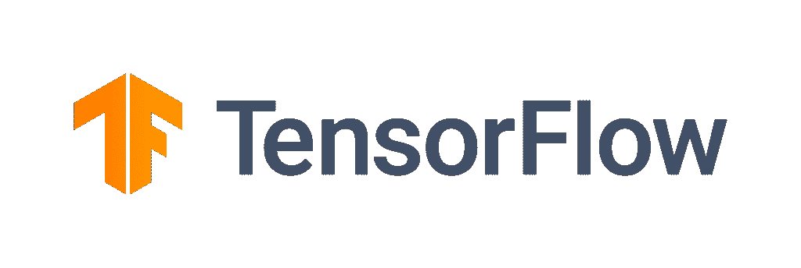
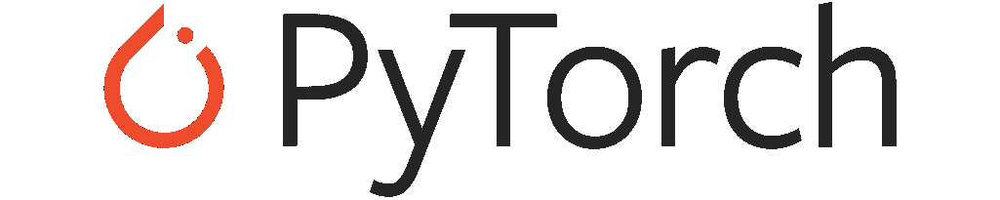
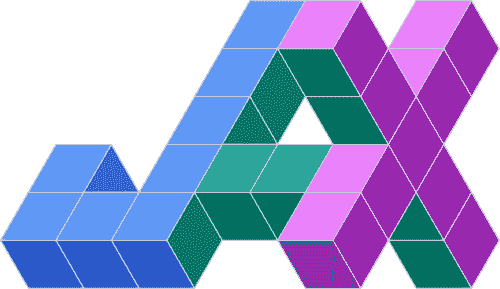

# tensor flow vs py torch vs Jax–比较

> 原文：<https://www.askpython.com/python-modules/tensorflow-vs-pytorch-vs-jax>

在本文中，我们尝试探索 python 中的 3 个主要深度学习框架——tensor flow vs py torch vs Jax。这些框架尽管不同，但有两个共同点——

*   它们是开源的。这意味着如果你觉得程序库中有一个 bug，你可以在 GitHub 中发布一个问题(并修复它)。您也可以在库中添加自己的功能。
*   由于全局解释器锁，Python 在内部很慢。所以这些框架使用 C/C++作为后端来处理所有的计算和并行处理。

我们将强调这些框架中最重要的几点，并尝试回答哪一个最适合您。

## tensor flow vs py torch vs Jax–快速概述

|  | Tensorflow | PyTorch | 贾克斯 |
| 开发人 | 谷歌 | 脸谱网 | 谷歌 |
| 灵活的 | 不 | 是 | 是 |
| 图形创建 | 静态/动态 | 动态的 | 静态 |
| 目标受众 | 
研发人员 | 
研发人员 | 研究人员
 |
| 低级/高级 API | 高水平（位） | 两者 | 两者 |
| 发展阶段 | 成熟(2.4.1 版) | 成熟(1.8.0 版) | 开发中(v0.1.55) |

TensorFlow vs PyTorch vs Jax – Comparison table

### TensorFlow

Google 开发的 TensorFlow 是目前*最流行的机器学习库*。以下是张量流的一些重要特征:

*   首先，它是一个非常用户友好的框架。高级 API -Keras 的可用性使得模型层定义、损失函数和模型创建变得非常容易。
*   TensorFlow2.0 附带了使用动态类型图的急切执行。这使得该库更加用户友好，是对以前版本的重大升级。
*   Keras 的这种高层接口有一定的弊端。由于 TensorFlow 抽象出了大量的底层机制(仅仅是为了方便最终用户)，这使得研究人员在使用他们的模型时自由度更小。
*   Tensorflow 提供的最有吸引力的东西之一是 TensorBoard，它实际上是 TensorFlow 可视化工具包。它允许你可视化损失函数，模型图，剖析等。

因此，如果你正从深度学习开始，或者希望轻松部署你的模型，TensorFlow 可以是一个很好的开始框架。TensorFlow Lite 可以更轻松地将 ML 模型部署到移动和边缘设备。你可以查看官方的 [GitHub Repo](https://github.com/tensorflow/tensorflow) 来深入了解这个框架。

### PyTorch

PyTorch(Python-Torch) 是一个来自脸书的机器学习库。它的受欢迎程度正在慢慢赶上 TensorFlow。PyTorch 的一些最重要的特性是:

*   与 TensorFlow 不同，PyTorch 使用动态类型图，这意味着执行图是随时创建的。它允许我们随时修改和检查图形的内部。
*   除了用户友好的高级 API 之外，PyTorch 确实有一个构建良好的低级 API，它允许对您的机器学习模型进行越来越多的控制。在训练期间，我们可以在模型向前和向后传递的过程中检查和修改输出。这被证明是非常有效的梯度裁剪和神经风格转移。
*   PyTorch 允许扩展他们的代码，添加新的损失函数和用户定义的层很容易。PyTorch autograd 功能强大，足以通过这些用户定义的层进行区分。用户也可以选择定义如何计算梯度。
*   PyTorch 对数据并行和 GPU 使用有广泛的支持。
*   PyTorch 比 TensorFlow 更 pythonic 化。PyTorch 非常适合 python 生态系统，它允许使用 Python 调试器工具来调试 PyTorch 代码。

PyTorch 由于其高度的灵活性吸引了许多学术研究者和工业界的注意。学习起来既简单又直观。PyTorch 还有强大的社区支持，以防你遇到问题。请务必从托管在 [GitHub](https://github.com/pytorch/pytorch) 中的库中查看更多 PyTorch。

### 贾克斯

Jax 是 Google 推出的一个相对较新的机器学习库。它更像是一个亲笔签名的库，可以区分每一个原生 python 和 NumPy 代码。让我们看看 JAX 的一些特点:

*   正如官方网站所描述的，JAX 能够对 Python+NumPy 程序进行**可组合转换:微分、矢量化、JIT 到 GPU/TPU，以及更多**。
*   与 PyTorch 相比，JAX 最重要的方面是梯度是如何计算的。在 torch 中，图形是在向前传递过程中创建的，梯度是在向后传递过程中计算的。另一方面，在 JAX，计算被表示为一个函数。在函数上使用`grad()`返回一个梯度函数，它直接计算给定输入的函数梯度。
*   JAX 是一个亲笔签名的工具，单独使用它几乎不是一个好主意。有各种基于 JAX 的 ML 库，其中著名的有 ObJax、Flax 和 Elegy。因为它们都使用相同的核心，而且接口只是 JAX 库的包装，所以我们把它们放在同一个括号里。
*   **亚麻**最初是在 PyTorch 生态系统下发展起来的。它更注重使用的灵活性。另一方面，**的挽歌**更多的是受到了喀拉斯的启发。 **ObJAX** 主要是为面向研究的目的而设计的，更注重简单性和可理解性。事实上，它符合 *研究者为*研究者提出的口号*。*

JAX 正变得日益受欢迎。许多研究人员正在使用 JAX 进行他们的实验，吸引了 PyTorch 的一些流量。JAX 仍处于起步阶段，不建议刚开始探索深度学习的人使用(目前)。玩这种艺术需要一些数学专业知识。访问[官方知识库](https://github.com/google/jax)以了解关于这个有前途的新图书馆的更多信息。

## 你选择哪一个？

选择 TensorFlow vs PyTorch vs Jax 的答案完全取决于您的使用目的。然而，如果你作为初学者从事机器学习项目，这两个库都不会出错。一旦你进入了高级 ML 建模，你的需求将变得足够具体，以至于你可以确定最适合你的库。

在那之前，敬请关注，继续学习！