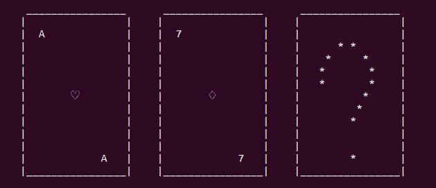
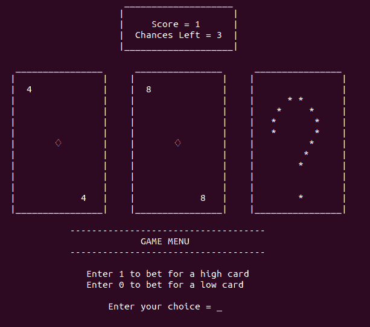

# Python 中基于终端的高低游戏

> 原文：<https://www.askpython.com/python/examples/terminal-hi-lo-game-in-python>

本文围绕创建我们自己的高低牌游戏，可以在命令行上玩。

Hi-Lo 非常简单，但却是赌场中著名的游戏，玩家的目标是猜测一副牌中的下一张牌是高还是低。卡片等级从王牌开始，从最低等级到国王，最高等级。

## 高低游戏演示

* * *

看起来很简单，对吧？让我们快速进入游戏的设计部分。

## 游戏设计

游戏开发中最有创意的部分是游戏设计。作为一款基于终端的卡牌游戏，对于一个程序员来说自由度并不多。

在游戏的特定时刻，会显示三张牌，前一张、当前一张和一副牌中面朝下的下一张。我们的游戏设计看起来像:



Cards Display

在屏幕上，我们可以看到红心 a，方块 7 和一张未知的下一张牌。这通过以下方式实现:

```py
def print_cards(prev_card, current_card):

	print()
	print("\t ________________      ________________      ________________")
	print("\t|                |    |                |    |                |")
	if prev_card.value == '10' and current_card.value == '10':
		print("\t|  {}            |    |  {}            |    |                |".format(prev_card.value,current_card.value))
	elif prev_card.value == '10': 
		print("\t|  {}            |    |  {}             |    |                |".format(prev_card.value,current_card.value))	
	elif current_card.value == '10':
		print("\t|  {}             |    |  {}            |    |                |".format(prev_card.value,current_card.value))	
	else:
		print("\t|  {}             |    |  {}             |    |                |".format(prev_card.value,current_card.value))	
	print("\t|                |    |                |    |      * *       |")
	print("\t|                |    |                |    |    *     *     |")
	print("\t|                |    |                |    |   *       *    |")
	print("\t|                |    |                |    |   *       *    |")
	print("\t|       {}        |    |       {}        |    |          *     |".format(prev_card.suit, current_card.suit))
	print("\t|                |    |                |    |         *      |")
	print("\t|                |    |                |    |        *       |")
	print("\t|                |    |                |    |                |")
	print("\t|                |    |                |    |                |")
	if prev_card.value == '10' and current_card.value == '10':
		print("\t|            {}  |    |            {}  |    |        *       |".format(prev_card.value,current_card.value))
	elif prev_card.value == '10': 
		print("\t|            {}  |    |            {}   |    |        *       |".format(prev_card.value,current_card.value))	
	elif current_card.value == '10':
		print("\t|            {}   |    |            {}  |    |        *       |".format(prev_card.value,current_card.value))	
	else:
		print("\t|            {}   |    |            {}   |    |        *       |".format(prev_card.value,current_card.value))	
	print("\t|________________|    |________________|    |________________|")
	print()

```

印刷卡片的技巧部分是卡片边界的对齐，这成为 10 值卡片的一个问题，因为它有两个字符而不是一个。使用简单的条件语句，问题就解决了。

`print_cards()`函数接受两个参数，即`Card`对象。

* * *

## 创建卡片

表示“扑克牌”的最佳方式是使用对象。我们创建一个`Card`类。

```py
class Card:
	def __init__(self, suit, value):
		self.suit = suit
		self.value = value

```

任何卡片都有两个特征:

*   **花色**–牌的花色类型，例如黑桃
*   **数值**–牌的面值，例如 ace 或九。

要了解更多 Python 中的类和对象，[请访问这里](https://www.askpython.com/python/oops/python-classes-objects)。

* * *

## 西装和价值观

我们需要特定的数据结构来存储花色和牌的类型。

```py
# The type of suit
suits = ["Spades", "Hearts", "Clubs", "Diamonds"]

# The suit value 
suits_values = {"Spades":"\u2664", "Hearts":"\u2661", "Clubs": "\u2667", "Diamonds": "\u2662"}

# The type of card
cards = ["A", "2", "3", "4", "5", "6", "7", "8", "9", "10", "J", "Q", "K"]

# The card value
cards_values = {"A": 1, "2":2, "3":3, "4":4, "5":5, "6":6, "7":7, "8":8, "9":9, "10":10, "J":11, "Q":12, "K":13}

```

这些数据结构中的每一个都在游戏的流畅运行中扮演了一些角色。

* * *

## 制作一副纸牌

一副牌包含 52 张牌，每张牌都有不同的花色和值组合。使用对象列表，我们存储所有的卡片。

```py
# The deck of cards
deck = []

# Loop for every type of suit
for suit in suits:

	# Loop for every type of card in a suit
	for card in cards:

		# Adding card to the deck
		deck.append(Card(suits_values[suit], card))

```

一切准备工作就绪后，就该开始游戏了。

```py
hi_lo_game(deck)

```

函数`hi_lo_game()`负责一个游戏的运行。它需要一副牌才能工作。

* * *

## 设置游戏变量

在我们进入游戏逻辑之前，我们需要设置一些游戏变量:

*   **前一张卡**–我们需要用一张空卡初始化前一张卡。
*   **当前卡**–初始化当前卡
    *   高低游戏的标准规则要求起始牌不是最低牌或最高牌。
    *   从一副牌中取出当前的牌
*   **得分**–正确猜测的次数。
*   **机会**–一次不正确猜测的机会数量。

```py
def hi_lo_game(deck):

	global cards_values

	# Initialize the previous card
	prev_card = Card(" ", " ")

	# Initialize the current card
	current_card = random.choice(deck)

	# The starting card cannot be lowest or highest
	while current_card.value == "A" or current_card.value == "K":
		current_card = random.choice(deck)

	# Remove the card from the deck	
	deck.remove(current_card)

	# Number of chances left
	chances = 3

	# The current
	score = 0

```

第一行函数中`card_values`前的`global`关键字，负责获取当前函数`hi_lo_game()`范围外定义的全局变量`card_values`。

* * *

## 游戏循环

游戏逻辑的关键组成部分之一是游戏循环。在我们的高低游戏版本中，游戏循环取决于留给玩家的机会数量。因此:

```py
# The GAME LOOP
while chances:

```

while 循环一直运行，直到留给玩家的机会不为零。

* * *

## 显示记分板

有两件事需要显示在我们的记分牌上:得分和机会。

```py
# Function to print the scorebaord	
def print_scoreboard(score, chances):
	print("\t\t\t     ____________________")
	print("\t\t\t    |                    |")
	if score >= 10:
		print("\t\t\t    |     Score = {}     |".format(score))
	else:	
		print("\t\t\t    |     Score = {}      |".format(score))
	print("\t\t\t    |  Chances Left = {}  |".format(chances))	
	print("\t\t\t    |____________________|")

```

* * *

## 游戏菜单

我们的游戏菜单是接受玩家输入所需的界面。在游戏过程中，菜单看起来像这样:



Game Menu

该游戏菜单由以下人员创建:

```py
print_scoreboard(score, chances)
print_cards(prev_card, current_card)

print("\t\t   ------------------------------------")
print("\t\t\t\tGAME MENU")
print("\t\t   ------------------------------------")
print()
print("\t\t      Enter 1 to bet for a high card")
print("\t\t      Enter 0 to bet for a low card")
print()

```

* * *

## 接受玩家输入

在这个游戏中，玩家唯一要做的就是猜“高”或“低”。在游戏菜单中，我们已经给“高”分配了 1，而给“低”分配了 0。

```py
# Try block for player input error
try:
	choice = int(input("\t\t\t  Enter your choice = "))
except ValueError:
	clear()
	print("\t\t\tWrong Input!! Try Again.")
	continue	

# Some wrong choice
if choice > 1 or choice < 0:
	clear()
	print("\t\t\tWrong Input!! Try Again.")
	continue		

```

有`try`块用于抑制误差，并通过`except`部分引导误差。

* * *

## 交换卡片

我们 Hi-Lo 游戏的游戏逻辑非常简单。我们需要将当前卡切换到之前的卡，并将未知卡作为当前卡。

```py
# Switch the current card to the previous card
prev_card = current_card

# Choose the new current card
current_card = random.choice(deck)

# Remove the new card from the deck
deck.remove(current_card)

```

* * *

## 检查回合结果

新卡选定后，我们可以检查结果，即高或低。

```py
# A high card
if cards_values[current_card.value] > cards_values[prev_card.value]:
	result = 1

# A low card	
elif cards_values[current_card.value] < cards_values[prev_card.value]:
	result = 0

# Same value card	
else:
	result = -1	

```

* * *

## 管理游戏变量

像分数和机会这样的游戏变量需要根据结果进行更新。

```py
# A Tie Round
if result == -1:
	clear()
	print("\t\t\t TIE GAME!! Play Again")

# Round won
elif choice == result:
	clear()
	print("\t\t\t YOU WIN!!! Play Again")
	score = score + 1	

# Round Lost	
else:
	if chances == 1:
		clear()
		print("\t\t\t\tGAME OVER")
		print_cards(prev_card, current_card)
		print("\t\t        Your Final Score =", score)
		print("\t\t      Thank you for playing!!!")
		break	
	clear()
	print("\t\t\t YOU LOSE!! Play Again")
	chances = chances - 1

```

在玩家赢之前没有问题。当玩家输了，我们也需要管理游戏的结局。

一旦玩家消耗了最后一次机会，游戏就显示涉及打印最终分数的最终状态。

这总结了用 Python 语言创建我们自己的高低游戏的教程。

* * *

## 完整的代码

```py
import random
import os

# Function to clear the terminal
def clear():
	os.system("clear")

# Function to print the scorebaord	
def print_scoreboard(score, chances):
	print("\t\t\t     ____________________")
	print("\t\t\t    |                    |")
	if score >= 10:
		print("\t\t\t    |     Score = {}     |".format(score))
	else:	
		print("\t\t\t    |     Score = {}      |".format(score))
	print("\t\t\t    |  Chances Left = {}  |".format(chances))	
	print("\t\t\t    |____________________|")

# Function to print the cards
def print_cards(prev_card, current_card):

	print()
	print("\t ________________      ________________      ________________")
	print("\t|                |    |                |    |                |")
	if prev_card.value == '10' and current_card.value == '10':
		print("\t|  {}            |    |  {}            |    |                |".format(prev_card.value,current_card.value))
	elif prev_card.value == '10': 
		print("\t|  {}            |    |  {}             |    |                |".format(prev_card.value,current_card.value))	
	elif current_card.value == '10':
		print("\t|  {}             |    |  {}            |    |                |".format(prev_card.value,current_card.value))	
	else:
		print("\t|  {}             |    |  {}             |    |                |".format(prev_card.value,current_card.value))	
	print("\t|                |    |                |    |      * *       |")
	print("\t|                |    |                |    |    *     *     |")
	print("\t|                |    |                |    |   *       *    |")
	print("\t|                |    |                |    |   *       *    |")
	print("\t|       {}        |    |       {}        |    |          *     |".format(prev_card.suit, current_card.suit))
	print("\t|                |    |                |    |         *      |")
	print("\t|                |    |                |    |        *       |")
	print("\t|                |    |                |    |                |")
	print("\t|                |    |                |    |                |")
	if prev_card.value == '10' and current_card.value == '10':
		print("\t|            {}  |    |            {}  |    |        *       |".format(prev_card.value,current_card.value))
	elif prev_card.value == '10': 
		print("\t|            {}  |    |            {}   |    |        *       |".format(prev_card.value,current_card.value))	
	elif current_card.value == '10':
		print("\t|            {}   |    |            {}  |    |        *       |".format(prev_card.value,current_card.value))	
	else:
		print("\t|            {}   |    |            {}   |    |        *       |".format(prev_card.value,current_card.value))	
	print("\t|________________|    |________________|    |________________|")
	print()

# The Card class definition
class Card:
	def __init__(self, suit, value):
		self.suit = suit
		self.value = value

def hi_lo_game(deck):

	global cards_values

	# Initialize the previous card
	prev_card = Card(" ", " ")

	# Initialize the current card
	current_card = random.choice(deck)

	# The starting card cannot be lowest or highest
	while current_card.value == "A" or current_card.value == "K":
		current_card = random.choice(deck)

	# Remove the card from the deck	
	deck.remove(current_card)

	# Number of chances left
	chances = 3

	# The current
	score = 0

	# The GAME LOOP
	while chances:

		print_scoreboard(score, chances)
		print_cards(prev_card, current_card)

		print("\t\t   ------------------------------------")
		print("\t\t\t\tGAME MENU")
		print("\t\t   ------------------------------------")
		print()
		print("\t\t      Enter 1 to bet for a high card")
		print("\t\t      Enter 0 to bet for a low card")
		print()

		# Check if we reached the end of the deck
		if len(deck) == 0:
			clear()
			print_cards(prev_card, current_card)
			print("\t\t    YOU HAVE REACHED THE END OF THE DECK!")
			print("\t\t           Congratulations!!!")
			print()
			print("\t\t          Your Final Score =", score)
			print("\t\t        Thank you for playing!!!")
			break

		# Try block for player input error
		try:
			choice = int(input("\t\t\t  Enter your choice = "))
		except ValueError:
			clear()
			print("\t\t\tWrong Input!! Try Again.")
			continue	

		# Some wrong choice
		if choice > 1 or choice < 0:
			clear()
			print("\t\t\tWrong Input!! Try Again.")
			continue		

		# Switch the current card to the previous card
		prev_card = current_card

		# Choose the new current card
		current_card = random.choice(deck)

		# Remove the new card from the deck
		deck.remove(current_card)

		# A high card
		if cards_values[current_card.value] > cards_values[prev_card.value]:
			result = 1

		# A low card	
		elif cards_values[current_card.value] < cards_values[prev_card.value]:
			result = 0

		# Same value card	
		else:
			result = -1	 	

		# A Tie Round
		if result == -1:
			clear()
			print("\t\t\t TIE GAME!! Play Again")

		# Round won
		elif choice == result:
			clear()
			print("\t\t\t YOU WIN!!! Play Again")
			score = score + 1	

		# Round Lost	
		else:
			if chances == 1:
				clear()
				print("\t\t\t\tGAME OVER")
				print_cards(prev_card, current_card)
				print("\t\t        Your Final Score =", score)
				print("\t\t      Thank you for playing!!!")
				break	
			clear()
			print("\t\t\t YOU LOSE!! Play Again")
			chances = chances - 1

if __name__ == '__main__':

	# The type of suit
	suits = ["Spades", "Hearts", "Clubs", "Diamonds"]

	# The suit value 
	suits_values = {"Spades":"\u2664", "Hearts":"\u2661", "Clubs": "\u2667", "Diamonds": "\u2662"}

	# The type of card
	cards = ["A", "2", "3", "4", "5", "6", "7", "8", "9", "10", "J", "Q", "K"]

	# The card value
	cards_values = {"A": 1, "2":2, "3":3, "4":4, "5":5, "6":6, "7":7, "8":8, "9":9, "10":10, "J":11, "Q":12, "K":13}

	# The deck of cards
	deck = []

	# Loop for every type of suit
	for suit in suits:

		# Loop for every type of card in a suit
		for card in cards:

			# Adding card to the deck
			deck.append(Card(suits_values[suit], card))

	hi_lo_game(deck)

```

* * *

## 结论

Python 中的 Hi-Lo 游戏是一个非常容易创建的游戏。我们希望读者清楚创建一个简单的基于终端的游戏的基本概念。

如果您有任何疑问或建议，可以在下面的评论区给我们留言。