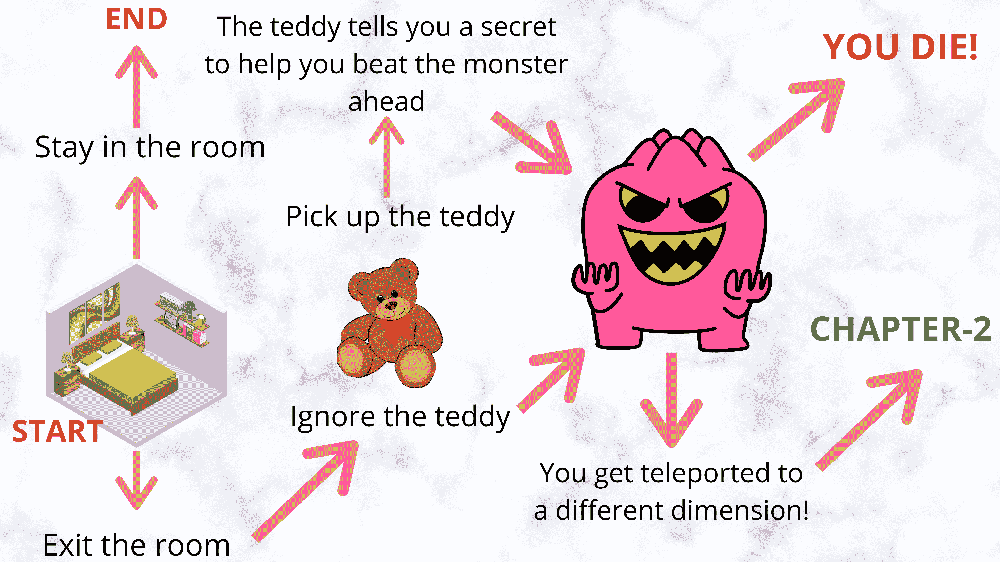
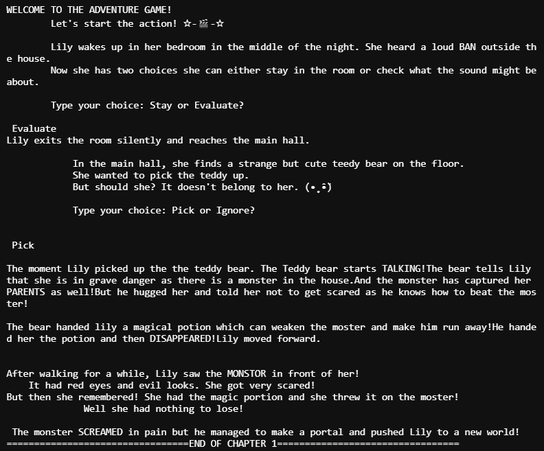

# 如何用 Python 创建基于文本的冒险游戏？

> 原文：<https://www.askpython.com/python/text-based-adventure-game>

你好，学习伙伴！今天我们将从头开始制作一个有趣的基于文本的冒险游戏。首先，让我们了解什么是基于文本的游戏，然后我们将在 python 编程语言中实现相同的内容。

## 什么是基于文本的游戏？

基于文本的游戏是完全基于文本的输入输出简单游戏。在这种类型的游戏中，当用户以输入的形式做出选择时，用户可以选择处理各种情况。

## 我们游戏的故事情节

下图显示了我们将在本教程中用 python 构建的小故事。你可以根据自己的喜好展开或者改变故事。



Text Based Story Game

## 基于文本的冒险游戏的 Python 实现

让我们首先通过打印最初的场景和故事如何发展来开始这个故事。这可以通过简单地使用[打印功能](https://www.askpython.com/python/built-in-methods/python-print-function)来完成。为了更有趣，我们还可以添加表情符号和表情符号！

```
print("""WELCOME TO THE ADVENTURE GAME!
    Let's start the action! ☆-🎬-☆

    Lily wakes up in her bedroom in the middle of the night. She heard a loud BAN outside the house.
    Now she has two choices she can either stay in the room or check what the sound might be about.

    Type your choice: Stay or Evaluate?
""")

```py

干得好！现在我们有了场景设置，结果也很有趣，看，你的第一选择来了！现在让我们接受用户的输入，并为每个选择输入条件语句。

我们需要确保我们的游戏对用户输入的所有类型都有答案，并且不会导致任何选择的错误。

```
def scene1():
    import time
    print("""WELCOME TO THE ADVENTURE GAME!
        Let's start the action! ☆-🎬-☆

        Lily wakes up in her bedroom in the middle of the night. She heard a loud BAN outside the house.
        Now she has two choices she can either stay in the room or check what the sound might be about.

        Type your choice: Stay or Evaluate?
    """)

    c1 = input()
    time.sleep(2)
    ans = 'incorrect'
    while(ans=='incorrect'):
        if(c1.upper()=="STAY"):
            print("\nLily decides to stay in the room and ends up staying inside forever as noone seems to come to help her.")
            ans = 'correct'
        elif(c1.upper()=="EVALUATE"):
            print("Lily exits the room silently and reaches the main hall.")
            ans='correct'
            scene2()
        else:
            print("ENTER THE CORRECT CHOICE! Stay or Evaluate?")
            c1 = input()

```py

我们选择第一个选项`input`，然后我们将创建一个变量来确认我们的答案是正确还是不正确。然后我们创建条件循环和 if-else 语句。游戏一次又一次地要求选择，直到给出的答案有效。

现在第一个场景完成了，我们可以继续下一个场景，用同样的方式构建整个游戏。下面是第二个场景的代码。

```
def scene2():
    import time
    print("""
            In the main hall, she finds a strange but cute teddy bear on the floor. 
            She wanted to pick the teddy up. 
            But should she? It doesn't belong to her. (•˳̂•̆)

            Type your choice: Pick or Ignore?

            """)
    time.sleep(2)
    c1 = input()
    ans = 'incorrect'
    while(ans=='incorrect'):
        if(c1.upper()=="PICK"):
            print("""\nThe moment Lily picked up the the teddy bear. The Teddy bear starts TALKING!The bear tells Lily that she is in grave danger as there is a monster in the house.And the monster has captured her PARENTS as well!But he hugged her and told her not to get scared as he knows how to beat the moster!""")
            time.sleep(2)
            print("""\nThe bear handed lily a magical potion which can weaken the moster and make him run away!He handed her the potion and then DISAPPEARED!Lily moved forward.""")
            ans = 'correct'
            pick="True"
        elif(c1.upper()=='IGNORE'):
            print("""\nLily decided not to pick up the bear and walked forward.""")
            ans='correct'
            pick="False"
        else:
            print("Wrong Input! Enter pick or ignore?")
            c1=input()
    time.sleep(2)
    scene3(pick)

```py

第三个场景的代码如下。现在，第三个场景的结果取决于场景 2 中的选择，即泰迪熊是被选中还是被忽略，以及主角是否收到了药剂。

```
def scene3(pick_value):
    import time
    print("""\n\nAfter walking for a while, Lily saw the MONSTOR in front of her!
    It had red eyes and evil looks. She got very scared! """)
    time.sleep(2)
    if(pick_value=="True"):
        time.sleep(2)
        print("""But then she remembered! She had the magic portion and she threw it on the moster!
              Well she had nothing to lose!""")
        time.sleep(2)
        print("\n The monster SCREAMED in pain but he managed to make a portal and pushed Lily to a new world!")
    elif(pick_value=="False"):
        print("The monster attacked Lily and hurt her! She was then thrown to the new world by the monster!")

```py

我们将在三个场景后结束故事的第一章。你可以根据自己的喜好展开甚至改变整个故事。

要开始故事，只需开始故事的场景 1。

```
scene1()
print("\n\n")
print("=================================END OF CHAPTER 1=================================")

```

上面故事的结果如下图。这真是太棒了！



Text Based Adventure Game Output

## 结论

现在你知道如何建立简单和容易的基于文本的冒险游戏！你也可以尝试自己独特的故事！编码快乐！感谢您的阅读！