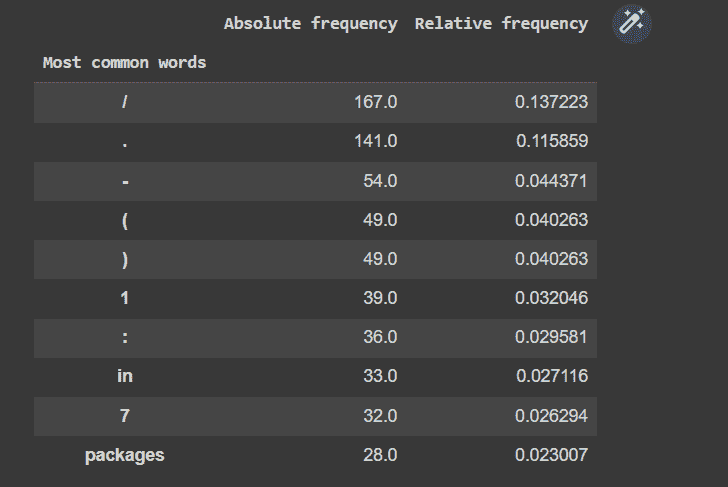
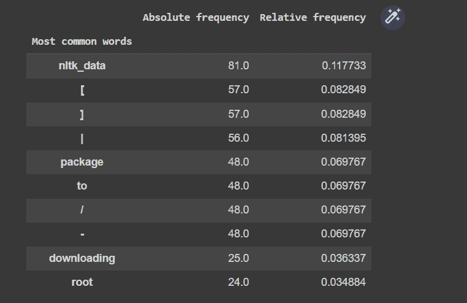
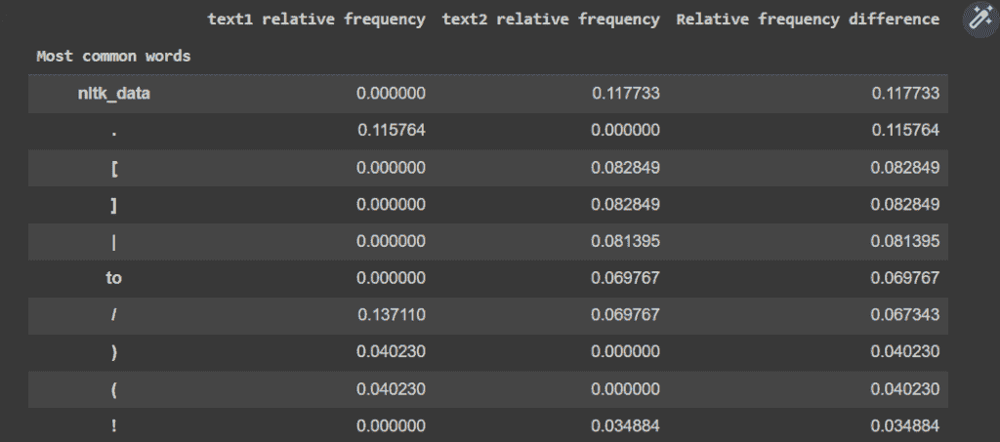
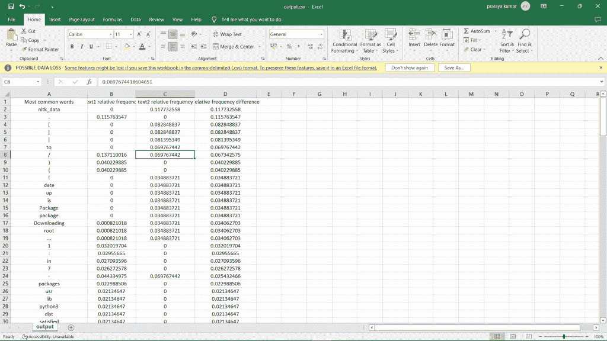

# Python 中的文本挖掘——完全指南

> 原文：<https://www.askpython.com/python/examples/text-mining-in-python>

今天，我们将学习一个非常令人兴奋的话题，那就是 Python 中的文本挖掘。我们将学习一些重要的模块，以及一些重要的方法。在深入讨论之前，让我们快速浏览一下目录。

## Python 中的文本挖掘是什么？

在开始之前，让我们了解什么是文本挖掘。

文本挖掘是从文本数据中提取信息的过程。它涉及多种任务，例如文本分类、文本聚类、概念/实体提取、情感分析、文档摘要和上下文相关建模。它使用信息检索、词汇分析、词频研究和模式识别技术来寻找链接和关联。它还使用可视化和自然语言处理算法和分析方法。

**文本挖掘的优势**

*   它构建非结构化数据以供进一步分析。
*   它降低了错误见解的风险。
*   它创建信息决策、自动化流程和研究分析。

## 文本挖掘的应用

*   **信息提取**:从非结构化数据中识别和提取相关事实。
*   **文档分类和聚类**:按照分类和聚类的方法对术语进行分组和归类。
*   **信息检索**:将文本文档中检索到的文本进行字符串化。
*   **[自然语言处理](https://www.askpython.com/python/examples/introduction-to-nlp) :** 它是文本挖掘的主要部分。这里，我们使用不同的计算任务来理解和分析来自文本文件的非结构化数据。

## 用 Python 实现文本挖掘

今天我们将进行文本挖掘，我们将在计算机上尝试一个简单的文本挖掘问题。让我们输入代码片段，不要迟到。我们将使用我们的 google collab。我们将一步一步来，完成我们的要求。

### 步骤 1:导入模块

为了完成我们的工作，我们需要导入一些模块。

*   **Codecs 模块**:用于实现文件编码和解码的类，提供查找过程中管理错误的访问。
*   **集合模块**:作为字典、列表、元组和集合等容器的替代。
*   [**【NLTK(自然语言工具包)**](https://www.askpython.com/python-modules/tokenization-in-python-using-nltk) :是用于自然语言处理的库。
*   [**Matplotlib 库**](https://www.askpython.com/python-modules/matplotlib/python-matplotlib) :用于我们数据的可视化(可能是图形或者图表)。
*   [**NumPy 库**](https://www.askpython.com/python-modules/numpy/python-numpy-module) :用于处理数组。它提供了一些受 NumPy 库支持的内置方法。
*   [**熊猫库**](https://www.askpython.com/python-modules/pandas/python-pandas-module-tutorial) :用于 python 编程语言中的数据操作和分析。
*   **nltk.stem** :它是 nltk 模块的一个子包，为一个字符串或内容去除形态词缀(额外的乘积)。我们从这个子包中导入 porter stemmer 算法来完成词干提取。
*   nltk.tokenize :它帮助我们将文本分割成记号。

最后两个包用于计算文本文件中的令牌数。我们将创建一个函数 `total_tokens()` ，我们将在同一个函数中使用这些函数。

```py
import codecs
import collections

import numpy as np
import pandas as pd
import nltk
from nltk.stem import PorterStemmer
from nltk.tokenize import WordPunctTokenizer
import matplotlib

```

如果在导入我们的模块时出现任何错误，您可以使用如下的 [pip 安装程序](https://www.askpython.com/python-modules/python-pip)在您的命令提示符下安装它们。

```py
!pip install nltk
!pip install pandas
!pip install numpy
!pip install matplotlib

```

### 步骤 2:读取文本文件

编解码器模块提供 codecs.open()方法来读取和写入 Unicode 编码的文件。这对于读取包含多种不同语言字符的文件非常有用。

```py
with codecs.open("/content/text1.txt", "r", encoding="utf-8") as f:
  text1=f.read()
with codecs.open("/content/text2.txt", "r", encoding="utf-8") as f:
  text2=f.read()   

```

## 步骤 3:创建函数

我们使用的是 WordPunctTokenizer()。tokenize()方法来计算文本文件中的标记总数。这将帮助我们更容易地处理我们的数据文件。

我们使用 collection.counter()方法将每个单独的令牌作为键存储在字典中，并将它们的计数作为相应的值。这样，在实现之后，下面的函数将返回一个字典列表，以及令牌总数。

```py
def total_tokens(text):
 n = WordPunctTokenizer().tokenize(text)
 return collections.Counter(n), len(n)

```

我们可以创建一个函数来计算文本文件中最常见单词的相对和绝对频率。通过这样做，我们可以创建一个返回结果的 dataframe。

```py
#function to create relative frequency and absolute frequency for most common words
def make_df(counter, size):
 #getting absolute and relative frequencies for each tokens in the counter list  
 absolute_frequency = np.array([el[1] for el in counter])
 relative_frequency = absolute_frequency / size

 #creating a data frame using obtained data above(absolute_frequency & relative_frequency)
 df = pd.DataFrame(data=np.array([absolute_frequency, relative_frequency]).T, index = [el[0] for el in counter], columns=["Absolute frequency", "Relative frequency"])
 df.index.name = "Most common words"

 return df

```

### 步骤 4:处理文本

现在我们也将使用上述两个函数来分析单个文本。我们将把这两个文本文件传递给`total_token()`函数。在获得各个令牌及其计数的列表后，我们将把它们都传递给 `make_df()` 函数，以获得结果数据帧。

```py
#for text1
text1_counter, text1_size = get_text_counter(text1)
make_df(text1_counter.most_common(10), text1.size)

```



上面的代码片段使用前面的函数 [**为每个令牌及其频率创建一个数据帧**](https://www.askpython.com/python-modules/pandas/create-an-empty-dataframe) 。让我们对 text2 做同样的事情。

```py
#for text2
text2_counter, text2_size = get_text_counter(text2)
make_df(text2_counter.most_common(10), text2_size)

```

上面的代码片段将给出如下结果。



让我们找出两个文档中最常见的单词，并打印出所有这些最常见单词的词频差异。

```py
all_counter = text1_counter + text2_counter
all_df = make_df(all_counter.most_common(1000), 1)
x = all_df.index.values

#creating our new list for dataframe as df_data[] comprising of 
#text1 relative frequency as text1_c,	
#text2 relative frequency as text2_c, and	
#Relative frequency difference as difference for both text files
df_data = []
for word in x:
 #getting relative frequency for each word in text1 and text2 and loading the same into text1_C and text2_c respectively
 text1_c = text1_counter.get(word, 0) / text1_size
 text2_c = text2_counter.get(word, 0) / text2_size

 #calculating difference between text1_c and text2_c & getting mod for all(in case of negative difference value)
 difference = abs(text1_c - text2_c)

 #appending above three columns into the list
 df_data.append([text1_c, text2_c, difference])

#creating dataframe dist_df and loading above list into the same
dist_df = pd.DataFrame(data=df_data, index=x, columns=["text1 relative frequency", "text2 relative frequency","Relative frequency difference" ])
dist_df.index.name = "Most common words"
dist_df.sort_values("Relative frequency difference", ascending=False, inplace=True)

#printing our required result
dist_df.head(10)

```

上面的代码片段将给出如下输出。



### 步骤 5:将文件保存为 CSV 格式

```py
dist_df.to_csv("output.csv")

```

上面的语法将创建一个名为 output.csv 的文件，并将我们的输出加载到这个文件中。就这样，我们保存了我们需要的结果。



## 结论

在本文中，我们讨论了文本挖掘的一小部分。我们学习了一些新的模块及其方法，然后将它们投入使用。我们希望您喜欢我们今天的教程，并期待在未来学习更多令人兴奋的话题。