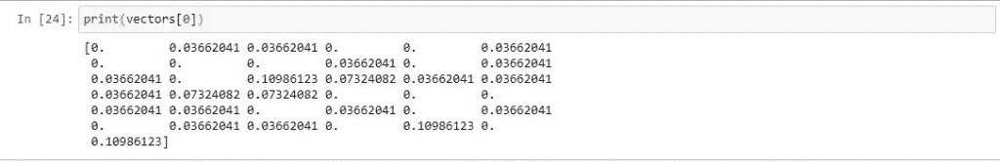

# 用 Python 从头开始创建 TF-IDF 模型

> 原文：<https://www.askpython.com/python/examples/tf-idf-model-from-scratch>

TF-IDF 模型是一种用数值表示单词的方法。“你好，最近怎么样？”你很容易明白我想问你什么，但是计算机擅长处理数字而不是文字。

为了让计算机理解句子和单词，我们用数字来表示这些句子，同时希望保留上下文和含义。

TF-IDF 模型就是这样一种用数值表示单词的方法。TF-IDF 代表**“词频-逆文档频率”**。

这种方法消除了单词袋模型所面临的缺点。它不会对所有单词赋予相同的值，因此出现几次的重要单词将被赋予较高的权重。

在本文中，我们将从头开始一步一步地创建一些样本文本语料库的 TF-IDF 表示。

## TF-IDF 简介

TF-IDF 是词频和逆文档频的乘积。下面是 TF-IDF 的计算公式。

`TF-IDF = Term Frequency (TF) * Inverse Document Frequency (IDF)`

你问的词频和逆文档频是什么？让我们看看它们到底是什么。

### 什么是词频？

它是对文档中单词出现频率的度量。它是单词在文档中出现的次数与该文档中单词总数的比率。

`tf(t,d) = count of t in d / number of words in d`

### 什么是**逆文档频率**？

在语料库中很少出现的单词具有高 IDF 分数。它是文档数与包含该单词的文档数之比的对数。

我们取这个比率的对数，因为当语料库变大时，IDF 值可能变大，导致它爆炸，因此取对数将抑制这种效应。

我们不能除以 0，我们通过在分母上加 1 来平滑这个值。

`idf(t) = log(N/(df + 1))`

## TF-IDF 模型的逐步实施

让我们直接进入 Python 中 TF-IDF 模型的实现部分。

### 1.预处理数据

我们将从预处理文本数据开始，为训练数据中的单词建立一个词汇集，并为集中的每个单词分配一个唯一的索引。

```py
#Importing required module
import numpy as np
from nltk.tokenize import  word_tokenize 

#Example text corpus for our tutorial
text = ['Topic sentences are similar to mini thesis statements.\
        Like a thesis statement, a topic sentence has a specific \
        main point. Whereas the thesis is the main point of the essay',\
        'the topic sentence is the main point of the paragraph.\
        Like the thesis statement, a topic sentence has a unifying function. \
        But a thesis statement or topic sentence alone doesn’t guarantee unity.', \
        'An essay is unified if all the paragraphs relate to the thesis,\
        whereas a paragraph is unified if all the sentences relate to the topic sentence.']

#Preprocessing the text data
sentences = []
word_set = []

for sent in text:
    x = [i.lower() for  i in word_tokenize(sent) if i.isalpha()]
    sentences.append(x)
    for word in x:
        if word not in word_set:
            word_set.append(word)

#Set of vocab 
word_set = set(word_set)
#Total documents in our corpus
total_documents = len(sentences)

#Creating an index for each word in our vocab.
index_dict = {} #Dictionary to store index for each word
i = 0
for word in word_set:
    index_dict[word] = i
    i += 1

```

### 2.创建一个用于计数的字典

然后我们[创建一个字典](https://www.askpython.com/python/dictionary/python-dictionary-dict-tutorial)来记录包含给定单词的文档数量。

```py
#Create a count dictionary

def count_dict(sentences):
    word_count = {}
    for word in word_set:
        word_count[word] = 0
        for sent in sentences:
            if word in sent:
                word_count[word] += 1
    return word_count

word_count = count_dict(sentences)

```

### 3.定义一个函数来计算词频

现在，让我们先定义一个函数来计算词频(TF)。

```py
#Term Frequency
def termfreq(document, word):
    N = len(document)
    occurance = len([token for token in document if token == word])
    return occurance/N

```

### 4.定义计算逆文档频率的函数

现在，使用术语频率函数集，让我们为逆文档频率(IDF)定义另一个函数

```py
#Inverse Document Frequency

def inverse_doc_freq(word):
    try:
        word_occurance = word_count[word] + 1
    except:
        word_occurance = 1 
    return np.log(total_documents/word_occurance)

```

### 5.组合 TF-IDF 功能

让我们创建另一个函数，将上面的 TF 和 IDF 函数结合起来，得到我们想要的 TF-IDF 模型的输出。

```py
def tf_idf(sentence):
    tf_idf_vec = np.zeros((len(word_set),))
    for word in sentence:
        tf = termfreq(sentence,word)
        idf = inverse_doc_freq(word)

        value = tf*idf
        tf_idf_vec[index_dict[word]] = value 
    return tf_idf_vec

```

### 6.将 TF-IDF 模型应用到我们的文本中

TF-IDF 模型在 Python 中的实现已经完成。现在，让我们将文本语料库传递给函数，看看输出向量是什么样子的。

```py
#TF-IDF Encoded text corpus
vectors = []
for sent in sentences:
    vec = tf_idf(sent)
    vectors.append(vec)

print(vectors[0])

```



TF-IDF Encoded Vector

现在，如果模型遇到除 vocab 之外的未知单词，它会给我们一个关键错误，因为我们没有考虑任何未知的标记。

本文的目的是展示 TF-IDF 实际上是如何工作的。

你可以在我的 GitHub 库[这里](https://github.com/Ash007-kali/Article-Datasets/tree/main/TF-IDF%20Model%20from%20Scratch)找到本教程的笔记本。

使用一个新的、更加通用的文本语料库来随意实现和修改代码。

## 结论

在本文中，我们用 Python 从头实现了一个 TF-IDF 模型。我们还专注于理解模型背后的一些理论，并最终使用我们创建的函数对我们自己的句子进行编码。

快乐学习！