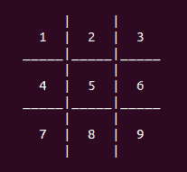
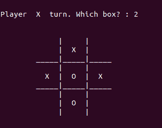
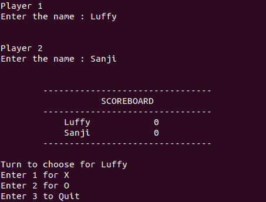

# 使用 Python 的井字游戏

> 原文：<https://www.askpython.com/python/examples/tic-tac-toe-using-python>

在本文中，我们将从头开始介绍使用 Python 语言创建井字游戏的步骤。

<https://www.askpython.com/wp-content/uploads/2020/06/tic_tac_toe.mp4>

* * *

## 关于游戏

井字游戏是一种双人游戏，在 3×3 的方格上进行。每个玩家轮流占据一个单元，目标是在水平、垂直或对角线模式中放置三个标记。一名玩家使用十字`'X'`作为他的标记，而另一名玩家使用零`'O'`。

* * *

## 第一步:井字游戏设计

我们将在命令行上玩井字游戏，因此，我们要做的第一件事是为我们的井字游戏创建一个设计。



Tic-tac-toe Design

如果玩家必须标记一个特定的盒子，他必须输入网格中显示的相应数字。假设，我们希望占据中心块，那么我们将在终端中输入`5`。该网格可以通过以下方式生成:

```py
# Function to print Tic Tac Toe
def print_tic_tac_toe(values):
	print("\n")
	print("\t     |     |")
	print("\t  {}  |  {}  |  {}".format(values[0], values[1], values[2]))
	print('\t_____|_____|_____')

	print("\t     |     |")
	print("\t  {}  |  {}  |  {}".format(values[3], values[4], values[5]))
	print('\t_____|_____|_____')

	print("\t     |     |")

	print("\t  {}  |  {}  |  {}".format(values[6], values[7], values[8]))
	print("\t     |     |")
	print("\n")

```

在上面的代码中，该函数根据作为参数传递的值创建了我们的井字游戏。这里的参数`values`是一个包含网格中每个单元格状态的列表。

* * *

## 步骤 2:使用数据结构存储信息

任何游戏的核心都是背后的游戏机制。因为这是一个相当容易创建的游戏，所以涉及的机制也很简单。

在任何时刻，我们都需要两个关键信息:

*   **网格的状态—**我们必须有一个数据结构来存储每个单元格的状态，即它是被占用还是空闲。
*   **每个玩家的招式****–**我们必须以某种方式知道每个玩家过去和现在的招式，也就是`'X'`和`'O'`所占据的位置。

> **注意:**这两个信息都可以使用网格的状态来访问，但是每次我们需要玩家的位置时都需要遍历它。这可以称为时间与空间复杂度的权衡。这是一种节省时间的通用技术。

```py
# Function for a single game of Tic Tac Toe
def single_game(cur_player):

	# Represents the Tic Tac Toe
	values = [' ' for x in range(9)]

	# Stores the positions occupied by X and O
	player_pos = {'X':[], 'O':[]}

```

**网格的状态**由一个字符列表管理，它可以有三个可能的值，

*   `' '`–一个空单元格
*   `'X'`–玩家 X 占据的单元格
*   `'O'`–玩家 O 占据的单元格

**每个玩家的走法**都被存储为一个整数列表的字典。键是用于各自玩家的`'X'`和`'O'`。它们对应的列表包含了它们所占据的网格单元的编号。

> **注:**变量`cur_player`，存储当前出招的玩家，如`'X'`或`'O'`。

* * *

## 第三步:游戏循环

每个游戏都有某种游戏循环，一直运行到某个玩家赢了或者游戏以平局结束。在井字游戏中，每一次循环迭代指的是任何玩家的一步棋。

```py
# Game Loop for a single game of Tic Tac Toe
while True:
	print_tic_tac_toe(values)

```

* * *

## 步骤 4:处理玩家输入

在每一次游戏迭代中，玩家必须输入他的移动。

```py
# Try exception block for MOVE input
try:
	print("Player ", cur_player, " turn. Which box? : ", end="")
	move = int(input())	
except ValueError:
	print("Wrong Input!!! Try Again")
	continue

# Sanity check for MOVE inout
if move < 1 or move > 9:
	print("Wrong Input!!! Try Again")
	continue

# Check if the box is not occupied already
if values[move-1] != ' ':
	print("Place already filled. Try again!!")
	continue

```

我们创建了一个`try`块，以防玩家输入一些意外的值。这样的事件不能停止游戏，因此，我们处理`ValueError`的异常并继续我们的游戏。

我们需要执行一些健全性检查，比如输入的值是一个有效的位置，如果它是一个有效的位置，它是否已经被占用？

* * *

## 第五步:更新信息

根据玩家输入，我们需要更新信息以使游戏顺利运行。

```py
# Update game information

# Updating grid status 
values[move-1] = cur_player

# Updating player positions
player_pos[cur_player].append(move)

```

`values`列表根据当前玩家更新所占的单元格。玩家位置加上当前玩家刚刚占据的位置。

在更新了`values`列表并调用了`print_tic_tac_toe()`函数之后，网格看起来像这样:



Tic-tac-toe after 5 turns.
Last move: ‘X’ at 2

* * *

## 第六步:检查赢或平

在每一步棋之后，我们都要检查是否有玩家赢了游戏或者游戏已经被抽了。可以通过以下方式进行检查:

### 函数调用:

```py
# Function call for checking win
if check_win(player_pos, cur_player):
	print_tic_tac_toe(values)
	print("Player ", cur_player, " has won the game!!")		
	print("\n")
	return cur_player

# Function call for checking draw game
if check_draw(player_pos):
	print_tic_tac_toe(values)
	print("Game Drawn")
	print("\n")
	return 'D'

```

如果任何玩家赢了，那么`single_game()`函数将返回当前的玩家，是谁走了这步棋。万一游戏抽到了，`'D'`发回。

### 功能:

```py
# Function to check if any player has won
def check_win(player_pos, cur_player):

	# All possible winning combinations
	soln = [[1, 2, 3], [4, 5, 6], [7, 8, 9], [1, 4, 7], [2, 5, 8], [3, 6, 9], [1, 5, 9], [3, 5, 7]]

	# Loop to check if any winning combination is satisfied
	for x in soln:
		if all(y in player_pos[cur_player] for y in x):

			# Return True if any winning combination satisfies
			return True
	# Return False if no combination is satisfied		
	return False		

# Function to check if the game is drawn
def check_draw(player_pos):
	if len(player_pos['X']) + len(player_pos['O']) == 9:
		return True
	return False	

```

**check _ win()–**该函数拥有所有中奖组合。它所做的只是，检查当前玩家的位置是否满足任何获胜组合。如果是，它返回`True`。如果没有一个组合被满足，那么函数返回`False`。

**check _ draw()–**抽签的条件相当简单，因为当所有“九”个位置都有人时，游戏就开始抽签。

* * *

## 第七步:切换当前玩家

由于每个玩家一次只能移动一次，因此每次成功移动后，我们必须交换当前的玩家。

```py
# Switch player moves
if cur_player == 'X':
	cur_player = 'O'
else:
	cur_player = 'X'

```

就单个游戏而言，这就是我们需要做的一切。但是如果玩家想玩多个游戏，本文还提供了一个记分牌系统来记录。

* * *

## 第八步:输入玩家名字

任何记分牌都必须显示每个球员的名字。

```py
if __name__ == "__main__":

	print("Player 1")
	player1 = input("Enter the name : ")
	print("\n")

	print("Player 2")
	player2 = input("Enter the name : ")
	print("\n")

```

* * *

## 第九步:存储游戏相关信息

需要存储像当前玩家、玩家的选择(打叉或不打叉)、可用选项(打叉和不打叉)以及记分牌这样的信息。

```py
# Stores the player who chooses X and O
cur_player = player1

# Stores the choice of players
player_choice = {'X' : "", 'O' : ""}

# Stores the options
options = ['X', 'O']

# Stores the scoreboard
score_board = {player1: 0, player2: 0}

```

默认情况下，当前玩家是最先输入名字的玩家。

* * *

## 步骤 10:设计记分牌

记分牌存储为一个字典，其中键是玩家的名字，值是他们的获胜号码。

```py
# Function to print the score-board
def print_scoreboard(score_board):
	print("--------------------------------")
	print("       	   SCOREBOARD       ")
	print("--------------------------------")

	players = list(score_board.keys())
	print("   ", players[0], "    ", score_board[players[0]])
	print("   ", players[1], "    ", score_board[players[1]])

	print("--------------------------------\n")

```

为了显示记分牌，我们需要玩家的名字。使用`.keys()`函数提取关键字，然后将其转换为列表，以便在显示分数时可以对其进行索引。

* * *

## 步骤 11:外部游戏循环

我们需要另一个游戏循环，用于管理井字游戏的多场比赛。每场比赛，当前玩家选择他的标记(`'X'`或`'O'`)。用于选择的菜单必须在每个游戏迭代中显示:

```py
# Game Loop for a series of Tic Tac Toe
# The loop runs until the players quit 
while True:

	# Player choice Menu
	print("Turn to choose for", cur_player)
	print("Enter 1 for X")
	print("Enter 2 for O")
	print("Enter 3 to Quit")

```

记分板和菜单如下所示:



Scoreboard and Menu

* * *

## 步骤 12:处理和分配玩家选择

每次迭代，我们必须处理和存储当前玩家的选择。

```py
# Try exception for CHOICE input
try:
	choice = int(input())	
except ValueError:
	print("Wrong Input!!! Try Again\n")
	continue

# Conditions for player choice	
if choice == 1:
	player_choice['X'] = cur_player
	if cur_player == player1:
		player_choice['O'] = player2
	else:
		player_choice['O'] = player1

elif choice == 2:
	player_choice['O'] = cur_player
	if cur_player == player1:
		player_choice['X'] = player2
	else:
		player_choice['X'] = player1

elif choice == 3:
	print("Final Scores")
	print_scoreboard(score_board)
	break	

else:
	print("Wrong Choice!!!! Try Again\n")

```

根据玩家的选择，数据已经存储。这很重要，因为在每场游戏结束后，它会告诉我们哪个玩家赢了。

* * *

## 步骤 13:执行匹配

在存储了所有必要的信息后，是时候执行独立匹配并存储获胜标记了。

```py
# Stores the winner in a single game of Tic-tac-toe
winner = single_game(options[choice-1])

```

* * *

## 步骤 14:更新记分牌

我们需要在每场井字游戏后更新记分牌。

```py
# Updates the scoreboard according to the winner
if winner != 'D' :
	player_won = player_choice[winner]
	score_board[player_won] = score_board[player_won] + 1

print_scoreboard(score_board)

```

如果游戏没有以平局结束，那么我们更新记分牌。

* * *

## 第 15 步:切换选择球员

这是一个慷慨的想法，每个玩家必须有机会选择他们想要的标志。为此，我们交换了`cur_player`中的值。

```py
# Switch player who chooses X or O
if cur_player == player1:
	cur_player = player2
else:
	cur_player = player1

```

* * *

## 完整的工作代码

```py
# Function to print Tic Tac Toe
def print_tic_tac_toe(values):
	print("\n")
	print("\t     |     |")
	print("\t  {}  |  {}  |  {}".format(values[0], values[1], values[2]))
	print('\t_____|_____|_____')

	print("\t     |     |")
	print("\t  {}  |  {}  |  {}".format(values[3], values[4], values[5]))
	print('\t_____|_____|_____')

	print("\t     |     |")

	print("\t  {}  |  {}  |  {}".format(values[6], values[7], values[8]))
	print("\t     |     |")
	print("\n")

# Function to print the score-board
def print_scoreboard(score_board):
	print("\t--------------------------------")
	print("\t       	   SCOREBOARD       ")
	print("\t--------------------------------")

	players = list(score_board.keys())
	print("\t   ", players[0], "\t    ", score_board[players[0]])
	print("\t   ", players[1], "\t    ", score_board[players[1]])

	print("\t--------------------------------\n")

# Function to check if any player has won
def check_win(player_pos, cur_player):

	# All possible winning combinations
	soln = [[1, 2, 3], [4, 5, 6], [7, 8, 9], [1, 4, 7], [2, 5, 8], [3, 6, 9], [1, 5, 9], [3, 5, 7]]

	# Loop to check if any winning combination is satisfied
	for x in soln:
		if all(y in player_pos[cur_player] for y in x):

			# Return True if any winning combination satisfies
			return True
	# Return False if no combination is satisfied		
	return False		

# Function to check if the game is drawn
def check_draw(player_pos):
	if len(player_pos['X']) + len(player_pos['O']) == 9:
		return True
	return False		

# Function for a single game of Tic Tac Toe
def single_game(cur_player):

	# Represents the Tic Tac Toe
	values = [' ' for x in range(9)]

	# Stores the positions occupied by X and O
	player_pos = {'X':[], 'O':[]}

	# Game Loop for a single game of Tic Tac Toe
	while True:
		print_tic_tac_toe(values)

		# Try exception block for MOVE input
		try:
			print("Player ", cur_player, " turn. Which box? : ", end="")
			move = int(input())	
		except ValueError:
			print("Wrong Input!!! Try Again")
			continue

		# Sanity check for MOVE inout
		if move < 1 or move > 9:
			print("Wrong Input!!! Try Again")
			continue

		# Check if the box is not occupied already
		if values[move-1] != ' ':
			print("Place already filled. Try again!!")
			continue

		# Update game information

		# Updating grid status 
		values[move-1] = cur_player

		# Updating player positions
		player_pos[cur_player].append(move)

		# Function call for checking win
		if check_win(player_pos, cur_player):
			print_tic_tac_toe(values)
			print("Player ", cur_player, " has won the game!!")		
			print("\n")
			return cur_player

		# Function call for checking draw game
		if check_draw(player_pos):
			print_tic_tac_toe(values)
			print("Game Drawn")
			print("\n")
			return 'D'

		# Switch player moves
		if cur_player == 'X':
			cur_player = 'O'
		else:
			cur_player = 'X'

if __name__ == "__main__":

	print("Player 1")
	player1 = input("Enter the name : ")
	print("\n")

	print("Player 2")
	player2 = input("Enter the name : ")
	print("\n")

	# Stores the player who chooses X and O
	cur_player = player1

	# Stores the choice of players
	player_choice = {'X' : "", 'O' : ""}

	# Stores the options
	options = ['X', 'O']

	# Stores the scoreboard
	score_board = {player1: 0, player2: 0}
	print_scoreboard(score_board)

	# Game Loop for a series of Tic Tac Toe
	# The loop runs until the players quit 
	while True:

		# Player choice Menu
		print("Turn to choose for", cur_player)
		print("Enter 1 for X")
		print("Enter 2 for O")
		print("Enter 3 to Quit")

		# Try exception for CHOICE input
		try:
			choice = int(input())	
		except ValueError:
			print("Wrong Input!!! Try Again\n")
			continue

		# Conditions for player choice	
		if choice == 1:
			player_choice['X'] = cur_player
			if cur_player == player1:
				player_choice['O'] = player2
			else:
				player_choice['O'] = player1

		elif choice == 2:
			player_choice['O'] = cur_player
			if cur_player == player1:
				player_choice['X'] = player2
			else:
				player_choice['X'] = player1

		elif choice == 3:
			print("Final Scores")
			print_scoreboard(score_board)
			break	

		else:
			print("Wrong Choice!!!! Try Again\n")

		# Stores the winner in a single game of Tic Tac Toe
		winner = single_game(options[choice-1])

		# Edits the scoreboard according to the winner
		if winner != 'D' :
			player_won = player_choice[winner]
			score_board[player_won] = score_board[player_won] + 1

		print_scoreboard(score_board)
		# Switch player who chooses X or O
		if cur_player == player1:
			cur_player = player2
		else:
			cur_player = player1

```

* * *

## 游戏时间到了！

创建游戏的所有步骤都已完成。现在是玩游戏的时候了。

```py
Player 1
Enter the name : Luffy

Player 2
Enter the name : Sanji

	--------------------------------
	       	   SCOREBOARD       
	--------------------------------
	    Luffy 	     0
	    Sanji 	     0
	--------------------------------

Turn to choose for Luffy
Enter 1 for X
Enter 2 for O
Enter 3 to Quit
1

	     |     |
	     |     |   
	_____|_____|_____
	     |     |
	     |     |   
	_____|_____|_____
	     |     |
	     |     |   
	     |     |

Player  X  turn. Which box? : 5

	     |     |
	     |     |   
	_____|_____|_____
	     |     |
	     |  X  |   
	_____|_____|_____
	     |     |
	     |     |   
	     |     |

Player  O  turn. Which box? : 1

	     |     |
	  O  |     |   
	_____|_____|_____
	     |     |
	     |  X  |   
	_____|_____|_____
	     |     |
	     |     |   
	     |     |

Player  X  turn. Which box? : 9

	     |     |
	  O  |     |   
	_____|_____|_____
	     |     |
	     |  X  |   
	_____|_____|_____
	     |     |
	     |     |  X
	     |     |

Player  O  turn. Which box? : 2

	     |     |
	  O  |  O  |   
	_____|_____|_____
	     |     |
	     |  X  |   
	_____|_____|_____
	     |     |
	     |     |  X
	     |     |

Player  X  turn. Which box? : 3

	     |     |
	  O  |  O  |  X
	_____|_____|_____
	     |     |
	     |  X  |   
	_____|_____|_____
	     |     |
	     |     |  X
	     |     |

Player  O  turn. Which box? : 7

	     |     |
	  O  |  O  |  X
	_____|_____|_____
	     |     |
	     |  X  |   
	_____|_____|_____
	     |     |
	  O  |     |  X
	     |     |

Player  X  turn. Which box? : 6

	     |     |
	  O  |  O  |  X
	_____|_____|_____
	     |     |
	     |  X  |  X
	_____|_____|_____
	     |     |
	  O  |     |  X
	     |     |

Player  X  has won the game!!

	--------------------------------
	       	   SCOREBOARD       
	--------------------------------
	    Luffy 	     1
	    Sanji 	     0
	--------------------------------

Turn to choose for Sanji
Enter 1 for X
Enter 2 for O
Enter 3 to Quit
2

	     |     |
	     |     |   
	_____|_____|_____
	     |     |
	     |     |   
	_____|_____|_____
	     |     |
	     |     |   
	     |     |

Player  O  turn. Which box? : 5

	     |     |
	     |     |   
	_____|_____|_____
	     |     |
	     |  O  |   
	_____|_____|_____
	     |     |
	     |     |   
	     |     |

Player  X  turn. Which box? : 3

	     |     |
	     |     |  X
	_____|_____|_____
	     |     |
	     |  O  |   
	_____|_____|_____
	     |     |
	     |     |   
	     |     |

Player  O  turn. Which box? : 2

	     |     |
	     |  O  |  X
	_____|_____|_____
	     |     |
	     |  O  |   
	_____|_____|_____
	     |     |
	     |     |   
	     |     |

Player  X  turn. Which box? : 8

	     |     |
	     |  O  |  X
	_____|_____|_____
	     |     |
	     |  O  |   
	_____|_____|_____
	     |     |
	     |  X  |   
	     |     |

Player  O  turn. Which box? : 1

	     |     |
	  O  |  O  |  X
	_____|_____|_____
	     |     |
	     |  O  |   
	_____|_____|_____
	     |     |
	     |  X  |   
	     |     |

Player  X  turn. Which box? : 9

	     |     |
	  O  |  O  |  X
	_____|_____|_____
	     |     |
	     |  O  |   
	_____|_____|_____
	     |     |
	     |  X  |  X
	     |     |

Player  O  turn. Which box? : 6

	     |     |
	  O  |  O  |  X
	_____|_____|_____
	     |     |
	     |  O  |  O
	_____|_____|_____
	     |     |
	     |  X  |  X
	     |     |

Player  X  turn. Which box? : 7

	     |     |
	  O  |  O  |  X
	_____|_____|_____
	     |     |
	     |  O  |  O
	_____|_____|_____
	     |     |
	  X  |  X  |  X
	     |     |

Player  X  has won the game!!

	--------------------------------
	       	   SCOREBOARD       
	--------------------------------
	    Luffy 	     2
	    Sanji 	     0
	--------------------------------

Turn to choose for Luffy
Enter 1 for X
Enter 2 for O
Enter 3 to Quit
3
Final Scores
	--------------------------------
	       	   SCOREBOARD       
	--------------------------------
	    Luffy 	     2
	    Sanji 	     0
	--------------------------------

```

* * *

* * *

## 结论

我们希望这篇文章对读者来说既有趣又有益。我也在 Github 上传了代码。你可以访问[这里](https://github.com/Aprataksh/Tic-tac-toe)获取代码。如果对游戏有什么建议，欢迎评论。

* * *