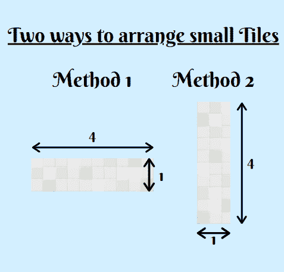
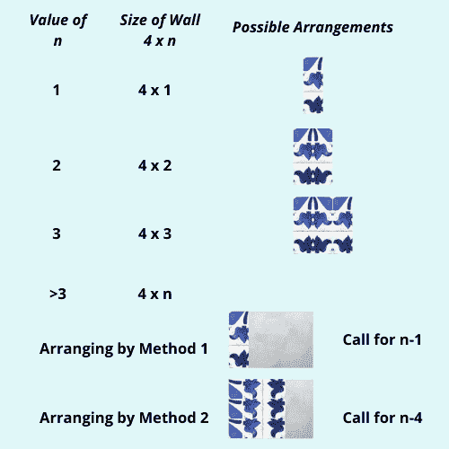

# 用 Python 解决切片问题

> 原文：<https://www.askpython.com/python/examples/tiling-problem>

在本教程中，我们将了解一个非常有趣的问题，称为**平铺问题**。我们先来了解一下，在这个问题上，我们想达到什么目的？

* * *

## **理解平铺问题**

在平铺问题中，我们将得到一面尺寸为 4*n 的墙，这意味着墙的高度为 4，墙的长度为 n(将取自用户)。

现在，我们将拥有无限数量的尺寸为 4*1 的小瓷砖，它们可以以两种不同的方式排列在墙上。下图显示了同样的情况。



Arrange Small Tiles Tiling Problem

我们的目标是用上面提到的两种方法中的一种来计算所有可能的图案，以填满整面墙。

* * *

## **Python 中平铺问题的解决方案**

人们可以使用循环和 if-else 条件手工编写简单的方法，也可以使用更快的方法，即**递归**方法。如果你想知道更多关于递归的知识，请阅读下面提到的教程。

***了解更多关于递归的知识:[Python 中的递归](https://www.askpython.com/python/python-recursion-function)***

使用递归，我们将把一个大问题分解成更小的问题。现在让我们来看看这两种安排中的小问题。

1.  **布置 1:** 根据**方法 1** 放置第一块瓷砖，该方法将墙的长度减少 4，当前瓷砖上方剩余的空间只能以一种方式填充(方法 1 为 3 块瓷砖)
2.  **布置 2:** 其次，我们可以按照**方法 2** 放置第一块瓷砖，这样可以将墙的长度减少 1。

在第一次安排完成后。我们通过调用相同的函数递归调用剩余墙壁的相同操作，但是 n 的值减少了。

最终的解决方案将是每个递归调用中两种安排的可能方式的总和。让我们通过下面展示的一个小插图来了解几个例子。



Recursive Solution Tiling Problem

* * *

## 用 Python 实现切片问题的解决方案

```py
def find_count_arrangements(n):   
    if(n<=3):
        return 1

    return find_count_arrangements(n-1) + find_count_arrangements(n-4)

n = int(input())
print(find_count_arrangements(n))

```

通过递归，代码实现非常简单。只要确保你已经理解了前面解释的解决方案。

* * *

我希望你理解了平铺问题的问题陈述、解决方案和代码实现。感谢您的阅读！

快乐学习！😇

* * *