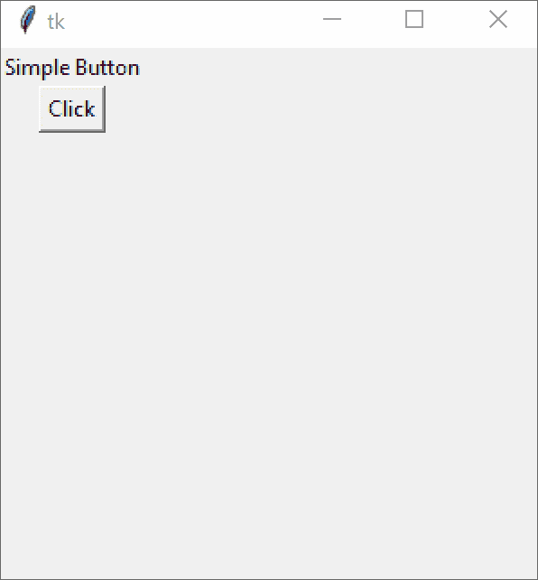
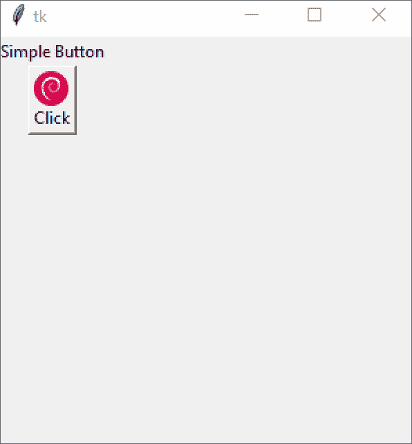

# Tkinter 教程–使用 Tkinter 按钮

> 原文：<https://www.askpython.com/python-modules/tkinter/tkinter-buttons>

大家好！在今天关于 [Tkinter](https://www.askpython.com/python-modules/tkinter) 的文章中，我们将介绍 Tkinter 按钮小部件。

Tkinter 按钮小部件是一个非常简单易用的小部件。

让我们用一些说明性的例子来看看我们如何构造按钮并向我们的 GUI 应用程序添加功能！

* * *

## Tkinter 按钮小工具

这个小部件可以用来制作不同类型的按钮。

我们可以让按钮不仅包含文本，还包含图像！

我们还可以使用*回调函数*让 Tkinter 按钮调用与按钮功能相对应的特定函数。

要定义一个带有特定文本和回调函数的按钮，我们可以使用下面的定义:

```py
button = tk.Button(master, text, command)

```

这里，`text`是按钮上的文字，`command`是指按钮被按下时调用的回调函数。

现在让我们制作一个简单的应用程序，它有一个按钮，当点击它时，显示一个警告框，告诉我们它被点击了！

下面的代码片段说明了这一点，注释解释了每一行代码。

```py
import tkinter as tk
from tkinter import messagebox

# Create the master object
master = tk.Tk()

# Sets the window size as "300x300"
master.geometry("300x300")

# This is the button callback function
# This must be visible to the button, so we must define it before the button widget!
def buttonCallback():
    messagebox.showinfo("Message", "You have clicked the Button!")

# Create a Button widget
button = tk.Button(master, text="Click", command=buttonCallback)

# And a label for it
label_1 = tk.Label(master, text="Simple Button")

# Use the grid geometry manager to put the widgets in the respective position
label_1.grid(row=0, column=0)
button.grid(row=1, column=0)

# The application mainloop
tk.mainloop()

```

现在，运行这个程序，您将得到以下输出。



Button Example 1

现在，如果你想要一个图片和你的按钮在一起，让它看起来更漂亮，这是可能的！

只需在`tk.Button()`调用中添加另一个关键字参数，名为`image`！这是一个`ImageTk.PhotoImage`，您必须使用一个图像文件来实例化它。

要使用`ImageTk`，必须从`PIL`模块导入。我们首先创建一个`PIL`图像，调整它的大小，使它足够小，然后形成我们的`PhotoImage`。

```py
from PIL import Image, ImageTk

# Create a tk.PhotoImage
my_image = Image.open("path/to/image.png")
# Resize it to fit button dimensions
my_image = my_image.resize((25, 25), Image.ANTIALIAS)

```

现在，我们准备好形成 photoimage 对象。

```py
my_image = Imagetk.PhotoImage(my_image)

```

现在，我们终于可以将它添加到我们的按钮上了！

```py
b = Button(compound=LEFT, image=my_image, text="Button")

```

但是，你必须小心，因为使用图标会覆盖按钮上的任何文本。

要避免这种情况，请使用`compound`关键字参数。该值可以设置为`tk.CENTER`、`tk.LEFT`、`tk.RIGHT`、`tk.TOP`或`tk.BOTTOM`。这将指定文本相对于图像的方向。

因为我们将文本放在图像的顶部，所以我们将使用`tk.TOP`

```py
b = Button(compound=LEFT, image=my_image, text="Button", compound=tk.TOP)

```

下面我将向您展示完整的代码:

```py
import tkinter as tk
from tkinter import messagebox
from PIL import Image, ImageTk

# Create the master object
master = tk.Tk()

# Sets the window size as "300x300"
master.geometry("300x300")

# This is the button callback function
# This must be visible to the button, so we must define it before the button widget!
def buttonCallback():
    messagebox.showinfo("Message", "You have clicked the Button!")

# Create a tk.PhotoImage
my_image = Image.open("debian.png")
# Resize it to fit button dimensions
my_image = my_image.resize((25, 25), Image.ANTIALIAS)
# Finally, get the PhotoImage object
my_image = ImageTk.PhotoImage(my_image)

# Create a Button widget
button = tk.Button(master, text="Click", image=my_image, command=buttonCallback, compound=tk.TOP)

# And a label for it
label_1 = tk.Label(master, text="Simple Button")

# Use the grid geometry manager to put the widgets in the respective position
label_1.grid(row=0, column=0)
button.grid(row=1, column=0)

# The application mainloop
tk.mainloop()

```

**输出**



Button Example 2

* * *

## 结论

希望您也能够构建自己的 Tkinter 按钮小部件。在接下来的教程中，我们将更多地关注更多的小部件，请继续关注！

* * *