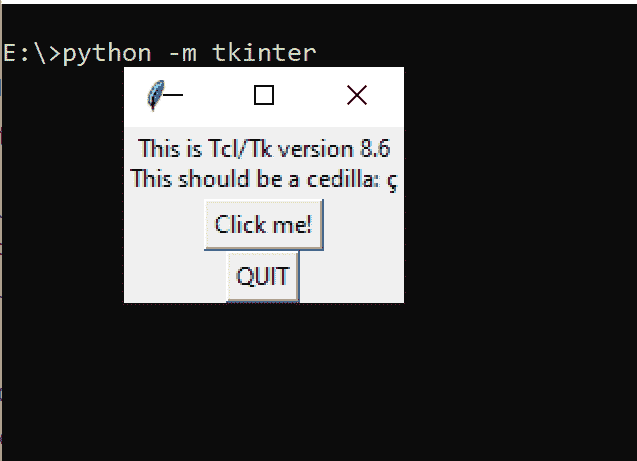
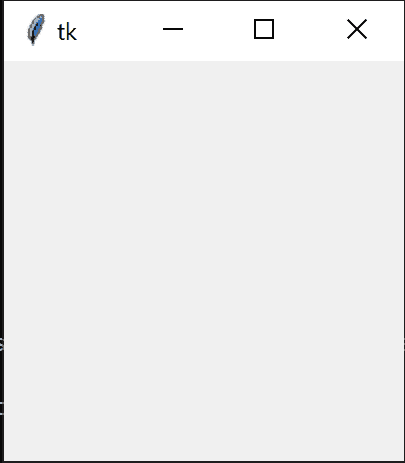
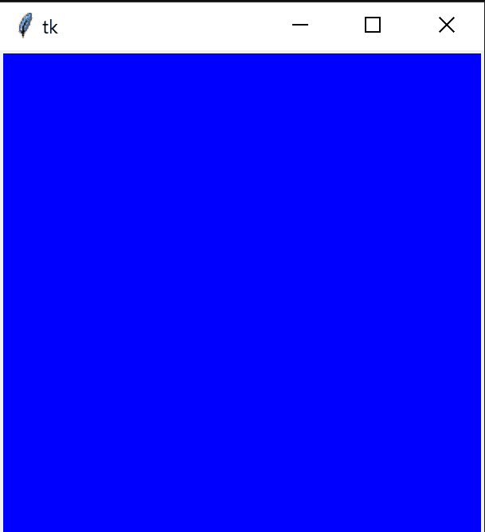
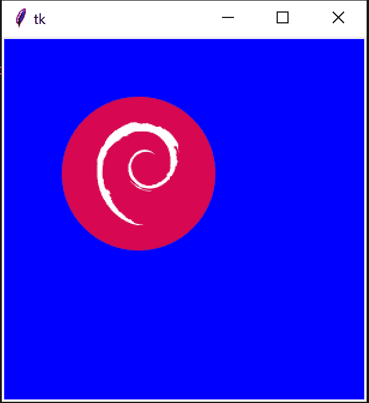

# Tkinter 教程第 1 部分-制作 Tkinter 画布

> 原文：<https://www.askpython.com/python-modules/tkinter/tkinter-canvas>

大家好！让我们在本教程中学习如何创建一个 Tkinter 画布。由于 Tkinter 库非常大，我们将在接下来的时间里讨论很多有趣的话题！

* * *

## Tkinter 是什么？

Tkinter 是一个 Python 接口，使用它我们可以创建 **GUI** (图形用户界面)。

这个库是跨平台的，这意味着它是 Python 开发人员的理想选择，因为您的应用程序代码现在可以独立于平台了！

最棒的是它已经预装了 Python 的！所以没必要单独安装这个。

但为了以防万一，我们将检查 Tkinter 是否在我们的系统上正常工作。因此，进入您的 Windows 命令提示符(或者 Linux/Mac 上的 Bash)并键入:

```py
python -m tkinter

```

一个示例窗口应该如下所示，表明 Tkinter 正在工作:

*   

    Tkinter 检查

而你要用这个库，就一行！

```py
import tkinter

```

现在，我们可以开始在 Tkinter 上编写我们的第一个程序了。为此，我将建立一个简单的程序，在屏幕上显示图像。

让我们开始构建应用程序的第一步:**创建一个新画布！**

* * *

## 创建 Tkinter 画布

### 步骤 1:创建应用程序和主对象句柄

在创建画布之前，我们需要实例化 Python `Tkinter`对象。默认的构造函数将实例化一个 Tkinter 对象。

这个对象通常被称为**根**对象(**主**对象)。这是因为您的 GUI 应用程序通过该对象使用所有调用。没有这个对象，您的应用程序无法运行。

要创建主对象，请执行以下操作:

```py
import tkinter as tk

# Create our master object to the Application
master = tk.Tk()

```

我们现在已经创建了主对象。现在，为了运行应用程序，通常，这样的程序被设计成一个[事件循环](https://en.wikipedia.org/wiki/Event_loop)。

现在，我们还需要一个应用程序的句柄，这样应用程序就可以使用这个对象并将其传递给事件循环。

这个班为我们准备了这个。所以我们将创建一个继承这个类的应用程序类。所以现在我们可以直接从我们的应用程序对象调用主循环。

```py
class Application(tk.Frame):
	def __init__(self, master=None):
		# We need the master object to
		# initialize important stuff
		super().__init__(master) # Call tk.Frame.__init__(master)
		self.master = master # Update the master object after tk.Frame() makes necessary changes to it

```

我们创建一个名为`Application`的应用程序类。这个类的构造函数调用[基类](https://www.askpython.com/python/oops/inheritance-in-python) ( `tk.Frame`)构造函数并传递 master 对象，这样就可以初始化重要的东西。

现在，`super.__init__(master)`将实际修改主对象，所以我们将自己的副本更新为最新的副本，因为其他调用需要它。

应用程序对象`app`的主程序在名为`app.mainloop()`的主事件循环下运行。这实际上就是在你的机器上从 Python 到低级语言的所有调用。

要开始主循环，只需调用这个函数！

```py
import tkinter as tk

class Application(tk.Frame):
	def __init__(self, master=None):
		# We need the master object to
		# initialize important stuff
		super().__init__(master) # Call tk.Frame.__init__(master)
		self.master = master # Update the master object after tk.Frame() makes necessary changes to it

# Create our master object to the Application
master = tk.Tk()
# Create our application object
app = Application(master=master)
# Start the mainloop
app.mainloop()

```

现在，如果您运行这个程序，您将得到以下输出。



Sample Tkinter Output

### 第 2 部分:创建我们的 Tkinter 画布

现在，我们准备创建我们的画布！

我们可以使用`tk.Canvas()`方法来创建画布。

它的初始化如下:

```py
canvas = tk.Canvas(master_object, bg="blue", width=canvas_width, height=canvas_height)

```

这一行将创建一个背景为蓝色的画布对象，具有指定的宽度和高度(像素)。

但是在这里，我们仍然不能直接开始循环。我们需要在画布中应用更改，并将对象打包到画布上。这需要`canvas.pack()`。

现在，我们可以在主循环中显示我们的空画布了！

```py
import tkinter as tk

class Application(tk.Frame):
	def __init__(self, master=None):
		# We need the master object to
		# initialize important stuff
		super().__init__(master) # Call tk.Frame.__init__(master)
		self.master = master # Update the master object after tk.Frame() makes necessary changes to it
	def createCanvas(self, canvas_width, canvas_height):
		# Create our canvas (blue background)
		canvas = tk.Canvas(self.master, bg="blue", width=canvas_width, height=canvas_height)
		return canvas

# Create our master object to the Application
master = tk.Tk()
# Create our application object
app = Application(master=master)
canvas = app.createCanvas(300, 300)
# Pack items into the canvas
canvas.pack()
# Start the mainloop
app.mainloop()

```

现在让我们运行这个程序:



Canvas Blue

太好了！这似乎像预期的那样工作。现在让我们在画布上做更多的东西。

让我们在应用程序上显示 Debian Linux 的图像。


Debian

我们可以使用`tk.PhotoImage`类创建一个图像项目。

```py
img = tk.PhotoImage(file="debian.png") # Create our PhotoImage object
image = canvas.create_image(100, 100, anchor=NW, image=img) # Create the image on our canvas

```

让我们把它放在我们类的一个`addImage()`方法下。

```py
        def addImage(self, canvas, filename, image_x, image_y, direction=tk.NW):
		self.img = tk.PhotoImage(file=filename) # Create our PhotoImage object
		canvas.create_image(image_x, image_y, anchor=direction, image=self.img) # Create the image on our canvas
		return canvas

```

现在，整个程序看起来像这样:

```py
import tkinter as tk

class Application(tk.Frame):
	def __init__(self, master=None):
		# We need the master object to
		# initialize important stuff
		super().__init__(master) # Call tk.Frame.__init__(master)
		self.master = master # Update the master object after tk.Frame() makes necessary changes to it
	def createCanvas(self, canvas_width, canvas_height):
		# Create our canvas (blue background)
		canvas = tk.Canvas(self.master, bg="blue", width=canvas_width, height=canvas_height)
		return canvas
	def addImage(self, canvas, filename, image_x, image_y, direction=tk.NW):
		img = tk.PhotoImage(file=filename) # Create our PhotoImage object
		canvas.create_image(image_x, image_y, anchor=direction, image=img) # Create the image on our canvas
		return canvas

# Create our master object to the Application
master = tk.Tk()
# Create our application object
app = Application(master=master)
canvas = app.createCanvas(300, 300)
canvas = app.addImage(canvas, "debian.png", 50, 50)
# Pack items into the canvas
canvas.pack()
# Start the mainloop
app.mainloop()

```

但是当你运行这个程序时，你将再次得到蓝色的画布。为什么会这样？

根据堆栈溢出的[这个](https://stackoverflow.com/questions/49308962/how-to-insert-an-image-using-canvas-in-tkinter)线程，图像对象`img`被 Python 垃圾收集，没有显示。

为什么？显然`tk.PhotoImage`对象有这个属性。因此，我们需要在我们的类中增加一个额外的引用，以确保 Python 不会立即丢弃它。因此，我们可以在我们的`addImage()`方法中用`self.img`替换`img`，这样就解决了问题！

```py
import tkinter as tk

class Application(tk.Frame):
	def __init__(self, master=None):
		# We need the master object to
		# initialize important stuff
		super().__init__(master) # Call tk.Frame.__init__(master)
		self.master = master # Update the master object after tk.Frame() makes necessary changes to it
	def createCanvas(self, canvas_width, canvas_height):
		# Create our canvas (blue background)
		canvas = tk.Canvas(self.master, bg="blue", width=canvas_width, height=canvas_height)
		return canvas
	def addImage(self, canvas, filename, image_x, image_y, direction=tk.NW):
		self.img = tk.PhotoImage(file=filename) # Create our PhotoImage object
		canvas.create_image(image_x, image_y, anchor=direction, image=self.img) # Create the image on our canvas
		return canvas

# Create our master object to the Application
master = tk.Tk()
# Create our application object
app = Application(master=master)
canvas = app.createCanvas(300, 300)
canvas = app.addImage(canvas, "debian.png", 50, 50)
# Pack items into the canvas
canvas.pack()
# Start the mainloop
app.mainloop()

```

如果您现在运行这个程序，您将得到正确的输出:



Canvas Image

我们已经解决了这个问题！

现在，您可以继续使用 Tkinter 做各种事情，比如绘制形状和显示类似的图像。文档可以帮助你。

* * *

## 结论

在本文中，我们学习了 Tkinter canvas，以及如何创建 Tkinter Canvas 并在屏幕上显示它。请继续关注本模块的更多教程！

## 参考

*   [Python Tkinter documentation](https://docs.python.org/3/library/tkinter.html)

* * *