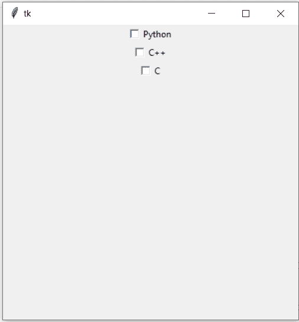
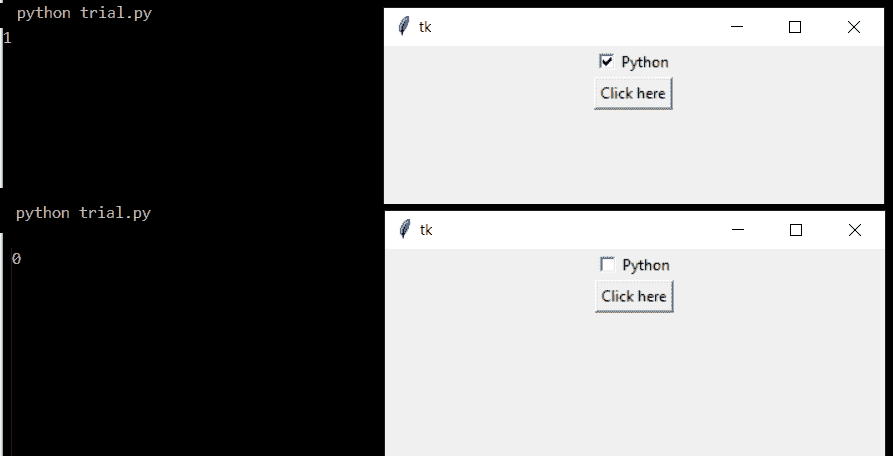

# Tkinter 复选框:一个简单的参考

> 原文：<https://www.askpython.com/python-modules/tkinter/tkinter-checkbox-and-checkbutton>

可以使用 tkinter checkbutton 小部件创建 tkinter 复选框。它允许用户选择多个选项或从多个不同的选项中进行选择。它们与[单选按钮](https://www.askpython.com/python-modules/tkinter/tkinter-messagebox-and-radiobutton)不同，因为在单选按钮中用户只能做一个选择，但是 checkbox 允许多项选择。

它们被视为包含空格的方形盒子。选中复选框时，框内会出现一个勾号。

## Tkinter Checkbutton 的基本实现

首先，我们将导入 Tkinter 模块并初始化框架的几何图形。

```py
from tkinter import *

root =Tk()

root.geometry("400x400+120+120")
root.mainloop()

```

现在我们已经分配了框架，因此我们将使用复选框功能放置一个复选框。如下所示。然后，我们将使用 pack()函数将这个小部件放在 Tkinter 框架中。

```py
c = Checkbutton(root, text = "Python")
c.pack()

c1 = Checkbutton(root, text = "C++")
c1.pack()

c2 = Checkbutton(root, text = "C")
c2.pack()

```

上面的代码只显示了三个简单的复选框，旁边有文本。它不包含任何功能，因为没有被触发的功能。

要进一步了解这一点，请继续阅读这篇文章。

下面显示的是简单复选框示例的完整代码。一定要尝试一下，并在本页末尾的评论区告诉我们你的意见。

```py
from tkinter import *

root =Tk()

c = Checkbutton(root, text = "Python")
c.pack()

c1 = Checkbutton(root, text = "C++")
c1.pack()

c2 = Checkbutton(root, text = "C")
c2.pack()

root.geometry("400x400+120+120")
root.mainloop()

```

上述代码的输出如下所示。



Output

## 将 Tkinter 复选框值存储在变量中

首先，我们将导入`tkinter`并使用`Tk()`函数初始化根。我们也决定了框架的大小。

```py
from tkinter import *

root = Tk()

root.geometry("400x400+120+120")
root.mainloop()

```

我们将在框架上放置一个复选框和按钮，如下所示。我们初始化一个变量`i`,如果控制台上的复选框未被选中，这个`i`输出 0，如果复选框被选中，输出 1。

```py
root = Tk()
i = IntVar()

c = Checkbutton(root, text = "Python", variable=i)
c.pack()

b = Button(root,text="Click here",command=click_me)
b.pack()

```

点击按钮后触发的`click_me()`函数打印复选框变量中存储的`i`值。

```py
def click_me():
    print(i.get())

```

整个代码的图解如下所示。输出的截图也上传了。

```py
from tkinter import *

def click_me():
    print(i.get())

root =Tk()
i=IntVar()
c = Checkbutton(root, text = "Python", variable=i)
c.pack()

b = Button(root,text="Click here",command=click_me)
b.pack()

root.geometry("400x400+120+120")
root.mainloop()

```

上述代码的输出如下所示。



Output

## 结论

关于 Tkinter 复选框的教程到此结束。Tkinter 模块非常庞大，我们想让你更容易理解。因此，请关注 Tkinter 教程页面以了解更多信息！

## 参考

[https://docs.python.org/3/library/tkinter.ttk.html](https://docs.python.org/3/library/tkinter.ttk.html)