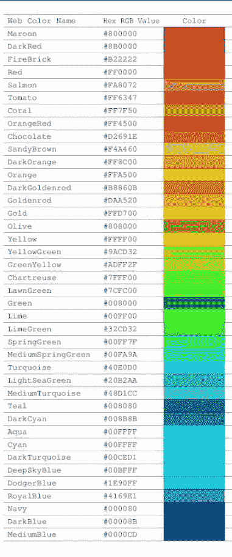
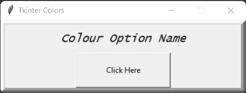
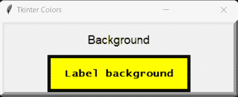
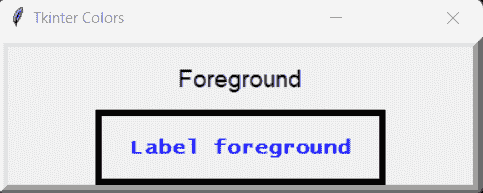

# Tkinter 颜色–完整指南

> 原文：<https://www.askpython.com/python-modules/tkinter/tkinter-colors>

Tkinter 是 Python 中的一个内置模块，用于开发图形用户界面(GUI)。它允许我们开发桌面应用程序。Tkinter 非常简单，易于使用。它为我们提供了不同的小部件，如`button, canvas, label, menu, message, etc.`来构建 Python 中的 GUI。

你也可以探索我们所有的 [Tkinter 教程](https://www.askpython.com/python-modules/tkinter)！本教程将向您介绍 Tkinter 中不同颜色选项的使用。

* * *

## Tkinter 有哪些颜色？

颜色主要用于使图形用户界面更有吸引力。Tkinter 将颜色视为字符串。颜色有两种说法:

1.  **十六进制值**
    Ex。#FF0000(红色)、#008000(绿色)、#FFFF00(黄色)等。
2.  **色名**
    Ex。金色、银色、蓝色等。

以下是快速参考用的颜色代码列表:



Tkinter Colour List

现在，让我们探索一下 Tkinter 提供的不同颜色选项。

* * *

## Tkinter 的颜色选项

首先，让我们看看 GUI 的一般结构，我们将使用它来探索所有的颜色选项。

```py
import tkinter as tk
from tkinter import *

#main window
root = tk.Tk()
#title of the window
root.title("Tkinter Colors")
#disabling resizing of the window
root.resizable(0, 0)

#---frame for top name---
top = Frame(root, width = 500, height = 70, bd=8, relief="raise")
top.pack(side = TOP)

#--name in the frame--
name = Label(top, text="Colour Option Name", width=30, height=2, 
                       font = ("Lucida Console", 14, "italic"))
name.grid(padx = 18)

#--button--
button = Button(top, text="Click Here", width=20, height=3)
button.grid(padx = 2)

root.mainloop()

```

**输出:**



Tkinter Colour GUI Structure

上面是一个基本的图形用户界面，标题是“颜色间”。它由顶部的一个显示颜色选择名称的框架和下面的一个用于演示功能的按钮组成。

* * *

一个元素或部件是一个**活动元素**，如果将光标指向它并按下鼠标按钮，它将执行一些动作。

### 1.活动背景

我们可以在一个活动元素上使用这个选项来设置小部件活动时的背景颜色。

```py
import tkinter as tk
from tkinter import *

#main window
root = tk.Tk()
#title of the window
root.title("Tkinter Colors")
#disabling resizing of the window
root.resizable(0, 0)

#---frame for top name---
top = Frame(root, width = 500, height = 70, bd=8, relief="raise")
top.pack(side = TOP)

#--name in the frame--
name = Label(top, text="Active Background", width=30, height=2, 
                 font = ("Lucida Console", 14, "italic"))
name.grid(padx = 18)

#--button--
button = Button(top, text="Click Here", width=20, height=3, 
                    activebackground='red')
button.grid(padx = 2)

root.mainloop()

```

**输出:**

<https://www.askpython.com/wp-content/uploads/2022/10/tkinter-active-bg-gif.mp4>

上面的视频显示，按钮背景在被点击时变成红色，即处于活动状态。这就是`activebackground`的工作方式。

* * *

### 2.活动前景

此选项指定小工具激活时的前景色，即激活小工具将使颜色变为代码中指定的颜色。

```py
import tkinter as tk
from tkinter import *

#main window
root = tk.Tk()
#title of the window
root.title("Tkinter Colors")
#disabling resizing of the window
root.resizable(0, 0)

#---frame for top name---
top = Frame(root, width = 500, height = 70, bd=8, relief="raise")
top.pack(side = TOP)

#--name in the frame--
name = Label(top, text="Active Foreground", width=30, height=2,
            font = ("Lucida Console", 14, "italic"))
name.grid(padx = 18)

#--button--
button = Button(top, text="Click Here", width=20, height=3, 
                font = ("Lucida Console", 12, "bold"), activeforeground='red')
button.grid(padx = 2)

root.mainloop()

```

**输出:** 3。

<https://www.askpython.com/wp-content/uploads/2022/10/tkinter-active-fg.mp4>

正如在上面的视频中看到的，当我们单击按钮时，文本“单击此处”的颜色会变成代码中提到的红色。

* * *

### 3.背景

此颜色表示小工具的背景颜色。它既可用于活动元素，也可用于非活动元素。背景也可以指定为`bg`。这里，我们没有使用按钮，而是使用一个标签作为小部件来演示这个选项。

```py
import tkinter as tk
from tkinter import *

#main window
root = tk.Tk()
#title of the window
root.title("Tkinter Colors")
#disabling resizing of the window
root.resizable(0, 0)

#---frame for top name---
top = Frame(root, width = 500, height = 70, bd=8, relief="raise")
top.pack(side = TOP)

#--name in the frame--
name = Label(top, text="Background", width=30, height=2, 
                  font = ("Andalus", 14))
name.grid(padx = 18)

#--label--
label = Label(top, text="Label background", width=20, height=3, borderwidth=5, relief="solid", 
               font = ("Lucida Console", 12, "bold"), background='yellow')
label.grid(padx = 2)

root.mainloop()

```

**输出:**



Tkinter Background Colour

这里标签的背景是黄色的。

* * *

### 4.前景

此颜色表示小工具的前景色。它也可用于活动和非活动元素。前景也可以指定为`fg`。同样，在这里，我们没有使用按钮，而是使用标签作为小部件来演示该选项。

```py
import tkinter as tk
from tkinter import *

#main window
root = tk.Tk()
#title of the window
root.title("Tkinter Colors")
#disabling resizing of the window
root.resizable(0, 0)

#---frame for top name---
top = Frame(root, width = 500, height = 70, bd=8, relief="raise")
top.pack(side = TOP)

#--name in the frame--
name = Label(top, text="Foreground", width=30, height=2, 
                  font = ("Andalus", 14))
name.grid(padx = 18)

#--label--
label = Label(top, text="Label foreground", width=20, height=3, borderwidth=5, relief="solid",
              font = ("Lucida Console", 12, "bold"), foreground='blue')
label.grid(padx = 2)

root.mainloop()

```

**输出:**



Tkinter Foreground Colour

正如我们所见，标签的前景色在这里是蓝色的。

* * *

## 结论

本教程到此为止。我们已经了解了 Tkinter 的不同颜色选项。