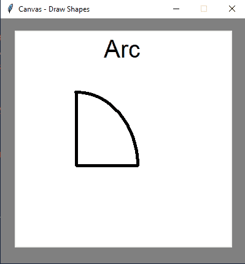
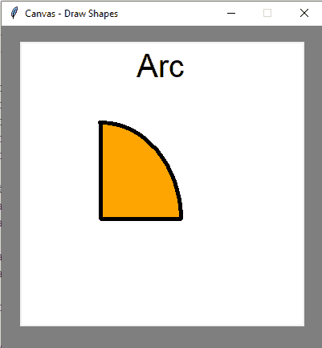

# Tkinter 创建 Oval–快速指南

> 原文：<https://www.askpython.com/python-modules/tkinter/tkinter-create-oval>

你好，程序员们！在本文中，我们将使用 Tkinter 绘制不同的形状。在之前的博客中， **[使用 Tkinter](https://www.askpython.com/python-modules/tkinter/drawing-lines)** 画线的话题只是这个最先进概念的一个良好开端。读者可以在这个[网址](https://www.askpython.com/python/drawing-a-line-using-tkinter(opens in a new tab))上查看。因此，在这一个前进到新的让我们画一些更多的形状。

***也读: [Tkinter 教程——用 Tkinter 画布画一条线](https://www.askpython.com/python-modules/tkinter/drawing-a-line-in-tkinter-canvas)***

## 基本设置

对于我们的项目文件，建立一个新的目录总是一个好的编程实践。这有助于我们为将来的目的更快地整理东西。

1.  创建一个文件夹，即:**t inter Shapes**。
2.  创建一个保存我们的脚本/代码的 Python 文件。搞定了。我们已经准备好编码了。
3.  如果任何从业者愿意，他们可以为每个代码创建单独的 Python 脚本

***跳过基础知识？[跳转到在 Tkinter](#tkinter-oval-and-circle) 中创建椭圆。***

## 创建 Tkinter 画布

Tkinter 中的[画布是帮助我们进行绘图和相关工作的基本窗口。这是一个白色的屏幕，充当白板，我们有彩色粉笔，它准备好显示我们的草图。下面是画布设置的代码:](https://www.askpython.com/python-modules/tkinter/tkinter-canvas)

**代码:**

```py
from tkinter import Tk
from tkinter import Canvas

window = Tk()
window.geometry("400x400")
window.configure(background = "grey")
window.title("Canvas - Draw Shapes")
window.resizable(False, False)

# setting up the canvas
canvas = Canvas(width = 350, height = 350, bg = "white")
canvas.pack(pady = 20)

window.mainloop()

```

**输出:**


Canvas Screen

所以，我们有一个中间有画布的 Tlkinter 窗口。

1.  分辨率为 **350×350** 。
2.  背景设置为**白色**。

## 绘制形状的函数

有在画布上绘制形状的内置函数。这些都是从 Canvas 类本身派生的。该列表如下:

1.  **create _ line()–画一条线。**
2.  **create _ arc()–在屏幕上绘制弧线。**
3.  create _ oval()-绘制椭圆、圆、椭圆。
4.  create _ polygon()–追踪六边形、五边形等。

让我们看看对我们最重要的两个函数 create _ arc()和 create_oval()方法。我们开始吧！

### 在 Tkinter 中创建弧

**代码:**

```py
from tkinter import Tk
from tkinter import Canvas

window = Tk()
window.geometry("400x400")
window.configure(background = "grey")
window.title("Canvas - Draw Shapes")
window.resizable(False, False)

# setting up the canvas
canvas = Canvas(width = 350, height = 350, bg = "white")
canvas.pack(pady = 20)

# create a text that renders the name of our shape
canvas.create_text(175, 30, text = "Arc", font = ("Arial", 30))

#create an arc
canvas.create_arc(0, 340, 200, 100, width = 5)

window.mainloop()

```

**输出:**



Drawing an arc

**说明:**

1.  前七行代码是窗口和画布的基本设置。
2.  从八线开始，我们画一条弧线。调用 **create_arc()** 函数。要将其放置在轴平面上，给出坐标 **(x1，y1，x2，y2)。记得按顺序给他们。**最后一个参数是宽度。这是形状的厚度。
3.  我们也可以使用**填充**参数给弧线添加颜色。只需在 **create_arc()** 内部调用，然后以字符串格式 **: "color_name"** 赋予**颜色名称**。
4.  为了增加更多的细节，我们使用函数 create_text() 渲染一个文本。我们把它放在画布的顶部，字体为 **Arial** ，大小为 **30** 。

**绘制彩色圆弧的代码:**

```py
from tkinter import Tk
from tkinter import Canvas

window = Tk()
window.geometry("400x400")
window.configure(background = "grey")
window.title("Canvas - Draw Shapes")
window.resizable(False, False)

# setting up the canvas
canvas = Canvas(width = 350, height = 350, bg = "white")
canvas.pack(pady = 20)

canvas.create_text(175, 30, text = "Arc", font = ("Arial", 30))
canvas.create_arc(0, 340, 200, 100, width = 5, fill = "orange")

window.mainloop()

```

**输出:**



A colorful arc

所以，代码和前面的一样。我们只是在 create_arc()函数中添加了 **fill** 参数，我们得到了一个漂亮的结果。

### 在 Tkinter 中创建圆形和椭圆形

准备好使用 Tkinter 创建椭圆了吗？让我们直接开始吧。

**椭圆形代码:**

```py
from tkinter import Tk
from tkinter import Canvas

window = Tk()
window.geometry("400x400")
window.configure(background = "grey")
window.title("Canvas - Draw Shapes")
window.resizable(False, False)

# setting up the canvas
canvas = Canvas(width = 350, height = 350, bg = "white")
canvas.pack(pady = 20)

canvas.create_text(175, 20, text = "Circle", font = ("Arial", 30))
canvas.create_oval(175, 100, 100, 175, width = 3)

window.mainloop()

```

**输出:**


The green Oval

**说明:**

1.  前七行是 Tkinter 和 canvas 的基本设置。
2.  在 Canvas 对象中，我们调用 **create_oval()** 函数。这负责跟踪椭圆和圆。
3.  给出坐标，然后我们就有结果了。

create_oval()方法也可以帮助你**创建圆**。只需确保 **x1 和 y2 相同，x2 和 y1 也相同。**

**圆的代码:**

```py
from tkinter import Tk
from tkinter import Canvas

window = Tk()
window.geometry("400x400")
window.configure(background = "grey")
window.title("Canvas - Draw Shapes")
window.resizable(False, False)

# setting up the canvas
canvas = Canvas(width = 350, height = 350, bg = "white")
canvas.pack(pady = 20)

canvas.create_text(175, 20, text = "Circle", font = ("Arial", 30))
canvas.create_oval(175, 100, 100, 175, width = 3)

window.mainloop()

```

**输出:**


A circle

## 结论

所以，这样一来，我们就可以[使用 Tkinter 的 Canvas](https://www.askpython.com/python-modules/tkinter/draw-shapes) 和内置的 shape 函数来绘制不同的形状。对于 GUI 编程和开发来说，这个库非常适合初学者。我建议读者试验一下代码，试着定制这些形状。我希望这将是一篇有趣的文章阅读。