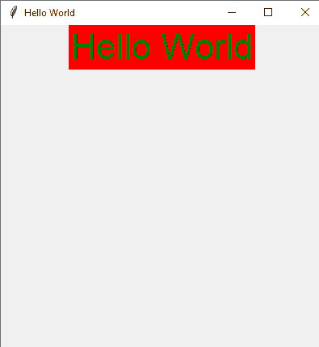
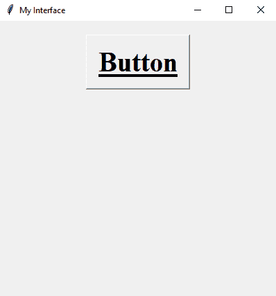

# Python Tkinter 教程:了解 Tkinter 字体类

> 原文：<https://www.askpython.com/python-modules/tkinter/tkinter-font-class>

在本文中，我们将学习更多关于 Tkinter 字体类的知识。当涉及到设计一个功能齐全且适应各种环境的图形用户界面时，Tkinter 是最好的选择。它是一个内置的图形库，带有 **Python** 编程语言。所以，让我们看看这个特殊库的一些特性，让我们的 GUI 开发更上一层楼。

***推荐阅读: [Tkinter 教程第一部分——制作 Tkinter 画布](https://www.askpython.com/python-modules/tkinter/tkinter-canvas)***

## Tkinter 简介

Python 在互联网上发布了许多 GUI 开发库。大部分都是**开源**的，好用。但是当它们与一个**GUI**入门指南不太相关时。从这个意义上说，初学者需要投入更多的时间和资源来学习，并根据自己的知识来实现。这是其中一些库的列表:

1.  **PyQT5**
2.  **Kivy**
3.  **wxppython**等。

但是 Tkinter 处在一个非常不同的框架中。*之所以内置，是因为基本的* ***Python 解释器*** *和****IDLE****——一个轻量级的 python IDE 都是用这个包设计的。*除此之外，从基础学到进阶比其他库都非常容易。这里列出了**主要部件**和**t 中间**的等级。

1.  **Root/Window:** 是这个库的主要小部件。一个可调整大小的窗口，包含其他子部件。
2.  **标签:**一个标签，可以处理维护每个 widget 标签的任务。它定义了它们的属性。
3.  **按钮:**根据用户命令运行的简单按钮。
4.  字体:一个特殊的类，帮助创建者设置任何子部件的字体。
5.  **Mainloop:** 这是一个主循环，它连续无限次运行 GUI，直到用户不退出。

* * *

## 一个带有 Tkinter 的 Hello World 小代码

在这一节中，我们将编写一段代码来创建一个 **Hello World 的窗口。**

**代码:**

```py
from tkinter import *
root = Tk()
root.title("Hello World")
root.geometry("400x400")

```

**输出:**


Tkinter Window

这是一个我们只用几行代码创建的窗口。让我们理解每一行。

1.  导入模块。
2.  然后使用**根**变量创建一个 **Tk()** 类的实例。我们可以给 Tk()类的对象取任何名字。
3.  使用 **title()** 函数设置窗口的标题。这将文本呈现在窗口的左上角。
4.  然后 **geometry()** 函数帮助设置我们窗口的宽度和高度。

* * *

## 了解在 Tkinter 中打印文本的基础知识

从基础开始的原因是我们需要理解 Tkinter 中的字体并不局限于一个特定的类，它们也反映在其他一些主要的部件中。

***也读作: [Tkinter 框架和标签:简易参考](https://www.askpython.com/python-modules/tkinter/tkinter-frame-and-label)***

既然我们已经进入心流，让我们了解更多关于它的事情。最重要的是，我们设计的 GUI 应该看起来有吸引力和信息量。因此，为了做到这一点，我们使用了 Tkinter 的 **Label()** 小部件。它的作用是在屏幕上呈现一些文本，给出一些我们想要的信息。**的语法**对它来说非常简单:

```py
label_1 = Label(active_window, foreground_color, background_color, font, height, width)

```

标签小部件有更多的参数，但是这些参数对于研究来说都是非常完美的。这是相同的代码。

```py
from tkinter import *

root = Tk()
root.title("Hello World")
root.geometry("400x400")

my_label = Label(root, text = "Hello World", fg = "Green", bg = "red", font = ("Arial", 32)) # setting up the labels 
my_label.pack()

root.mainloop()

```

**输出:**



Label Window Output

需要注意的要点是，**字体**在这里作为**参数**使用。我们可以给出一个由字体类型和大小组成的元组，或者直接给出名称。该参数有多种名称。下面是一些**的列表**。

1.  天线
2.  英国泰晤士报(1785 年创刊)
3.  时代新罗马
4.  大胆的
5.  斜体的
6.  粗斜体

pack()方法用于在屏幕上显示我们创建的标签。

* * *

## 使用 Tkinter 字体类

字体是一些很棒的自然创造的写作风格。世界各地的人们有不同的手写风格，那些知道如何将相同的字体转换成数字格式的人开发了我们使用和喜爱的字体。

使用 tkinter 字体类，您可以将打印在 Tkinter 窗口上的文本转换为粗体、斜体、罗马体，甚至可以更改字体系列。

现在我们已经操作了一些字体功能，让我们来看看从 tkinter.font 模块派生的主 **font** 类。该模块提供四种主要类型:

1.  **tkinter.font.NORMAL**
2.  **tkinter.font.BOLD**
3.  **tkinter.font.ITALIC**
4.  **tkinter.font.ROMAN**

要了解更多关于这个理论的信息，请阅读[链接](https://docs.python.org/3/library/tkinter.font.html)中的**官方文档**。

我们将直接看到代码形式的应用程序。

```py
from tkinter import *
from tkinter.font import Font

root = Tk()
root.title("My Interface")
root.geometry('400x400')

my_font = Font(
    family = 'Times',
    size = 30,
    weight = 'bold',
    slant = 'roman',
    underline = 1,
    overstrike = 0
)

my_button = Button(root, text = 'Button', font = my_font)
my_button.pack(pady = 20)

root.mainloop()

```



Tkinter Font Output

**上述代码的解释:**

1.  首先，我们导入所有子模块 tkinter 模块。然后从 tkinter.font 模块导入字体类。这是主要的实用程序类。
2.  然后创建一个实例，即**根**。将标题设置为“我的界面”
3.  将几何图形设置为 **500×500(宽 x 高)。**
4.  然后创建 **my_font** 作为 **Font** 类的实例。它有一组扩展的参数:**族:-** 用于选择字体类型，**大小:-** 字体大小，**粗细:-** 字体粗细加粗/正常，**倾斜:-** 斜体罗马/斜体，**下划线:-** 在文本下画下划线，**粗划:-** 画一条删除线。
5.  在那之后，一个按钮部件，只得到一个点击，什么也没有。在那里我们设置参数为默认窗口为 root，文本标签为“Button”，font = my_font。这将调用 font 类的已创建的 **my_font** 对象。
6.  主循环运行整个代码并跟踪每一个 GUI 事件。当用户按下关闭按钮时退出。

## 结论

这样，我们就结束了了解 tkinter 的字体类的话题。这是一个非常容易理解和实现的主题。希望这将使 GUI 知识得到更多的提高。